# Learning Path 2 - Lab 1 - Exercise 1 - Initialize your Microsoft 365 Tenant 

Adatum Corporation runs their legacy applications (such as Microsoft Exchange Server 2019) in an on-premises deployment. However, they recently subscribed to Microsoft 365, thereby creating a hybrid deployment in which they must synchronize their on-premises and cloud deployments. 

As Adatum's Enterprise administrator, you have been tasked with deploying Microsoft 365 in Adatum’s hybrid deployment using a virtualized lab environment. In this exercise, you will set up Adatum's Microsoft 365 trial tenant, and your instructor will guide you on how to obtain your Microsoft 365 credentials in your lab-hosted environment. You will use these credentials throughout the remaining labs in this course. 

In your lab environment, your lab hosting provider has already created a free Microsoft 365 trial tenant for you, along with a default tenant admin account in Microsoft 365 (the display name for this user account is ODL_User(Admin User)). You will log into the Domain Controller VM (LON-DC1-ID) using the ODL_User account which you can find in the **Environment Details** tab, and when you access Microsoft 365 for the first time, you will initially log in using the Microsoft 365 tenant admin account created by your lab hosting provider. You will then update Adatum's Microsoft 365 organizational profile, and you will prepare your tenant for Microsoft Azure Active Directory and for a future lab using Microsoft Teams.


### Task 1 - Obtain Your Microsoft 365 Credentials

Once you launch the lab, a free trial tenant will be automatically created for you to access Microsoft 365 in the Microsoft Virtual Lab environment. Within this tenant, your lab hosting provider will create a Microsoft 365 user account for a default tenant administrator named ODL_User. Your lab hosting provider will assign this user account a unique username and password, and the account will be assigned the Microsoft 365 Global administrator role. You must retrieve this username and password so that you can sign into Microsoft 365 within the Microsoft Virtual Lab environment under the resource section. You will also be assigned a unique network IP address and UPN name for your Microsoft 365 blob. You will also use this UPN name in various tasks throughout the labs for this course.

Because this course can be offered by learning partners using any one of several authorized lab hosting providers, the actual steps involved to retrieve the UPN name, network IP address, and tenant ID associated with your tenant may vary by lab hosting provider. Therefore, your instructor will provide you with the necessary instructions on how to retrieve this information for your course. <br/>

You should write down the following information (provided by your instructor) for later use:

- **Tenant prefix.** This tenant prefix is for the Microsoft 365 user accounts that you will use to sign into Microsoft 365 throughout the labs in this course. The domain for each Microsoft 365 user account is in the format of {user alias}@xxxxxZZZZZZ.onmicrosoft.com, where xxxxxZZZZZZ is the tenant prefix. It consists of two parts - your lab hoster's prefix (xxxxx; some hosters use a generic prefix such as M365x, while others use their company initials or some other designation) and the tenant ID (ZZZZZZ; usually a 6 digit number). Record this xxxxxZZZZZZ tenant prefix value for later use. When any of the lab steps direct you to sign into Microsoft 365 as one of the user accounts (such as the ODL_User), you must enter the xxxxxZZZZZZ value that you obtained here as the tenant prefix portion of your .onmicrosoft.com domain.

- **Tenant password.** This is the password provided by your lab hosting provider for the tenant admin account.

- **Custom Domain name.** Your lab hosting provider has created a custom domain name for Adatum that you will use when adding a custom domain into Microsoft 365 in a later lab exercise. The domain name is in the format **xxxUPNxxx.xxxCustomDomainxxx.xxx.** You must replace **xxxUPNxxx** with the UPN name provided by your lab hosting provider, and you must replace **xxxCustomDomainxxx.xxx** with the lab hosting provider's domain name. For example, let's assume your lab hosting provider is Fabrikam Inc. If the UPN number it assigns to your tenant is AMPVU3a and its custom domain name is fabrikam.us, then the domain name for your new custom domain would be AMPVU3a.fabrikam.us. Your instructor will provide you with your lab hosting provider's UPN number and custom domain name.  

- **Network IP address.** Write down the **IP Address** value (this is the IP Address of your parent domain; for example, 64.64.206.13).

### Task 2- Set up the Organization Profile

In your role as Holly Dickson, Adatum’s Enterprise Administrator, you have been tasked with setting up the company’s profile for its Microsoft 365 trial tenant. In this task, you will configure the required options for Adatum’s tenant. Since Holly has yet to create a personal Microsoft 365 user account (you will do this in the next lab exercise), Holly will initially sign into Microsoft 365 using the default Microsoft 365 tenant admin account and password that was created by your lab hosting provider. This account will be admin@xxxxxZZZZZZ.onmicrosoft.com (where xxxxxZZZZZZ is the tenant prefix assigned by your lab hosting provider); the display name for this account will be ODL_User.

### Task 1 - Obtain Your Office 365 Credentials

Once you launch the lab, you can obtain your **Office 365 credentials** from the **Environment details** tab. Copy the username and password.
   
   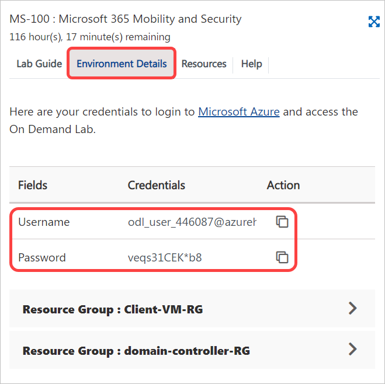 
   
### Task 2: Install and Activate Office 365 Apps

1. Once the environment is provisioned, select the **Microsoft Edge** icon. Maximize your browser window when it opens.

   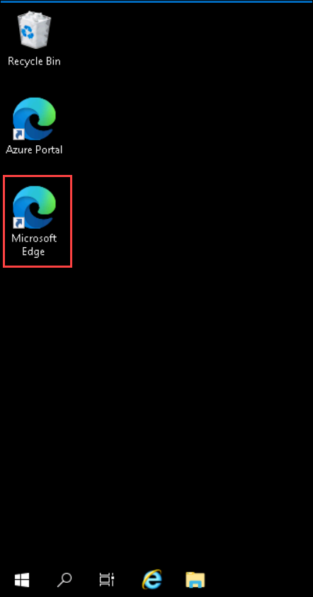 

1. In your browser go to the **Microsoft Office Home** page by entering the following URL in the address bar: 
   ```
   https://portal.office.com/
   ``` 

1. In the **Sign in** dialog box, copy and paste in the **Username** provided in the environment details page (**odl_user_DID@xxxxx.onmicrosoft.com**) and then select **Next**.

    

1. In the **Enter password** dialog box, copy and paste in the **Password** and then select **Sign in**.

    

1. On the **Help us protect your account** dialog box, Select **Skip for now (14 days until this is required)**.

    

1. On the **Stay signed in?** dialog box, select the **Don’t show this again** check box and then select **No.** 

   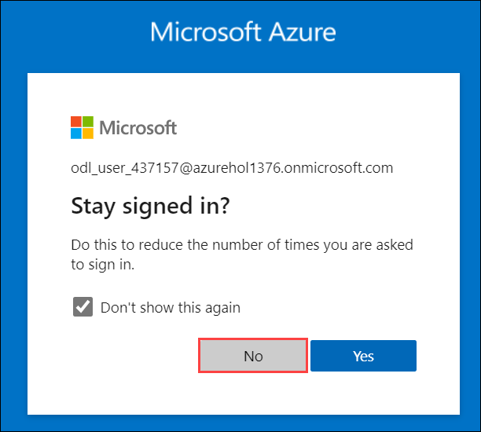 

1. If a **Get your work done with Office 365** window appears, then close it now. 

1. On the **Microsoft Office Home** tab, in the column of Microsoft 365 app icons that appears on the left side of the screen, select the **Admin** icon, which is the last icon in the list; this opens the **Microsoft 365 admin center** in a new browser tab. 

   

1. In the **Microsoft 365 admin center**, in the left-hand navigation pane, select **Show all** and then select **Settings**. In the **Settings** group, select **Org settings**. 

   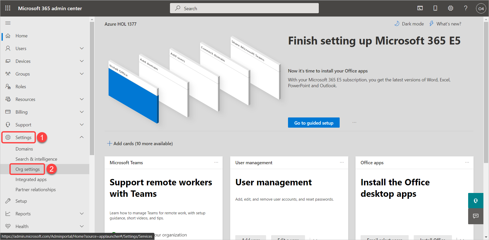

1. On the **Org settings** page, the **Services** tab at the top of the page is displayed by default. To the right of the **Services** tab is the **Organization profile** tab; select this tab now. 

1. On the **Org settings** page, in the **Organization profile** tab, select **Organization information** from the list of profile data.

   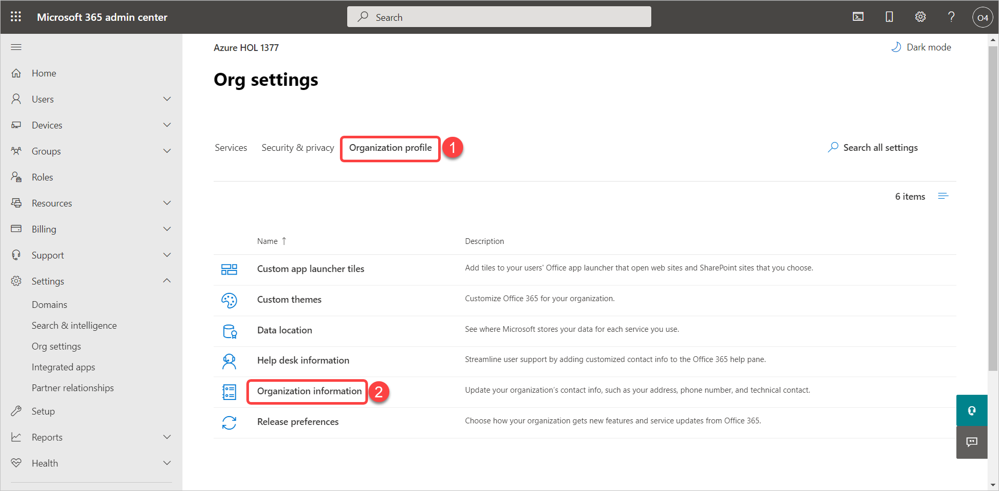

1. In the **Organization information** pane that appears, enter the following information:

   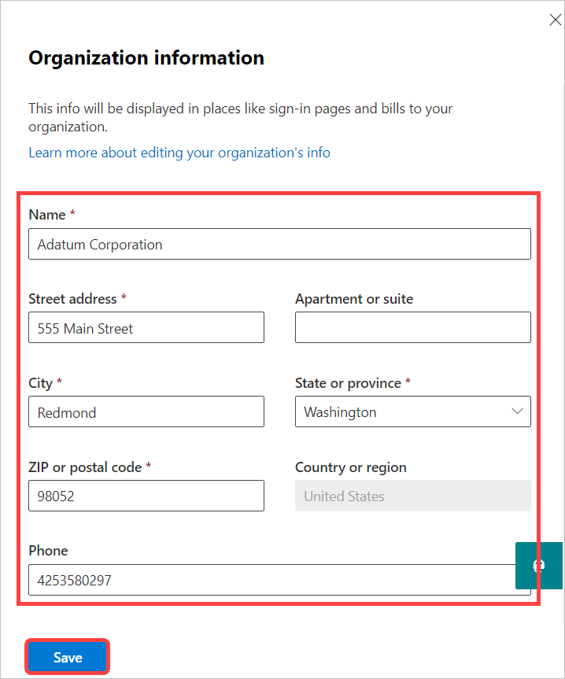

    - Name: **Adatum Corporation** (Note: Contoso is originally displayed as the organization name; this was explained in the Introduction section at the start of this lab. In this step you will change it to Adatum Corporation.)

    - Street Address: **555 Main Street**

    - City: **Redmond**

    - State or province: **Washington**

    - ZIP or postal code: **98052**

    - Phone: do not change

    - Technical contact: do not change

    - Preferred language: **English**

1. Select **Save**.

1. At the top of the **Organization information** pane, note the message indicating the changes have been saved. Select the **X** in the upper right-hand corner to close the pane.

1. Back on the **Organization profile** tab, in the list of organization profile data, select **Release preferences**.

1. In the **Release preferences** pane that appears, select the **Targeted release for select users** option and then select **Save**.<br/>

   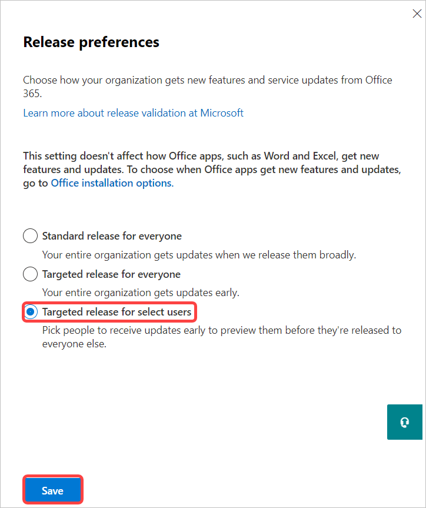

    **Note:** One of the benefits of Microsoft 365 is the ability to have the latest features and updates automatically applied to your environment, which can reduce maintenance costs and overhead for an organization and allow early-adopter users to test new features. By setting up your Release preferences, you can control how and when your Microsoft 365 tenant receives these updates. <br/>

    **Note:** This **Targeted release for select users** option enables you to create a control group of users who will preview updates so that you can prepare the updates for your entire organization. The **Targeted release for everyone** option is more commonly used in development environments, where you can get updates early for your entire organization. In non-development environments, such as Adatum, targeted release to a select group of users is the more typical preference as it enables an organization to control when it wants to make updates available to everyone once they've been reviewed by the control group.

2. In the **Release preferences** pane, below the list of release options, select **Select users**.

   

1. In the **Choose users for targeted release** pane that appears, select inside the **Who should receive targeted releases?** field. This displays the list of active users (these are the ten Microsoft 365 user accounts created for your tenant by your lab hosting provider). In this list, select each of the following users (Note: You have to select each user, one at a time; after selecting a user, you must select inside the field again to re-display the list so that you can display the next user): 

	- **Alex Wilber**
	- **Joni Sherman**
	- **Lynne Robbins**
	- **ODL_User** <br/>

    **Note:** Alex, Joni, and Lynne are administrators who are part of Holly's pilot team. Their accounts will be used throughout the labs for this course.
    
1. Select **Save**.

   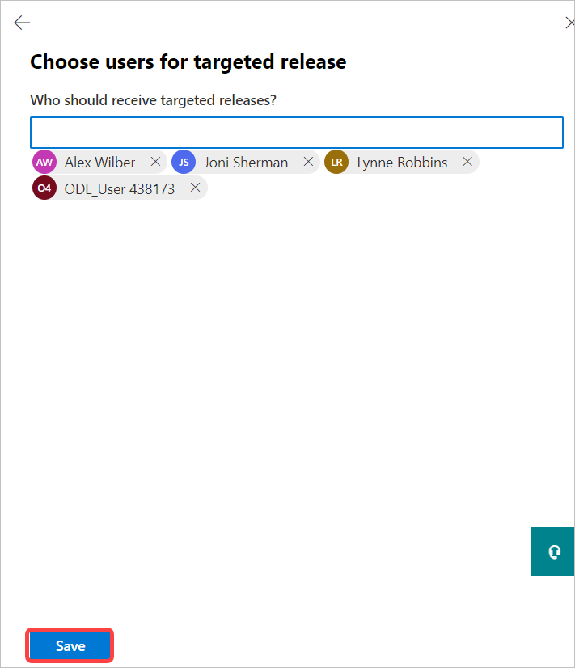

1. Verify the users you selected appear at the bottom of the **Release preferences** pane, and then select the **X** in the upper-right corner of the **Release preferences** pane to close it. 

1. In the list of organization profile data, select **Custom themes**.

1. In the **Custom themes** pane, in the **Customize Microsoft 365 for your organization** select **Default theme**, then select the **Show the user's display name** check box. <br/>

   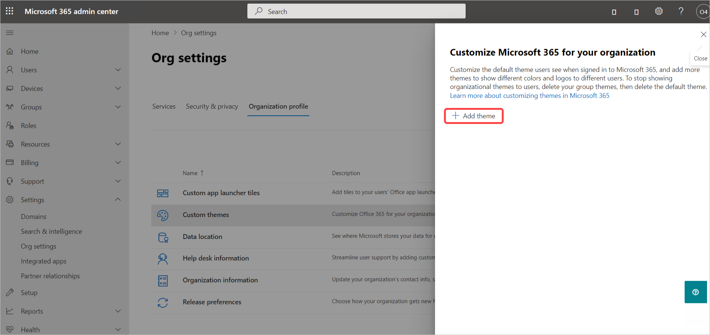

	As you scroll through the pane, review the various theme and branding options that are available for you to update. For this lab, you can change any of the options or leave the default values as is. For example, you can add the logo of your company and set the background image as the default for all your users. Along with these options you can change the colors for your navigation pane, text color, icon color, and accent color. Go ahead and explore the different options for your tenant and make any changes that you wish. <br/>

	**Tip:** Some color patterns aesthetically distract users. If you do change any of the colors, it is recommended that you avoid using high contrasting colors together, such as neon colors and high-resolution colors like bright pink and white.

1. Select **Save** when you are done and then close the **Custom themes** pane once your changes have been saved.

   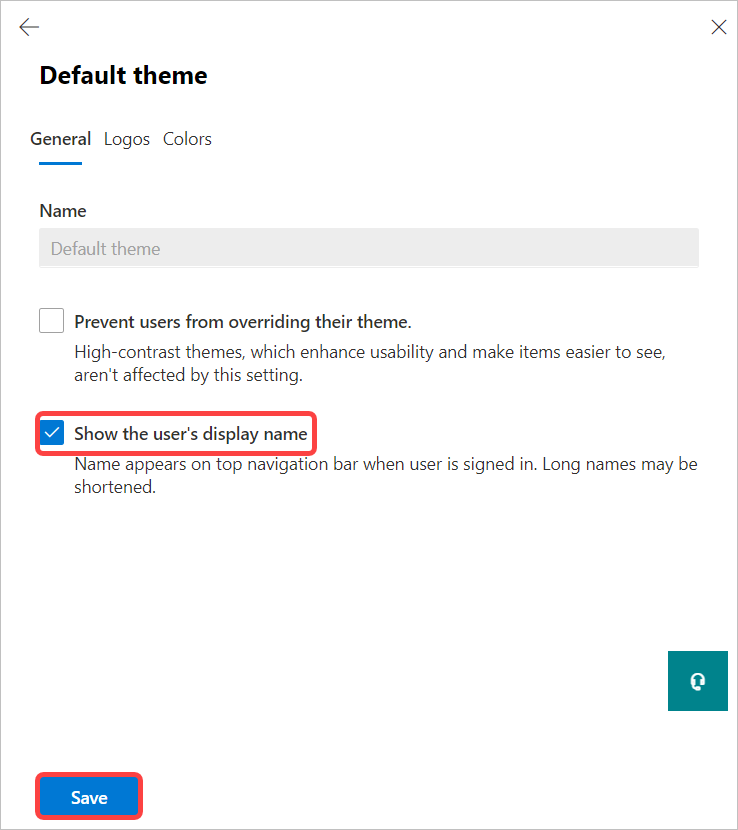


### Task 3 – Prepare for Microsoft Azure Active Directory 

Azure Active Directory is required to perform several configuration steps when installing Microsoft 365. Because several of these steps must be performed using Windows PowerShell, you should begin by installing the Azure Active Directory PowerShell module. This module can simply be installed through PowerShell itself. It allows you to perform many of the Microsoft 365 user and organization administration tasks through PowerShell. It’s great for bulk tasks such as password resets, password policies, license management and reporting, and so on.  

1. On LON-DC1-ID, you must open an elevated instance of **Windows PowerShell**. Select the magnifying glass (Search) icon on the taskbar at the bottom of the screen and type **powershell** in the Search box that appears. In the list of search results, right-click on **Windows PowerShell** (do not select Windows PowerShell ISE) and select **Run as administrator** in the drop-down menu. 

2. Maximize your PowerShell window. In **Windows PowerShell**, at the command prompt type the following command and then press Enter:

		Install-Module MSOnline
	
3. If you are prompted to install the **NuGet provider,** enter **Y** to select **[Y] Yes**. 

4. If you are prompted to confirm whether you want to install the module from an untrusted repository (PSGallery), enter **A** to select **[A] Yes to All.** 

   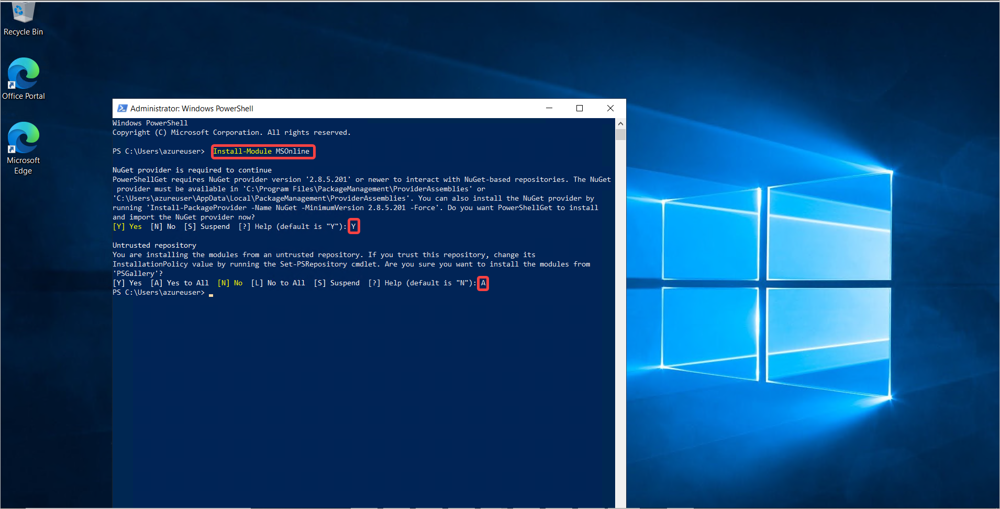

5. Once the installation is complete, the screen will return to the Windows PowerShell command prompt. You must then run the following command to install the Azure AD PowerShell module that you just retrieved in the earlier step:

		Install-Module AzureADPreview
	
6. If you are prompted to confirm whether you want to install the module from an untrusted repository (PSGallery), enter **A** to select **[A] Yes to All.** 

   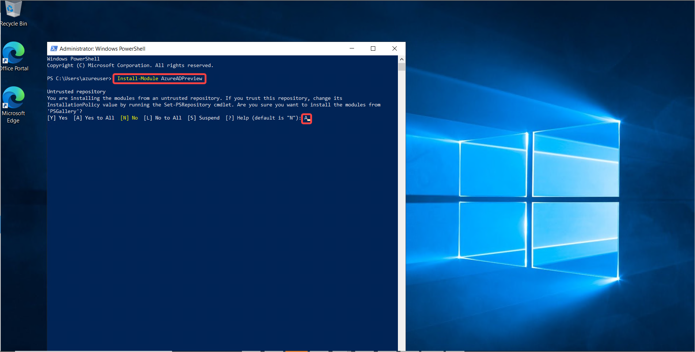

7. Once the installation is complete, the screen will return to the Windows PowerShell command prompt. You have now installed the Windows Azure Active Directory PowerShell Module.

8. Leave the Windows PowerShell window open but minimize it for now.

9. Remain logged into LON-DC1 and keep your Edge browser open.


### Task 4 – Prepare for External Access using Microsoft Teams 

When you get to Module 4, you will perform a lab in which you will create a new service request ticketing system. One of the tasks within that lab requires you to collaborate with one of your fellow student's Microsoft 365 tenant through Microsoft Teams. To enable this communication between your tenant and your fellow student's tenant, you must turn on the **External Access** functionality within Teams. When you turn on this External Access feature, it can take a couple of hours for your system to propagate the changes through your tenant. Therefore, you will turn on this External Access feature in this task so that the internal changes made by the system have time to propagate through your tenant by the time you eventually get to the Module 4 lab.

**Instructor/Student Note:** To facilitate this lab, your instructor should collect each student's tenant ID (ZZZZZZ) from each of their domains (this would be each student's xxxxxZZZZZZ.onmicrosoft.com domain, where xxxxxZZZZZZ is the tenant prefix assigned by your lab hosting provider; ZZZZZZ is the tenant ID portion of the tenant prefix that is unique to each student). The instructor will then assign to each student the tenant ID (ZZZZZZ) from another student (you can NOT be assigned your own tenant ID). When you enable External Access in this task, you will enter the domain associated with the assigned tenant ID from your fellow student (in other words, you will enter the **xxxxxZZZZZZ.onmicrosoft.com** domain, where ZZZZZZ is your fellow student's tenant ID).

By the time you get to the Module 4 labs, External Access should be ready so that you can collaborate with the student whose domain you set up in this task. Conversely, you should also be able to collaborate with the student who entered your domain in his or her External Access setup.

1. On LON-DC1-ID, in your Microsoft Edge browser, you should still be logged into the Microsoft 365 admin center as the ODL_User from the earlier task in which you updated Adatum's organizational profile. <br/>

	If you closed the Microsoft 365 admin center, then perform the same steps as before to open it and sign in as **ODL_User@xxxxxZZZZZZ.onmicrosoft.com** (where xxxxxZZZZZZ is the tenant prefix assigned by your lab hosting provider) with the tenant admin password provided by your lab hosting provider.
	
2. If necessary, in the **Microsoft 365 admin center**, in the left-hand navigation pane, select **...Show All** to display all the navigation menu options.

3. In the **Microsoft 365 admin center**, in the left-hand navigation pane under the **Admin Centers** group, select **Teams**.

4. A new tab will open in your Edge browser that displays the **Microsoft Teams admin center**. If a **Welcome to the Teams admin center** window appears, select **Skip tour**.

5. In the **Microsoft Teams admin center**, in the left-hand navigation pane, select **Org-wide settings** and then select **External access**.

6. On the **External access** page, confirm that the toggle switches for both external access options are in the **On** position. If either are set to **Off**, then set them to **On** now.

7. Below the toggle switches, select **+Add a domain**.

   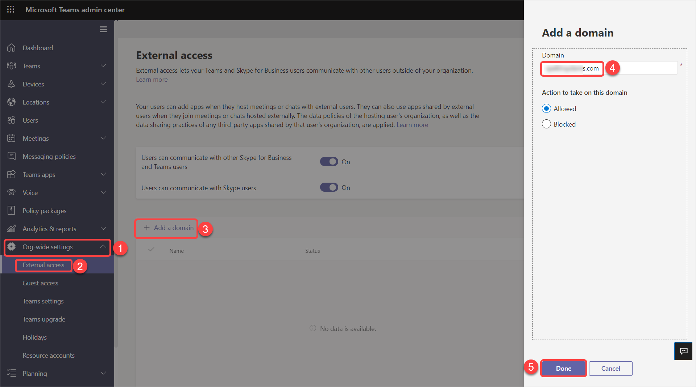

8. In the **Add a domain** pane that appears, enter **xxxxxZZZZZZ.onmicrosoft.com** (where xxxxxZZZZZZ **is your fellow student's tenant prefix** that was assigned to you by your instructor) in the **Domain** field. **Do NOT enter your own tenant prefix.** 

9. In the **Action to take on this domain** field, select **Allowed**, and then select **Done**.

10. On the **External access** page, select **Save**.

   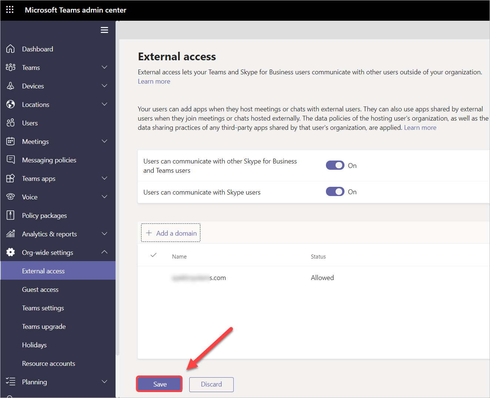

11. In your Microsoft Edge browser, close the **External access - Microsoft Teams** tab. This should return you to the **Microsoft 365 admin center** tab, which you should leave open as you proceed to the next exercise.


# Proceed to Lab 1 - Exercise 2 
