# Learning Path 2 - Lab 1 - Exercise 2 - Manage Users and Groups 

In the following lab exercise, you will take on the role of Holly Dickson, Adatum Corporation’s Enterprise Administrator. In this exercise, you will perform several user and group management functions within Microsoft 365. You will begin by creating a Microsoft 365 user account for Holly, who will be assigned the Global Admin role. You will create two Microsoft 365 groups and assign existing Microsoft 365 users as members of those groups. You will then delete one of the groups and then use Windows PowerShell to recover the deleted group.

**Note:** The VM environment provided by your lab hosting provider comes with ten existing Microsoft 365 user accounts, as well as a large number of existing on-premises user accounts. Several of the existing Microsoft 365 user accounts will be used throughout the labs in this course. This will save you from having to perform the tedious task of creating user accounts, which is typically not a task performed by Enterprise Administrators. Even though the ODL_User account has been set up for you by your lab hosting provider, you will still create Holly Dickson's user account, since having more than one Global admin is a best practice. It will also provide you with the experience of creating a Microsoft 365 user account in case you are not familiar with the process.

### Task 1: Create a User Account for Adatum's Enterprise Administrator

Holly Dickson is Adatum’s Enterprise Administrator. Since a Microsoft 365 user account has not been set up for her, she initially signed into Microsoft 365 as the ODL_User account (the default Global admin) in the previous lab (you did this when you began your role as Holly and signed in using the tenant admin account). In this task, you will continue in your role as Holly Dickson where you should still be logged into Microsoft 365 as the ODL_User. In this lab, Holly will create a personal Microsoft 365 user account for herself, and she will assign her user account the Microsoft 365 Global Administrator role, which gives her the ability to perform all administrative functions within Microsoft 365. Following this task, you will perform all remaining labs using Holly's persona.  

**Important:** As a best practice in your real-world deployment, you should always write down the first Global admin account’s credentials (in this lab, the ODL_User account, whose username is odl_user_xxxxx@zzzzz.onmicrosoft.com, where xxxxxZZZZZZ is the tenant prefix assigned by your lab hosting provider) and store it away for security reasons. **This account should be a non-personalized identity** that owns the highest privileges possible in a tenant. It should **not** be MFA activated (because it is not personalized). Because the username and password for this account are typically shared among several users, this first Global admin is a perfect target for attacks; therefore, it is always recommended that organizations create personalized service admin accounts and keep as few Global admins as possible. For those Global admins that you do create in your real-world deployment, they should each be mapped to a single identity (such as Holly Dickson), and they should each have Multi-Factor Authentication (MFA) enforced. That being said, you will not turn on MFA for Holly's account because time is limited in this training course and we do not want to take up lab time by making you log in using a second authentication method every time Holly logs in.

1. On LON-DC1-ID, the **Microsoft 365 admin center** should still be open in your Edge browser from the prior lab, and you should be signed into Microsoft 365 as the **ODL_User**. 

2. In the **Microsoft 365 admin center**, in the left-hand navigation pane, select **Users** and then select **Active users**. 

3. In the **Active users** list, you will see the list of existing user accounts that were created for you by your lab hosting provider. In this task, you are taking on the role of the **ODL_User**, and as such, you must create a user account for Holly Dickson, who is Adatum's new Enterprise Administrator. In doing so, you will assign Holly the Microsoft 365 role of Global Administrator, which gives Holly global access to most management features and data across Microsoft online services. 

4. In the **Active Users** window, select **Add a user** that appears on the menu bar above the list of active users. This initiates the **Add a user** wizard.

   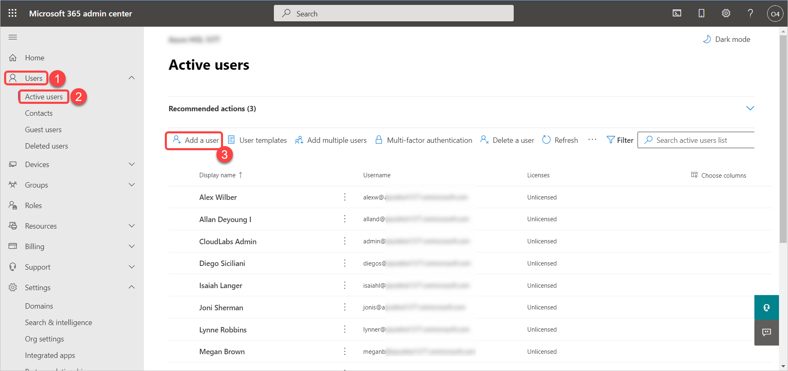

5. In the **Add a user** wizard, on the **Set up the basics** page, enter the following information:

	- First name: **Holly**

	- Last name: **Dickson** 

	- Display name: When you tab into this field, **Holly Dickson** will appear.

	- Username: **Holly**  
	
		‎**IMPORTANT:** To the right of the **Username** field is the domain field. It should be prefilled with the **xxxxxZZZZZZ.onmicrosoft.com** cloud domain (where xxxxxZZZZZZ is the tenant prefix provided by your lab hosting provider).  
	
		After configuring this field, Holly’s username should appear as: 

		**Holly@xxxxxZZZZZZ.onmicrosoft.com**  
	
	- Password settings: Clear (uncheck) the box next to **Automatically create a password**

	- Password: **Pa55w.rd** (Hint: Select the eye icon at the right side of the field to verify the password that you entered)

	- Clear (uncheck) the **Require this user to change their password when they first sign in** check box 

6. Select **Next**.

   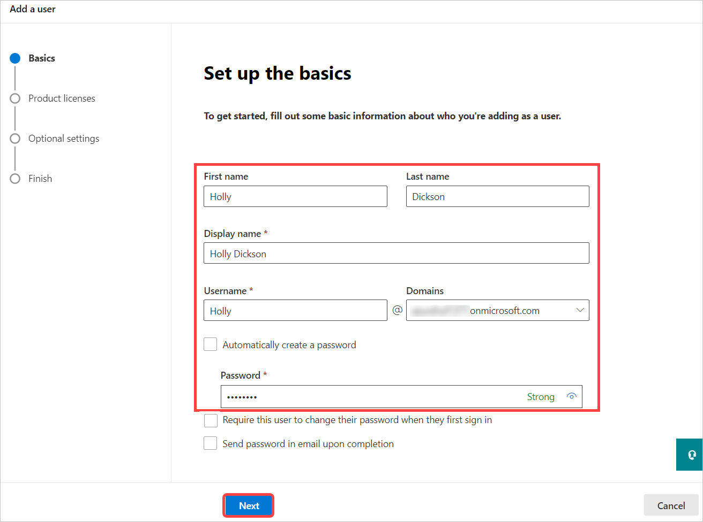

7. In the **Assign product licenses** page, enter the following information:

	- Select location: **United States**

	- Licenses: The **Assign user a product license** option should be selected by default; under this option, select **Office 365 E5** 

8. Select **Next.**

   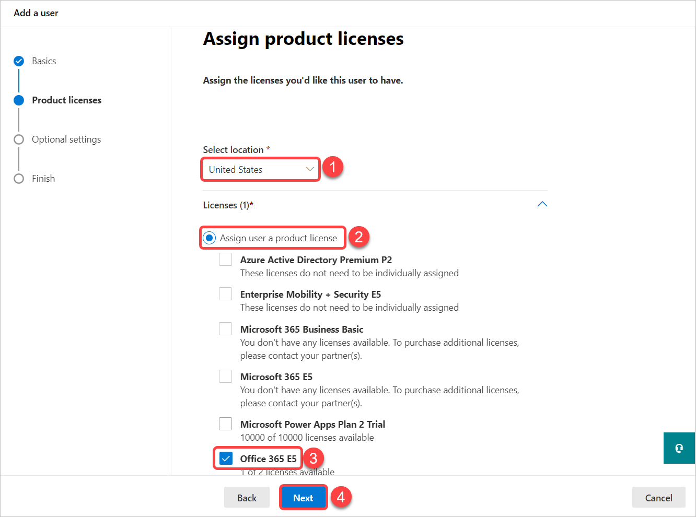

9. In the **Optional settings** window, select the drop-down arrow to the right of **Roles.** 

10. In the **Roles** section, select the **Admin center access** option. By doing so, the most commonly used Microsoft 365 administrator roles are enabled below this option. 

	**Note:** If you scroll down past this list of the most commonly used admin roles and select **Show all by category**, the complete list of admin roles will be displayed (sorted by category). For Holly, you do not need to view all the admin roles by category, since Holly will be assigned the Global admin role that appears in the list of most commonly used roles.

11. Select the **Global administrator** check box and then select **Next**.

   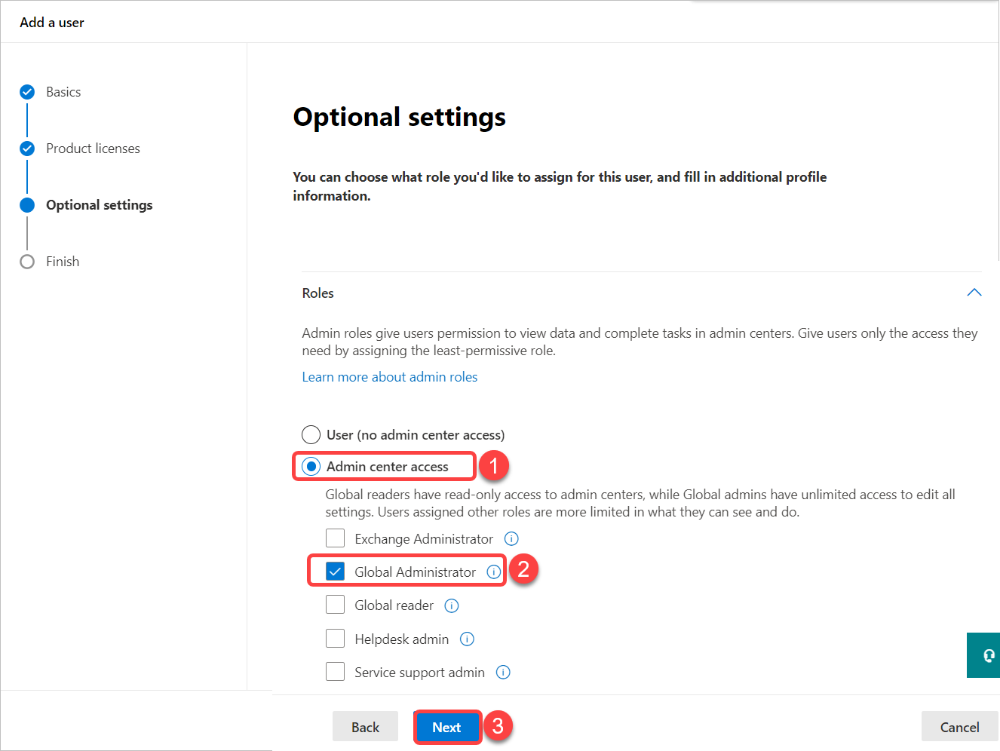

12. On the **Review and finish** window, review your selections. If anything needs to be changed, select the appropriate **Edit** link and make the necessary changes. Otherwise, if everything is correct, select **Finish adding**. 

   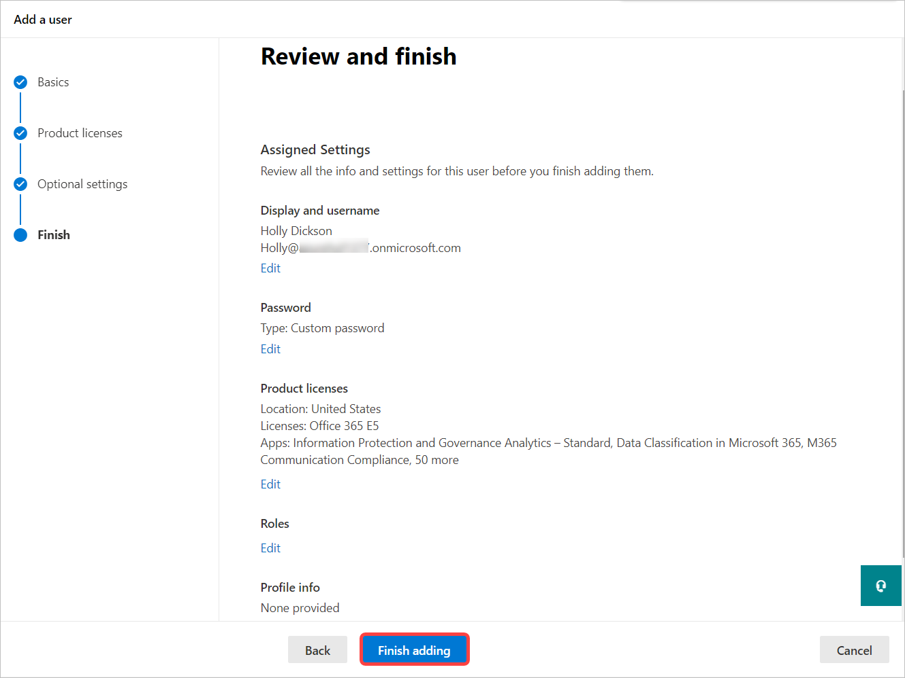

13. On the **Holly Dickson added to Active users** page, under the **User details** section, select **Show** next to the password to verify Holly's password is **Pa55w.rd** and then select **Close.** 

	**Note:** If you accidentally entered a different password, then once you return to the **Active users** page, you must select the **Reset a password** icon (the key icon that appears when you hover over Holly's account) to change her password to **Pa55w.rd**.
	
14. If a survey window appears, select **Cancel**.

15. Remain logged into LON-DC1-ID with the **Microsoft 365 admin center** open in your browser for the next task.

### Task 2: Create and Manage Groups  

After completing the previous task, you should still be signed into the **Microsoft 365 admin center** as the **ODL_User** account. In this task, you will begin implementing Adatum’s Microsoft 365 pilot project as Holly Dickson, Adatum’s new Enterprise Administrator. Therefore, you will begin this task by logging out of Microsoft 365 as the **ODL_User** and you will log back in as Holly. 

In this task, you will create two new groups and then manage the groups by assigning users to them. One group will be a Microsoft 365 group and the other a Security group; this will enable you to see some of the differences in the two types of groups. After creating the groups, you will then delete one of them. This will set up the next task, which examines how to recover a deleted group using Windows PowerShell.

1. On LON-DC1-ID, on the **Microsoft 365 admin center** tab in your Edge browser, select the user icon for the **ODL_User** (the **MA** circle) in the upper right-hand corner of your browser, and in the **ODL_User** window that appears, select **Sign out.**  
	
	**Important:** When signing out of one user account and signing in as another, you should close all the browser tabs except for your current tab (which will be the **Sign out** tab). This is a best practice that helps to avoid any confusion by closing the windows associated with the prior user. Take a moment now and close all other browser tabs except for the **Sign out** tab. 
	
2. In your Microsoft Edge browser, in the **Sign out** tab, enter the following URL in the address bar to sign back into Microsoft 365: **https://portal.office.com** 

3. In the **Pick an account** window, only the tenant admin account (the admin@xxxxxZZZZZZ.onmicrosoft.com account) that you just logged out from appears. Select **Use another account**. 

4. In the **Sign in** window, enter **Holly@xxxxxZZZZZZ.onmicrosoft.com** (where xxxxxZZZZZZ is the tenant prefix provided by your lab hosting provider). Select **Next**.

   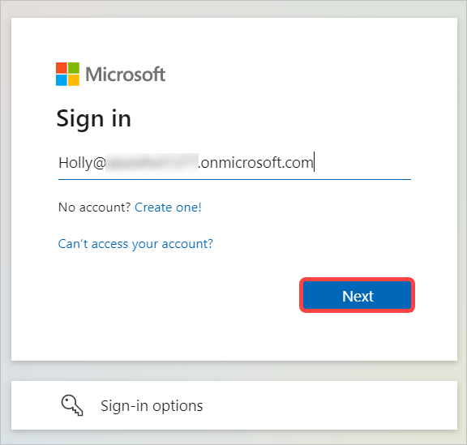 

5. In the **Enter password** window, enter **Pa55w.rd** and then select **Sign in**.

   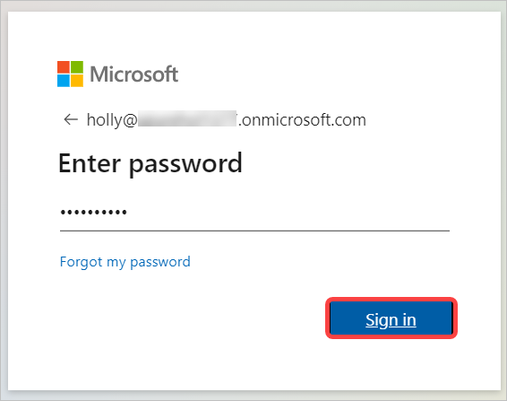 

6. If a **Get your work done with Office 365** window appears, select the **X** to close it. 

7. On the **Office 365 Home** page, in the column of Microsoft 365 app icons that appears along the left side of the screen, select the **Admin** icon to open the Microsoft 365 admin center in a new browser tab.

   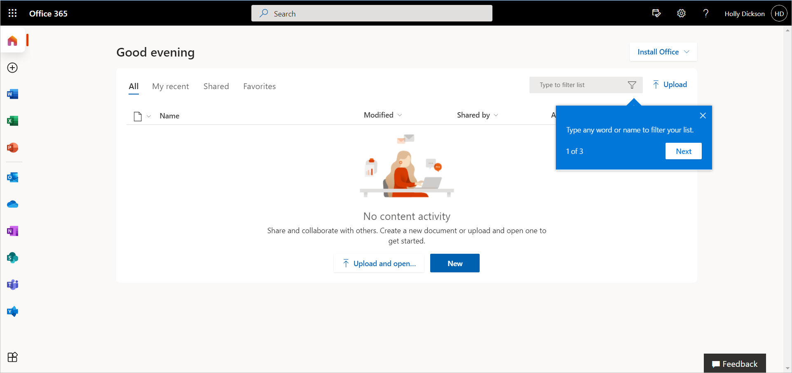

   

8. If a survey window appears, select **Cancel**.

9. In the **Microsoft 365 admin center**, select **Groups** in the left-hand navigation pane, and then under it, select **Active Groups**. 

10. In the **Active groups** page, select **Add a group** that appears on the menu bar above the list of groups. This initiates the **Add a group** wizard. 

   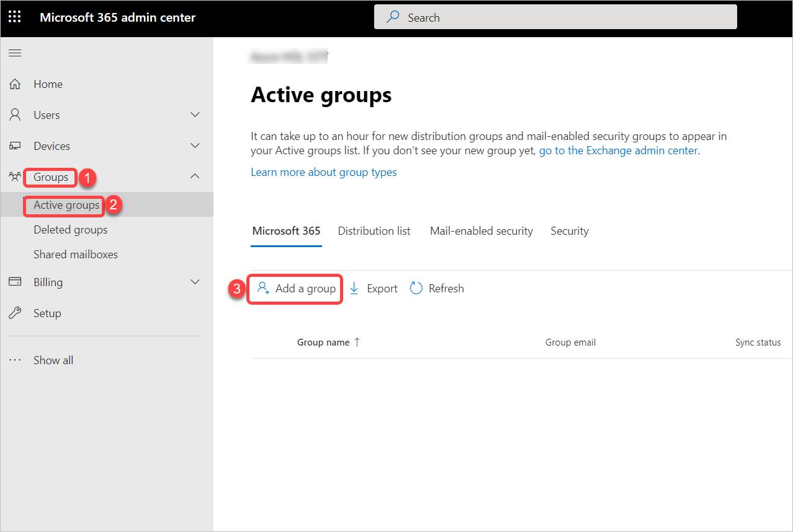

11. In the **Add a group** wizard, on the **Choose a group type** page, select **Microsoft 365 (recommended)** and then select **Next**. 

   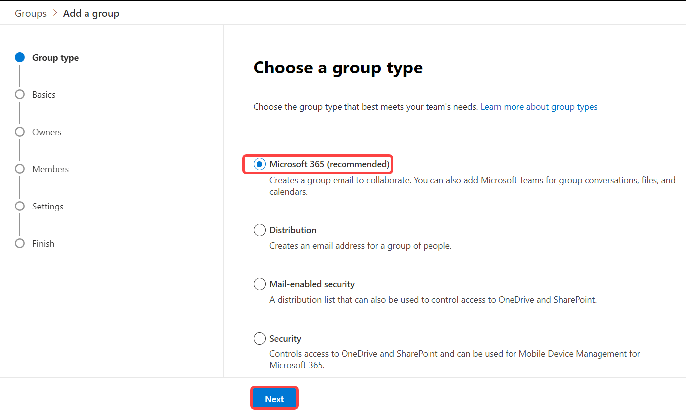

12. In the **Set up the basics** page, enter **Inside Sales** in the **Name** field, and then enter **Collaboration group for the Inside Sales team** in the **Description** field (even if you don't enter a description, you must still select into this field to enable the **Next** button). Select **Next**.

   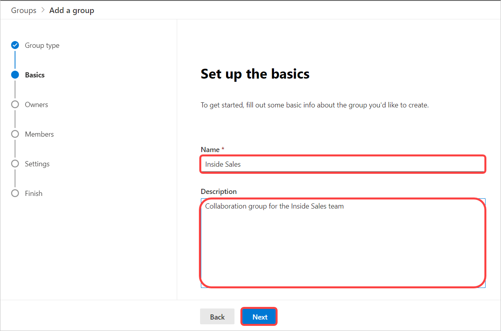

13. You will now assign **Allan Deyoung** and **Patti Fernandez** as owners of the **Inside Sales** group. In the **Assign owners** window, select **+ Assign owners**.

14. In the list of users that appears, select **Allan Deyoung** and **Patti Fernandez**, and then select **Add (2)**.

   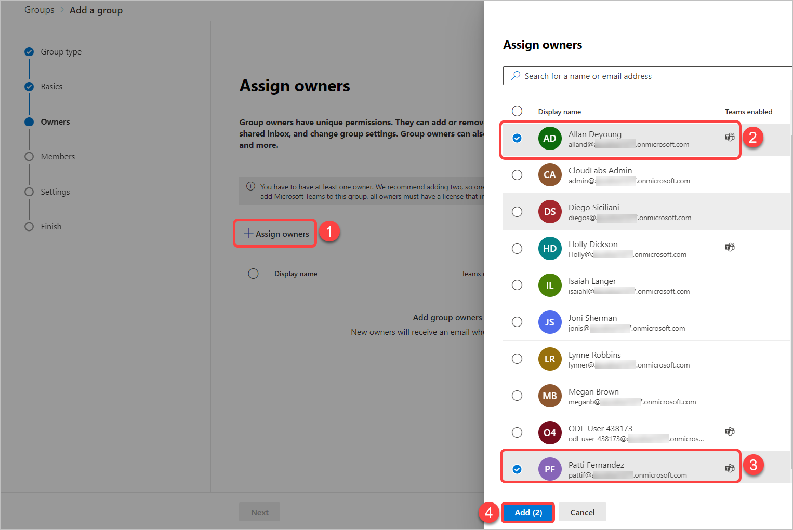

15. On the **Assign owners** page, Allan and Patti should appear as owners of the group. Select **Next**.

   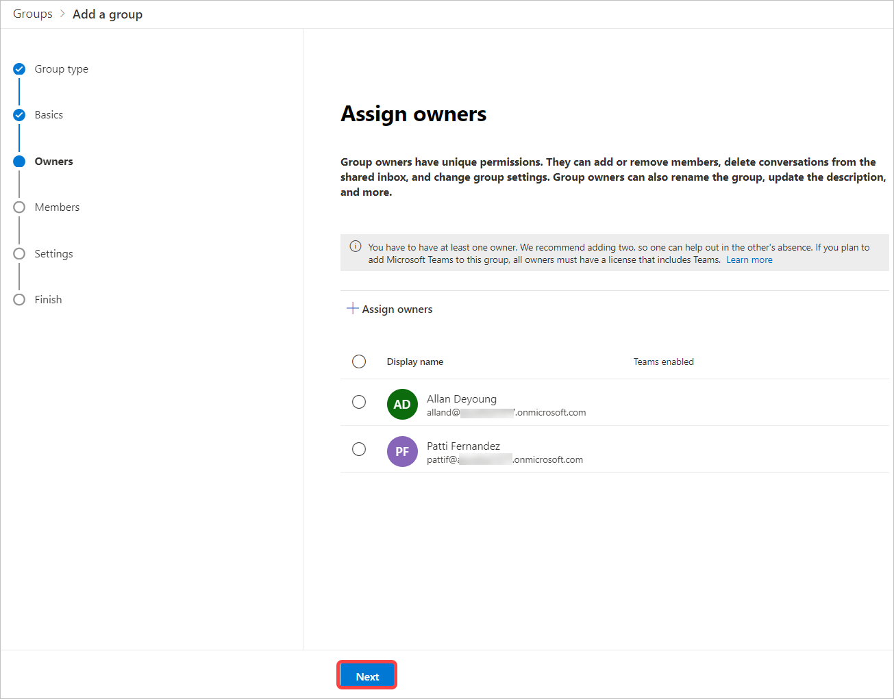

16. You will now assign Diego Siciliani and Lynne Robbins as members of the Inside Sales group. In the **Add members** page, select **+ Add members**.

17. In the list of users that appears, select **Diego Siciliani** and **Lynne Robbins**, and then select **Add (2)**.

   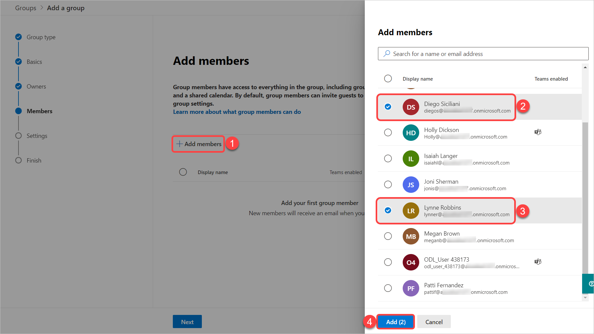

18. On the **Add members** page, Diego and Lynne should appear as members of the group. Select **Next**.

   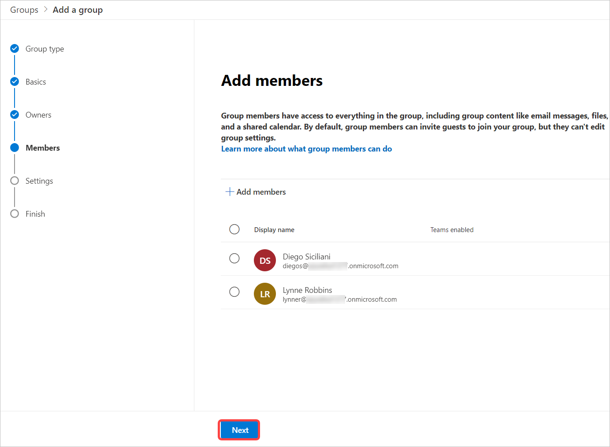

19. In the **Edit settings** page, enter the following information:  

	- Enter **insidesales** in the **Group email address** field
	- Even though Public is displayed in the **Privacy** field, select the field to display the two options that are available. Select **Public**.
	- Under the **Add Microsoft Teams to your group** section, verify the **Create a team for this group** check box is selected (select it if need be), and then select **Next**.

   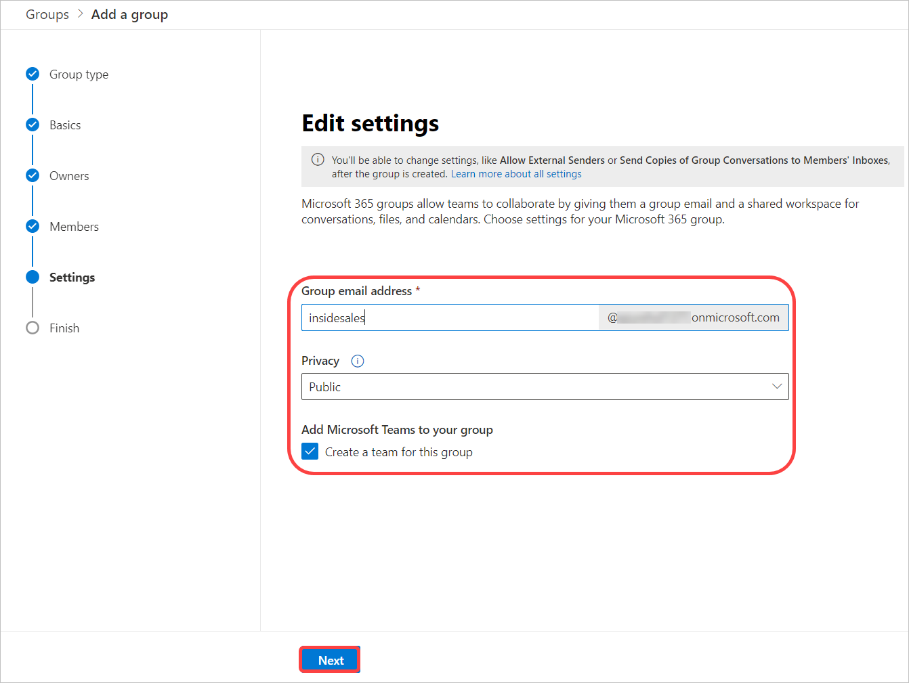

20. In the **Review and finish adding group** page, review the content that you entered. If anything needs to be fixed, select **Edit** under the specific area that needs adjustment, make any necessary corrections, and then select **Next** to continue back to this page. Once everything is correct, select **Create group**.

   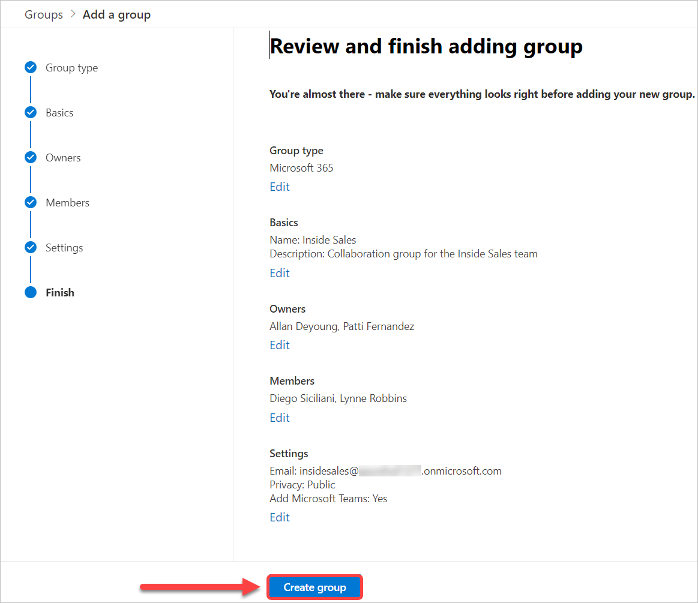

21. On the **New group created** window, note the comment at the top of the page that it may take 5 minutes for the new group to appear in the list of groups.  

	Select **Close**. This returns you to the **Active groups** page. 

22. Repeat steps 10-21 to add a new group with the following information:

	- Group type: **Security**

	- Name: **IT Admins**

	- Description: **IT administrative personnel** 

	**Note:** there is no owner, email address, or privacy setting for Security groups

   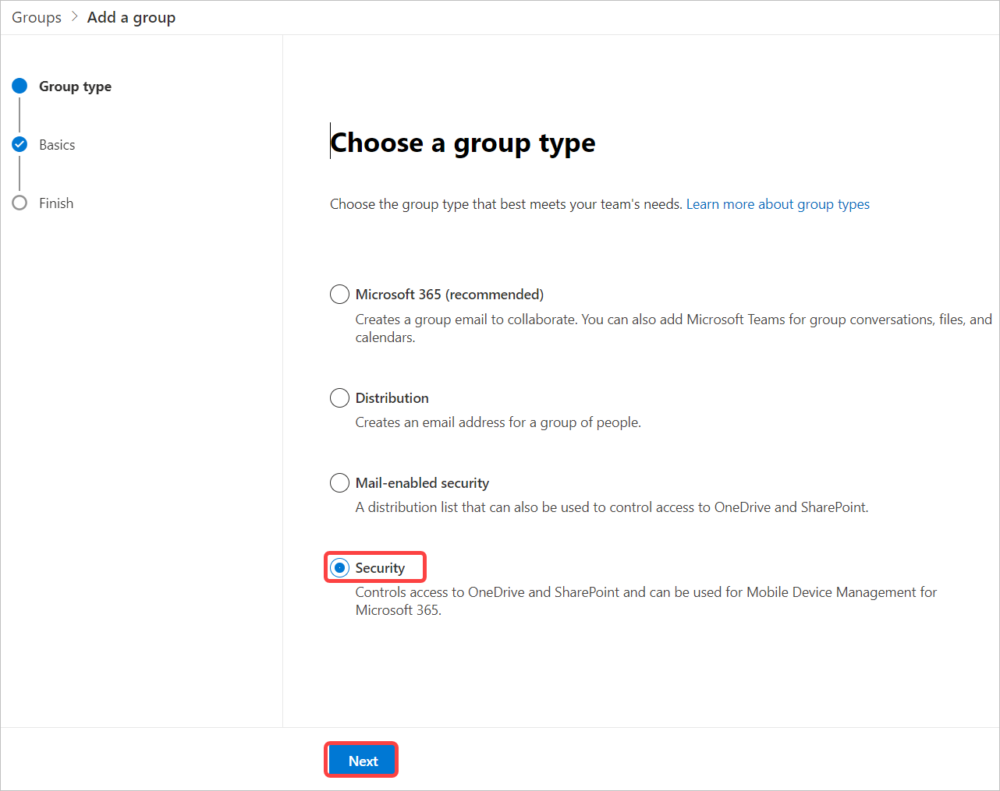

   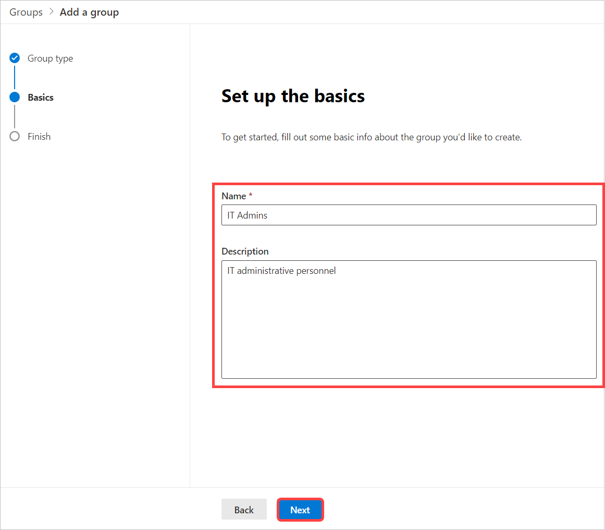

23. If either of the two new groups do not appear in the **Active groups** list, wait a minute or so and then select the **Refresh** option on the menu bar (to the right of **Add a group**). You may need to wait an additional minute or two for both groups to appear.

	**Note:** The IT admins group does not have a group email address because it's a Security group. Two additional group types are Mail-enabled Security groups and Distribution groups. Neither of these group types were used in this lab because it can take up to an hour for these two types of groups to appear in the Groups list; whereas Microsoft 365 groups and Security groups usually take just a matter of minutes to appear. 

24. You’re now ready to add members to the groups. In the list of **Active groups**, select the **IT Admins** group. 

25. In the **IT Admins** pane that appears, the **General** tab is displayed by default. Select the **Members** tab.

26. The **Members** tab displays sections for the Owners and the Members. Under the **Members** section, you can see that there are zero (0) members. Under this section, select **View all and manage members** to add members to the group. 

   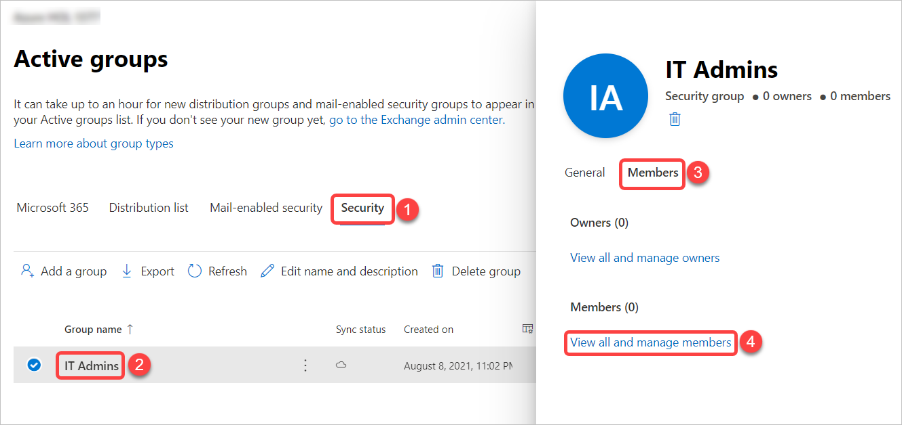

27. In the **Members** window that appears, select **+ Add members**. This displays the list of active Microsoft 365 users.

28. In the list of users, select the check boxes for **Isaiah Langer**, **Megan Brown** and **Nestor Wilke**, and then at the bottom of the window select **Add (3)**. 

   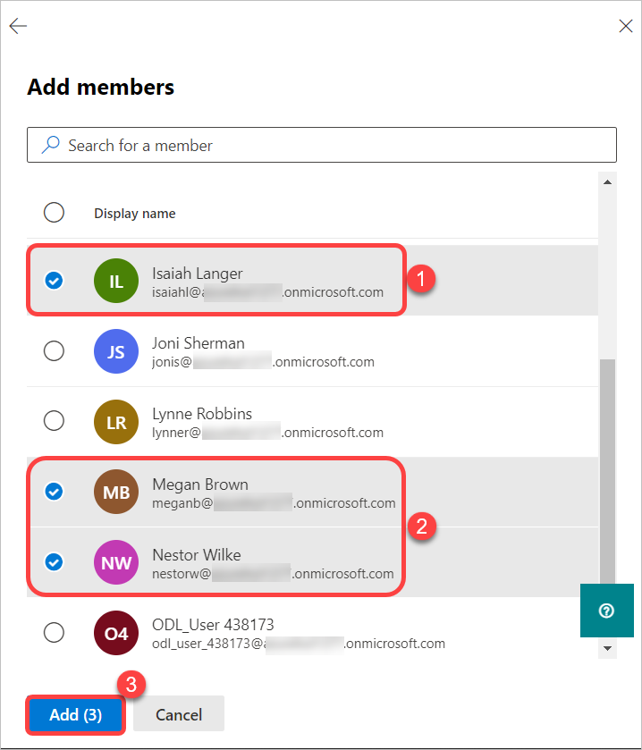

29. Verify that the members list has the three users and select the **X** to close the members pane. This displays the list of users for this group. Select **Close** again. 

30. You now want to test the effect of deleting a group. In the list of **Active groups,** select the vertical ellipsis icon (**More actions**) that appears to the right of the **Inside Sales** group. In the drop-down menu that appears, select **Delete group**. 

31. In the **Delete Inside Sales?** pane that appears, select the **Delete group** button.

   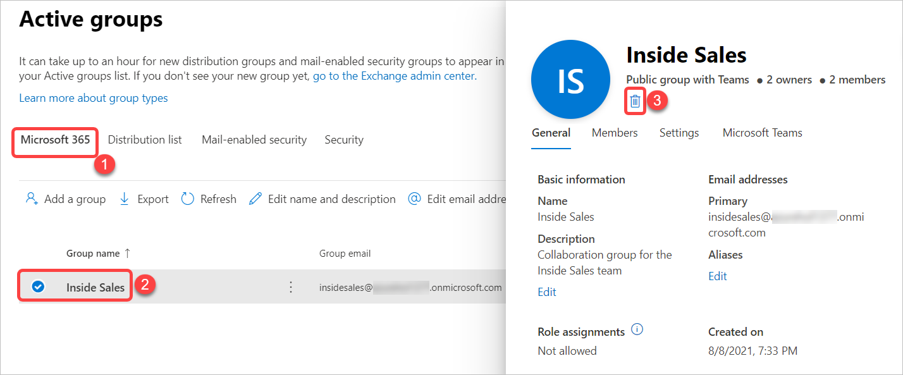

32. Once the group is deleted, select **Close**. 

33. This will return you to the list of **Active groups** in the **Microsoft 365 admin center**. The **Inside Sales** group should no longer appear. If the Inside Sales group still displays, wait a couple of minutes and then select the **Refresh** option on the menu bar. The updated **Active groups** list should no longer include the Inside Sales group.

34. To verify whether deleting this group affected any of its owners or members, select **Users** and then **Active Users** in the left-hand navigation pane. 

35. In the **Active users** list verify that the Inside Sales group's two owners (**Allan Deyoung** and **Patti Fernandez**) and the two members (**Diego Siciliani** and **Lynne Robbins**) still appear in the list of users. This verifies that deleting a group does not delete the user accounts that were owners or members of the group.

36. Remain logged into LON-DC1-ID with the **Microsoft 365 admin center** open in your browser for the next task.

### Task 3: Recover Groups using PowerShell 

In this task, you will use Windows PowerShell to recover the Inside Sales group that you previously deleted. To use Windows PowerShell to perform this Azure AD-related task, the Windows Azure Active Directory PowerShell Module must be installed. 

**NOTE:** You should have installed the Windows Azure Active Directory PowerShell Module in the prior lab exercise.   

1. If you’re not logged into LON-DC1-ID, then please do so now.

2. If Windows PowerShell is still open from the previous exercise, select the **Windows PowerShell** icon on the taskbar; otherwise, you must open an elevated instance of Windows PowerShell just as you did before. Maximize your PowerShell window.

3. In **Windows PowerShell**, at the command prompt type the following command and then press Enter to connect with an authenticated account to use Active Directory cmdlet requests:   

		Connect-AzureAD   

4. A new window will appear requesting your credentials. Sign in using Holly's Microsoft 365 account of **Holly@xxxxxZZZZZZ.onmicrosoft.com** (where xxxxxZZZZZZ is the tenant prefix provided by your lab hosting provider) and **Pa55w.rd** as the Password.  

   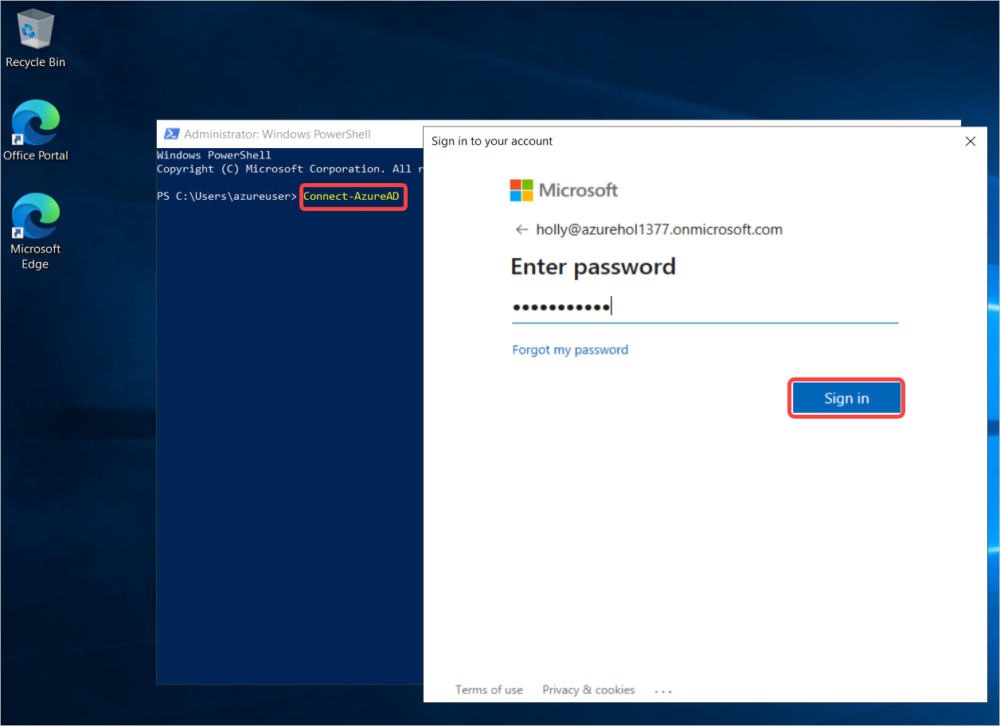

5. At the command prompt, type the following command and then press Enter to display the repository of deleted groups (this should display the **Inside Sales** group that you earlier deleted):   
	
		Get-AzureADMSDeletedGroup   

   

6. At the command prompt, either type or copy and paste in the following command; however, do not press Enter yet as you must first replace {objectId} with the actual Object ID of the deleted Inside Sales group. 

		Restore-AzureADMSDeletedDirectoryObject -Id {objectId}

	After entering or copy and pasting in the command, you must replace {objectId} with the Object ID of the Inside Sales group that appears in the table of deleted groups that was displayed after you ran the command in the prior step. To do so, you must select the entire ID of the Inside Sales group and then copy it to the clipboard by pressing Ctrl-C. To paste in the object ID, place your cursor in the correct position in the command line where {objectId} should appear and then press Ctrl-V.  
	
	After pasting in the Object ID, press Enter to run the command. This will retrieve and restore the deleted group whose Object ID matches the value you entered.  

	**NOTE:** If nothing happens when you hit Enter, then extraneous hidden characters may have been pasted in following the object ID. If this occurs, retype the command and then after pasting in the object ID, hit the Delete key a couple of times to delete any extraneous characters that may have been pasted in following the object ID, and then press Enter again.   

   
		
7. Leave your Windows PowerShell window open for the next exercise; simply minimize the PowerShell window for now.

8. You should now verify the **Inside Sales** group has been recovered. To do this, go to the **Microsoft 365 Admin Center** in your Edge browser, and then under **Groups** in the left-hand navigation pane, select **Active groups**. 

9. Verify the **Inside Sales** group has been restored and is present in the list of active groups. If the Inside Sales group does not appear, wait a minute or two and then select **Refresh** on the menu bar above the list of groups.

10. You now want to verify that the recovery process correctly updated the group's membership. From the **Active groups** windows, select the **Inside Sales** group.

11. In the **Inside Sales** pane, select the **Members** tab. **Allan Deyoung** and **Patti Fernandez** should appear as owners of the group, and **Diego Siciliani** and **Lynne Robbins** should appear as members of the group.

   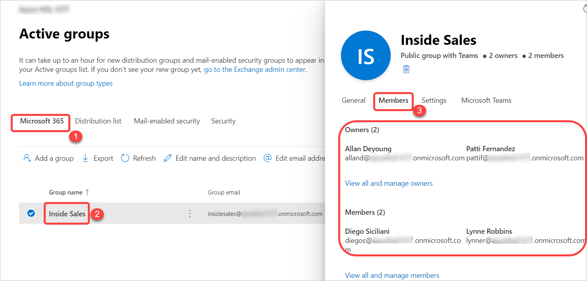

12. Close the **Inside Sales** window.

13. Remain logged into LON-DC1-ID and leave your browser tabs open so that they’re ready for the next task. 

# Proceed to Lab 1 - Exercise 3

