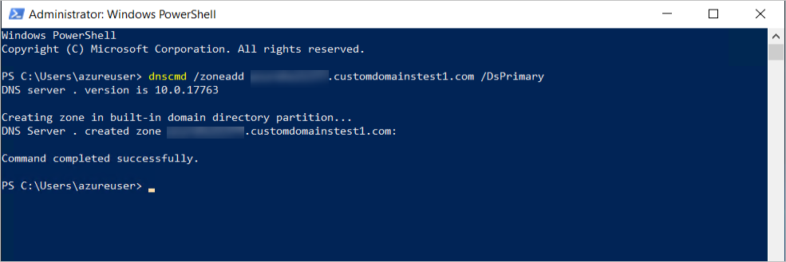
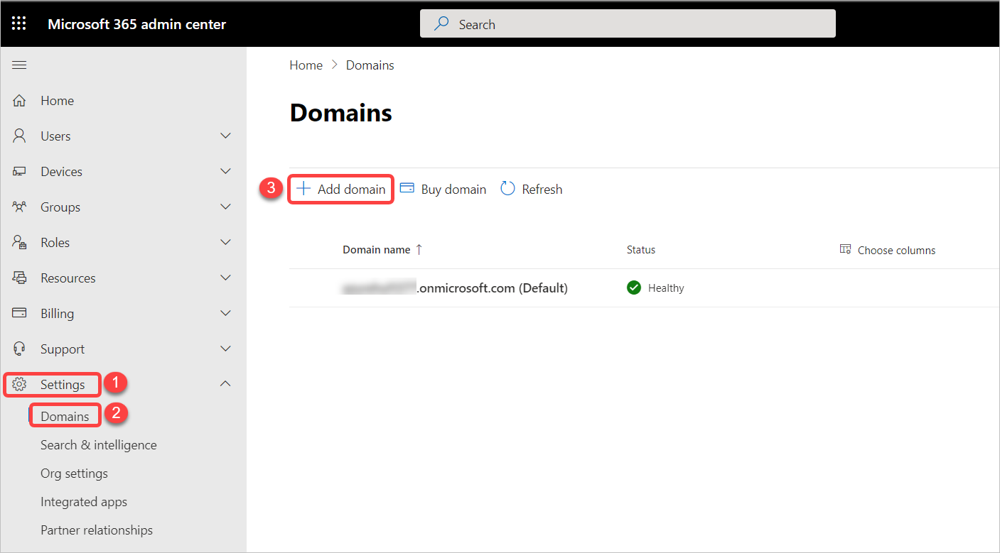
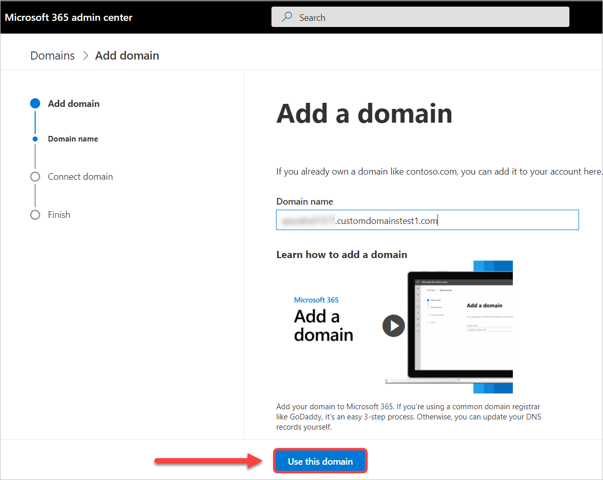
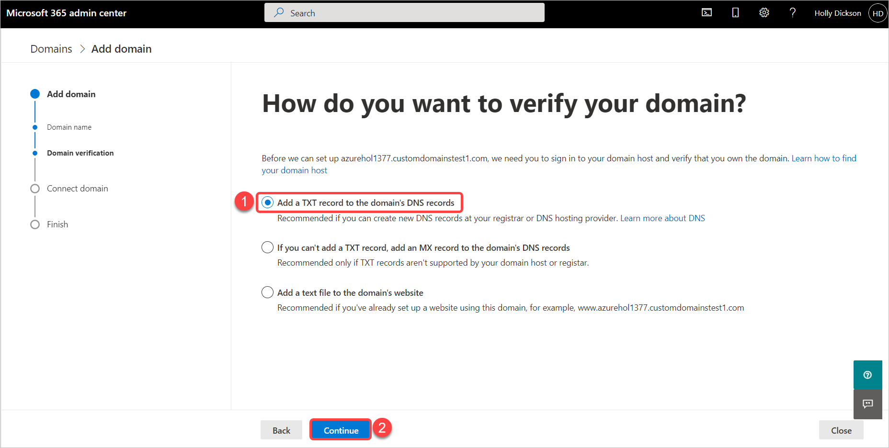
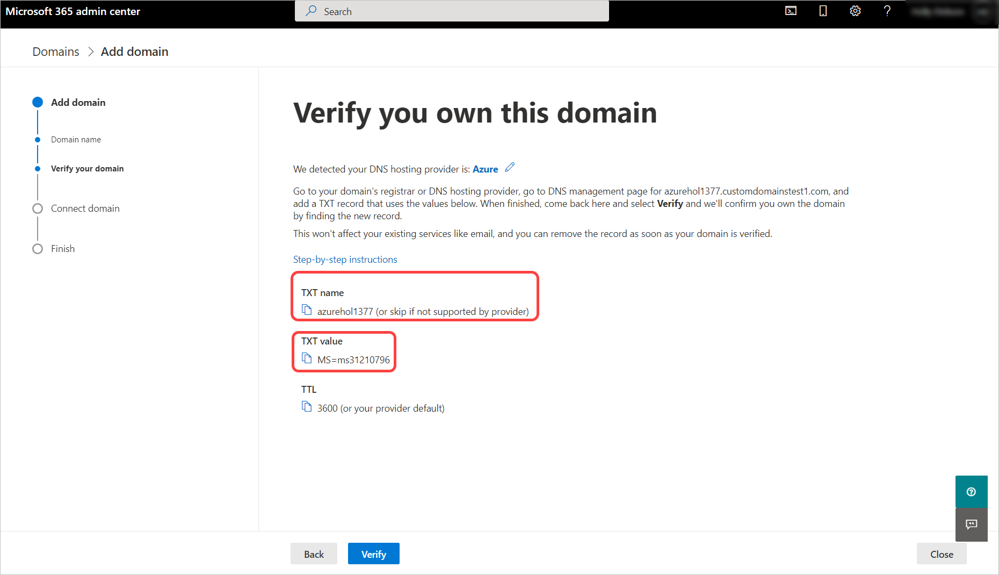
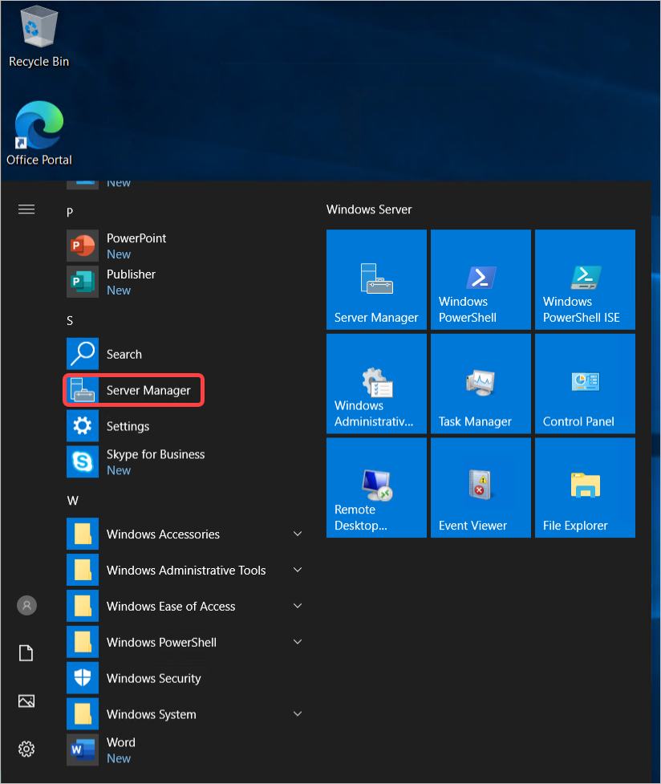
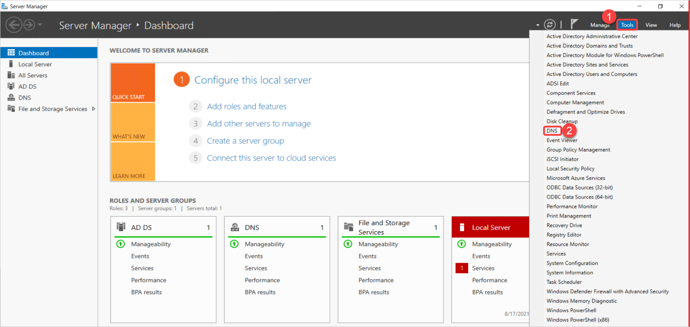
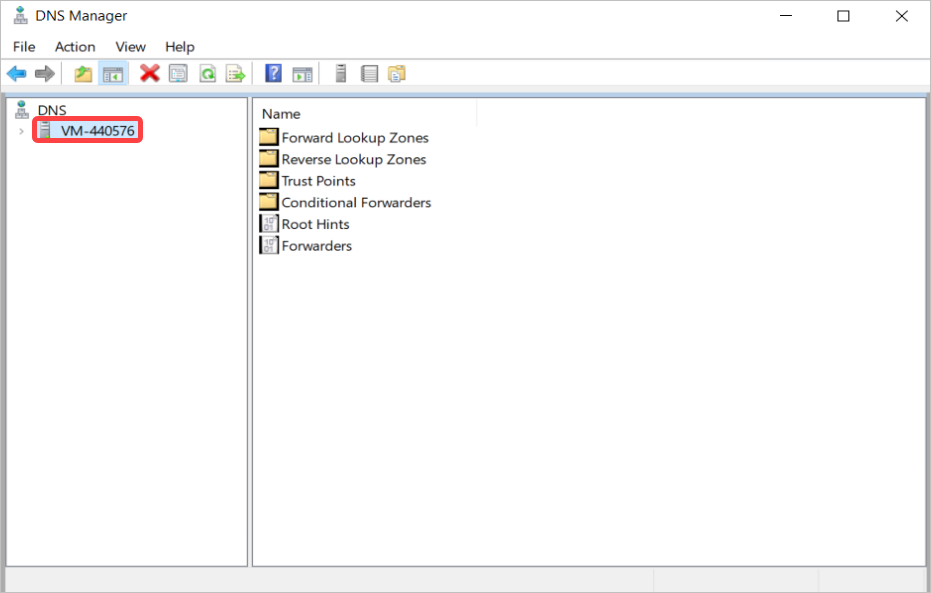
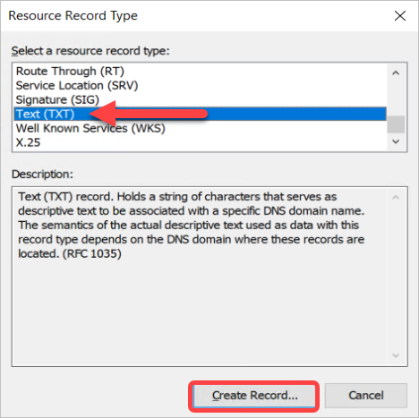
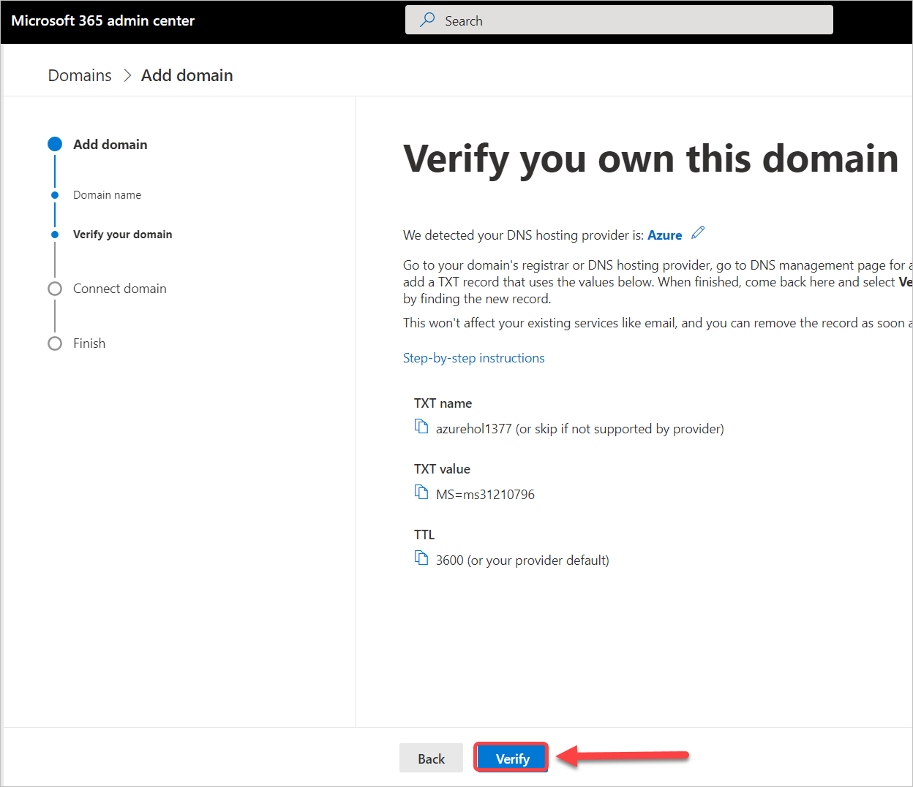

# Learning Path 2 - Lab 1 - Exercise 3 - Add a Custom Domain

Not every company has just one domain; in fact, many companies have more than one domain. Adatum has just purchased a new domain (xxxUPNxxx.xxxCustomDomainxxx.xxx; the exact name of which is provided by your lab hosting provider) that resides in Microsoft Azure but not in Adatum's on-premises environment. To support Adatum’s new custom domain, your lab hosting provider took on the role of Adatum’s third-party domain registrar. 

In this exercise, you will gain experience adding this domain to Adatum' Microsoft 365 deployment. When you add a domain to Microsoft 365, it's called an accepted, or custom domain. Custom domains allow companies to have their own branding on emails and accounts so that customers can verify who is emailing them (for example, @contoso.com). When a company adds a new domain to Microsoft 365, it must also maintain the DNS records that are necessary to support the services required by the company for the new domain. 

Most companies do not personally manage their domains' DNS records themselves; instead, they have a third-party resource that manages these records for them. To assist in this effort, Microsoft 365 provides certain third-party domain registrars with an automation tool that automatically adds and replaces a company’s DNS records. The automation tool also federates the sign in credentials for the third-party registrars and Microsoft 365. Using a tool to automatically maintain DNS records is a much-welcomed improvement from the days when companies had to manually maintain these records, which oftentimes introduced human error into a rather complicated process. Because these tools eliminate the need to manually add the DNS records, they eliminate human error from the process.

That being said, for the purpose of this lab, you will be asked to manually create the necessary DNS records required by this new custom domain. In the other Microsoft 365 training courses that use a custom domain (such as MS-101T00 and MS-030T00), the custom domain and its DNS records will be added into Adatum's Microsoft 365 deployment by the lab hosting provider, who will take on the role of the third-party domain registrar for Adatum. However, this MS-100T00 training course will task you with adding the domain and creating its required DNS records so that you gain experience and understanding of what the DNS records are about and why they are required for a new domain.

### Task 1 - Add a Custom Domain

In your hosted lab environment, Adatum already has an existing on-premises domain titled **adatum.com**, along with a Microsoft 365 domain titled **xxxxxZZZZZZ.onmicrosoft.com**. In this lab, you will create a second Microsoft 365 domain for Adatum that will be titled **xxxUPNxxx.xxxCustomDomainxxx.xxx**; you will replace **xxxUPNxxx** with the UPN name assigned to your tenant by your lab hosting provider, and you will replace **xxxCustomDomainxxx.xxx** with your lab hosting provider's custom domain name. Your instructor will provide you with your lab hosting's provider's custom domain name as well as show you how to locate the UPN name.

1. If you’re not logged into Lab VM, then please do so now.

1. If Windows PowerShell is still open from the previous exercise, select the **Windows PowerShell** icon on the taskbar; otherwise, you must open an elevated instance of Windows PowerShell just as you did before. Maximize your PowerShell window.

1. At the command prompt, you should run the following command to create a new zone in your on-premises DNS (remember to replace xxxUPNxxx with the unique UPN name assigned to your tenant by your lab hosting provider, and replace xxxCustomDomainxxx.xxx with your lab hosting provider's custom domain name):  

		dnscmd /zoneadd xxxUPNxxx.xxxCustomDomainxxx.xxx /DsPrimary
    
1. Minimize your Windows PowerShell window (do NOT close it as you will use it later).

   

1. In your Microsoft Edge browser that was left open from the prior task, you should still be logged into Microsoft 365 as Holly Dickson. In the left-hand navigation pane in the **Microsoft 365 admin center**, select **...Show all**, select **Settings**, and then under the **Settings** group select **Domains**. 

1. On the **Domains** page, note that in the list of domains, only the **xxxxxZZZZZZ.onmicrosoft.com** domain appears. The existing on-premises **adatum.com** domain does not appear in the list of Microsoft 365 domains. To add Adatum's new Microsoft 365 domain, select **+Add domain** in the menu bar that appears above the list of domains; this will start the **Add domain** setup wizard. 

   

1. In the **Add a domain** page, in the **Domain name** field, enter your domain name in the form of **xxxUPNxxx.xxxCustomDomainxxx.xxx** (where xxxUPNxxx is the unique UPN name provided by your lab hosting provider, and xxxCustomDomainxxx.xxx is your lab hosting provider's domain name), and then select **Use this domain**. 

   

1. In the **How do you want to verify your domain?** page, you must select a verification method to prove you own the domain. For this lab, select the **Add a TXT record to the domain's DNS records** option and then select **Continue**. 

   

1. On the **Verify you own this domain** page, you must copy the **TXT value** (NOT the TXT name) so that you can configure the domain later on in DNS Manager. To do so, select the **Copy record** icon that appears to the left of the **TXT value** (to the left of **MS=msXXXXXXXX**). If a dialog box appears, select **Allow access** to copy this value from the webpage to your clipboard.   

    ‎**Important:** Do not select the **Verify** button at this point; instead, proceed to the next step. However, if you did select the **Verify** button, you will receive an error indicating the system could not find the record you added for this domain (you can do this if you want to see the error; there is no harm in it). Therefore, you must complete the next series of steps to add the TXT record to this domain in **DNS Manager**. Once you finish that process, you will be instructed to return back to this page and select the **Verify** button so that you can complete the process of adding this domain in the Microsoft 365 admin center. 

   

1. Before you can verify you own this domain in the **Add domain** wizard, you must first add a DNS record for this domain in Server Manager. Select the **Server Manager** icon that appears in your taskbar at the bottom of the page. Maximize the Server Manager window if necessary.

   

1. In **Server Manager Dashboard,** select **Tools** in the top right corner of the window. In the drop-down menu that appears, select **DNS**, which will open **DNS Manager**. Maximize the DNS Manager window.

   

   

1. In the **DNS Manager** window, in the **File Explorer** section in the left-hand column, under **VM-Deployment-ID** expand the **Forward Lookup Zones** folder and then select the **xxxUPNxxx.xxxCustomDomainxxx.xxx** zone that you previously added in Windows PowerShell (where xxxUPNxxx is the unique UPN name provided by your lab hosting provider and xxxCustomDomainxxx.xxx is your lab hosting provider's domain name). 

1. Right-click on this **xxxUPNxxx.xxxCustomDomainxxx.xxx** zone, and in the menu that appears, select **Other New Records...** 

   

1. In the **Resource Record Type** window that appears, in the **Select a resource record type** field, scroll down and select **Text (TXT),** and then select the **Create Record...** button at the bottom of the window.

   

1. In the **New Resource Record** box, in the **Text (TXT)** tab, leave the **Record name** field blank. However, right-click in the **Text** field and select **Paste** from the menu that appears. This will paste in the TXT valued of **MS=msXXXXXXXX** that you copied to the clipboard when you were in the Microsoft 365 admin center.

   

1. Select **OK** to create the record. 

1. In the **Resource Record Type** window, select **Done**. Note how this Text (TXT) record appears in the details pane on the right for the xxxUPNxxx.xxxCustomDomainxxx.xxx domain that you previously created.  

	Leave your **DNS Manager** window open but minimize it as you will return to it in a later step in this task.  Minimize the **Server Manager** window as well. 

1. You are now ready to return to the Microsoft 365 admin center and resume adding the domain record. If you’ll recall, when you were earlier adding the domain in the Microsoft 365 admin center, you indicated that you wanted to verify the domain using a TXT record. At that point you had to switch to DNS Manger and add the TXT record. Now that you’ve added the TXT record, you can go back to the Microsoft 365 admin center and proceed with the domain verification process. 

	‎In your Edge browser, you should be back in the **Microsoft 365 admin center** tab that displays the **Verify you own this domain** page. The **TXT name** should display your UPN name (xxxUPNxxx) and the **TXT value** should display your MS=msXXXXXXXX value.

1. Scroll to the bottom of the window and select **Verify.**    

	**Note:** If you selected **Verify** in the prior step when you copied the TXT value just to see the error that you would receive, the **Verify** button changed to **Try again**. In you did this, then select **Try again** rather than **Verify**.  
	
	**Warning:** It can sometimes take up 5 to 10 minutes for the change that you just made to propagate through the system, and sometimes it can take significantly longer depending on your registrar (in this case, your lab hosting provider). If you receive an error indicating the system could not detect the record that you added, wait 5 minutes and select the **Try again** button. Continue to do so every 5 minutes or so until the TXT record is successfully verified, at which point the **Activate records** window will appear. 

    ‎**Important:** If you had a typo or any other configuration mistakes, the domain will not be verified. If this occurs, the **How do you want to connect to your domain?** window in the next step will not appear. In this case, select the **Back** button to repeat this task. Take your time when configuring the domain to make sure you don’t run into similar issues at this step in the process.

   

1. If your Text (TXT) record was successfully verified, the **How do you want to connect to your domain?** window will appear. Select **Continue**.

1. In the **Add DNS records** window, it enables you to add DNS records for three services that DNS supports - Exchange and Exchange Online Protection, Skype for Business, and Intune and Mobile Device Management for Microsoft 365.  

	**Exchange and Exchange Online Protection** is displayed by default and its check box is also selected by default. To see the other two services, select **Advanced Options**. Note that under **Advanced Options**, neither the **Skype for Business** nor the **Intune and Mobile Device Management for Microsoft 365** check boxes are selected. This is sufficient for Adatum; you should NOT select either of these two check boxes. Only the **Exchange and Exchange Online Protection** check box should be selected.  
	
	Under the **Exchange and Exchange Online Protection** service, the description indicates that 3 DNS records are needed for it to work properly: a Mail Exchanger (MX) record, an Alias (CNAME) record, and an additional Text (TXT) record. You must now switch back and forth between this **Add DNS records** page and **DNS Manager** to add these three additional DNS records for the new domain. For each DNS record that you add in DNS Manager, you will copy information from this **Add DNS records** page and then paste it into each corresponding record that you create in DNS Manager.   

	On the **Add DNS records** page, under the **Exchange and Exchange Online Protection** section, select the arrow (**>**) in the **MX Records** section to expand it. This displays the **Expected value** that the domain setup wizard expects to see in the MX record that you create for this domain in DNS Manager.  
	
	Then select the arrow (**>**) in the **CNAME Records** section and the **TXT Records** section. All three record types should now be expanded.
	
1. You will begin by adding the **MX record** required by the **Exchange and Exchange Online Protection** service. 

	a. In the **MX Records** section, under the **Points to address or value** column, select the copy icon that appears to the left of the expected value (for example, xxxUPNxxx-xxxCustomDomainxxx-xxx.mail.protection.outlook.com) to copy this value to the clipboard. If a dialog box appears, select **Allow access** to allow the webpage to copy the value to the clipboard.
	
	b. You must now switch to DNS Manager. On the taskbar at the bottom of the page, select the **DNS Manager** icon.

	c. In **DNS Manager**, under **Forward Lookup Zones**, the **xxxUPNxxx.xxxCustomDomainxxx.xxx** domain should be selected from when you earlier left off. If not, select this zone now. You should see the **TXT** record that you created earlier. You must now create a **Mail Exchanger (MX)** record for this domain. Under **Forward Lookup Zones**, right-click the **xxxUPNxxx.xxxCustomDomainxxx.xxx** domain and select **New Mail Exchanger (MX)...**

	d. In the **New Resource Record** window, in the **Mail Exchanger (MX)** tab, leave the **Host or child domain** field blank, but right-click in the **Fully qualified domain name (FQDN) of mail server** field and select **Paste** from the menu that appears. This will paste in the expected **Points to address or value** that you copied to the clipboard in **step a** above.
	
	e. Select **OK**. Note how this Mail Exchanger (MX) record appears in the details pane on the right for the xxxUPNxxx.xxxCustomDomainxxx.xxx domain that you previously created. Leave your DNS Manager window open as you will return to it in a later step in this task.
	
	f. Switch back to the **Add DNS records** page in the Microsoft 365 admin center by selecting the **Microsoft Edge** icon on the taskbar at the bottom of the page and selecting the **Microsoft 365 admin center** tab. At this point, you can either select **Continue** at the bottom of the **Add DNS records** page to verify the MX record that you just added, or you can wait until you have added all three records and then select **Continue** to verify all three records at once. 
	
	For the purposes of this lab, you will verify each record as you create it. Therefore, select **Continue**. It will display either a checkmark or an exclamation point next to **MX Records**. The checkmark in a green circle indicates that it successfully validated the MX record for this domain in DNS Manager, and the exclamation point in a red circle indicates that there was a problem with the MX record and it did not validate successfully. If the MX record did not validate successfully, then review the record to ensure you entered the proper information, make any necessary corrections, and then select **Continue** again. 

1. Once a checkmark appears next to **MX Records**, you must perform the following steps to add the **CNAME record** required by Exchange and Exchange Online Protection service. 

	a. On the **Add DNS records** page, in the **CNAME Records** section, under the **Points to address or value** column, select the copy icon that appears to the left of the expected value (for example, autodiscover.outlook.com).  
		
	**Important:** You will NOT copy the expected **Host Name** value. The value listed here as the expected host name is **autodiscover.xxxUPNxxx** (where xxxUPNxxx is your UPN name). However, if you paste this value in the **Alias name** field in the CNAME record in DNS Manager, the CNAME record validation on this page will fail. When you create the CNAME record in DNS Manager in the following steps, you will simply enter **autodiscover** as the **Alias name** and NOT **autodiscover.xxxUPNxxx**.  
	
	The reason for using only **autodiscover** as the **Alias name** is that Autodiscover is an Exchange service that minimizes configuration and deployment. For small, single SMTP namespace organizations such as Adatum, only autodiscover is needed as the Alias, as opposed to autodiscover.xxxUPNxxx for larger organizations with multiple SMTP namespaces. By adding the CNAME record to your on-premises DNS server, you're creating a redirect record that allows users to configure Outlook and access OWA by using either Basic Authentication or Modern Authentication(OAUTH).  
	
	Therefore, the only value you need to copy for the CNAME record is the expected value for the **Points to address or value** column (for example, autodiscover.outlook.com).

	b. On the taskbar at the bottom of the page, select the **DNS Manager** icon.

	c. In **DNS Manager**, under **Forward Lookup Zones**, right-click the **xxxUPNxxx.xxxCustomDomainxxx.xxx** domain and select **New Alias (CNAME)...**

	d. In the **New Resource Record** window, enter **autodiscover** in the **Alias name (uses parent domain if left blank)** field. 
	
	e. Right-click in the **Fully qualified domain name (FQDN) for target host** field and select **Paste** from the menu that appears. This will paste in the expected **Points to address or value** that you earlier copied to the clipboard.
	
	f. Select **OK**. Note how this Alias (CNAME) record appears in the details pane on the right for the xxxUPNxxx.xxxCustomDomainxxx.xxx domain that you previously created. Leave your DNS Manager window open as you will return to it in a later step in this task.
	
	g. Switch back to the **Add DNS records** page in the Microsoft 365 admin center. On the taskbar at the bottom of the page, select the **Microsoft Edge** icon and select the **Microsoft 365 admin center** tab. At this point, you can either select **Continue** at the bottom of the **Add DNS records** page to verify the CNAME record, or you can wait until you have added all three records and then select **Continue** to verify all three records at once.  
	
	For the purpose of this lab, select **Continue**. It will display either a checkmark or an exclamation point next to **CNAME Record**. The checkmark in a green circle indicates that it successfully validated the CNAME record for this domain in DNS Manager, and the exclamation point in a red circle indicates that there was a problem with the CNAME record and it did not validate successfully. If the CNAME record did not validate successfully, then review the record to ensure you entered the proper information, make any necessary corrections, and then select **Continue** again. 
	
1. Once a checkmark appears next to **CNAME Records**, you will finish by adding the **TXT record** required by Exchange and Exchange Online Protection service. 

	a. On the **Add DNS records** page, in the **TXT Records** section, under the **TXT value** column, select the copy icon that appears to the left of the expected value (for example, v=spf1 include:spf.protection.outlook.com -all) to copy this value to the clipboard.

	b. On the taskbar at the bottom of the page, select the **DNS Manager** icon.

	c. In **DNS Manager**, under **Forward Lookup Zones**, right-click the **xxxUPNxxx.xxxCustomDomainxxx.xxx** domain and select **Other New Records...**
	
	d. In the **Resource Record Type** window that appears, in the **Select a resource record type** field, scroll down and select **Text (TXT),** and then select the **Create Record...** button at the bottom of the window.

	e. In the **New Resource Record** window, in the **Text (TXT)** tab, leave the **Record name** field blank. However, right-click in the **Text** field and select **Paste** from the menu that appears. This will paste in the expected **TXT value** that you earlier copied to the clipboard.
	
	f. Select **OK**. 
	
	g. On the **Resource Record Type** window, select **Done**. 

1. In **DNS Manager**, you should now see the TXT record that you originally created to verify the domain, along with the MX, CNAME, and TXT records that you created for the Exchange service to work within this domain.  

	Minimize the DNS Manager window. 

1. This should return you to the **Add DNS records** window in your Edge browser. Select **Continue** to complete the new domain setup. If you selected **Continue** after adding the MX and CNAME records, and if each validated successfully, then only the TXT record will be validated at this point. However, if you did not select **Continue** after adding the MX and CNAME records, then all three records will be validated at this point.  
	
	If all three records have been successfully validated, then the **Domain setup is complete** page will appear. If this occurs, then select the **Done** button to complete the domain setup process.
	
	However, if any of the three records did not validate successfully, then the **Add DNS records** window will return, and it will display either a checkmark or an exclamation point next to each record type to indicate which ones validated successfully and which ones did not. An exclamation point in a red circle indicates that there was a problem with the record and it did not validate successfully (note that the Actual value for the record is left blank). If this occurs, you must correct the data on the corresponding record in DNS Manager and then select **Continue** again. You must repeat this process until all three records have successfully validated and the **Domain setup is complete** page appears.

1. Once the domain setup process is complete and the three DNS records validated successfully for the **Exchange and Exchange Online Protection** service, the **Domains > xxxUPNxxx.xxxCustomDomainxxx.xxx** page will be displayed. Verify the **Domain status** is **Healthy**.

1. On the **Domains > xxxUPNxxx.xxxCustomDomainxxx.xxx** page, select the **Domains** portion of this thread.  The **xxxUPNxxx.xxxCustomDomainxxx.xxx** custom domain that you just added should now appear in the list of domains, along with your **xxxxxZZZZZZ.onmicrosoft.com** domain.  

1. Remain logged into the VM-Deployment-ID with both **Microsoft Edge** and **Windows PowerShell** left open for the next task. 

# End of  Lab 1
