# Learning Path 3 - Lab 2 - Exercise 2 - Monitor and Troubleshoot Microsoft 365  

In this exercise you will be introduced to some troubleshooting tools in Microsoft 365 that enable you to troubleshoot mail flow issues. You will then analyze Adatum’s Microsoft 365 service health by reviewing several of the key service health queries and reports that are available in Microsoft 365. You will conclude this exercise by reviewing how to submit a service request with the Microsoft Support team should you ever need assistance with a problem.

### Task 1 - Troubleshoot Mail Flow in Microsoft 365  

Holly Dickson, Adatum's new Enterprise Administrator, wants to prepare herself for any potential mail flow problems that may occur within Adatum’s Exchange environment. As part of her pilot project, she has decided to create two test scenarios to analyze some of the troubleshooting options available to her. One email will be sent to an email address with an invalid domain (@alt.none), and another will be sent to an address with an invalid mailbox in a valid domain (@outlook.com). This task guides Holly though a variety of tools that she can use to troubleshoot different mail conflict scenarios. 

1. You should still be logged into LON-DC1 after having completed the prior exercise, and you should still be logged into Microsoft 365 as Holly Dickson.

2. In your **Microsoft Edge** browser, select the **Microsoft Office Home** tab to display the Office 365 Home page, which should still be open (if not, navigate to **https://portal.office.com** and log in as **Holly@xxxxxZZZZZZ.onmicrosoft.com** (where xxxxxZZZZZZ is the tenant prefix provided by your lab hosting provider) and **Pa55w.rd**).

3. In the **Office 365 Home** page, select the **Outlook** icon in the column of app icons on the left.  

	**Note:** If an **Outlook settings** window appears, accept **English** as the language, select your corresponding **Time zone**, and then select **Save**.  
	
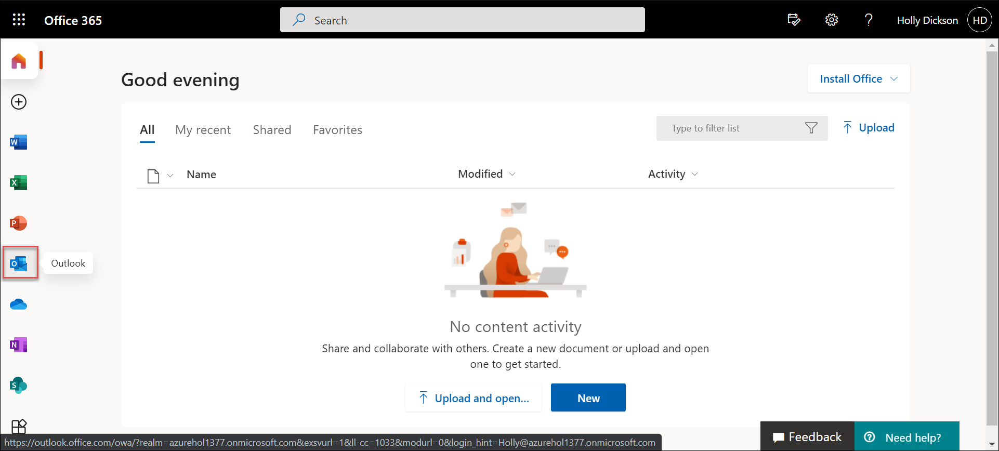

4. If a **Pick an account** window appears, select Holly's account of **Holly@xxxxxZZZZZZ.onmicrosoft.com** (where xxxxxZZZZZZis the tenant prefix provided by your lab hosting provider), and then enter **Pa55w.rd** in the **Enter password** window and select **Sign in**.

5. Holly's **Inbox** will be displayed in Outlook. If a **Welcome** window appears, select the **X** in the upper-right corner of the window to close it.  

	In Holly’s mailbox, at the top of the left-hand navigation pane, select the **New message** button to create a new email.

6. In this email, you will send the mail to an email address in which the domain (alt.none) is an invalid domain. In the email pane that appears, enter **user@alt.none** in the **To** field	. After entering the email address, tab off the **To** field to commit the entered value.

7. Enter a subject and some body text and then send the email.  

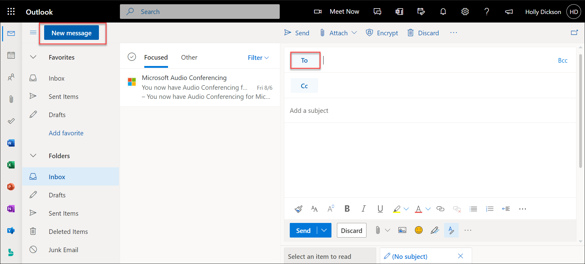

8. Wait for the delivery failure message to appear in Holly’s Inbox, then double-click the message to open it in a new window. This will make it easier to copy the text of the message in the next step. 

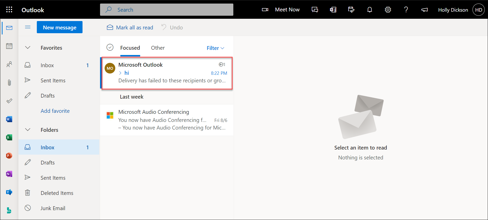

9. In the message window, scroll down through the message until you reach the body of text that says **Diagnostic information for administrators**. Select the text in the body of the message starting after **Diagnostic information for administrators** through the end of the message. With this text selected, press **Ctrl+C** to copy it to the clipboard, and then close message window.

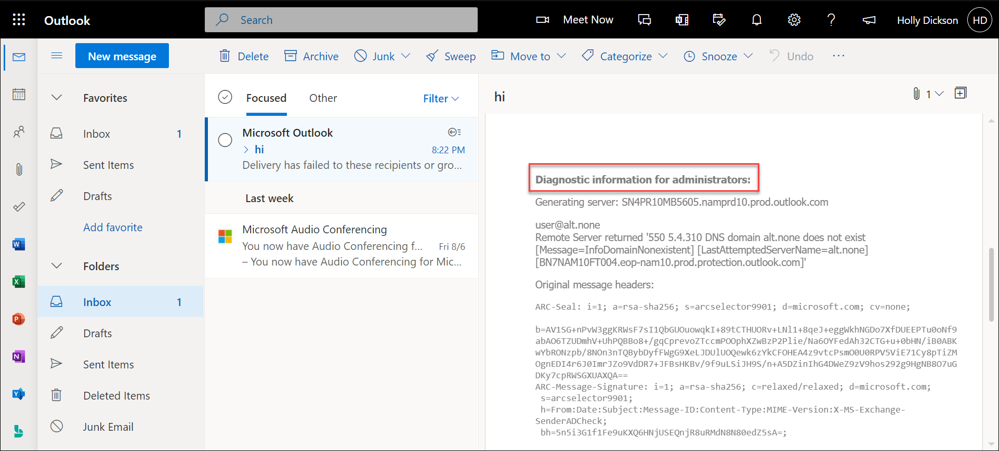

10. Open a new tab in your web browser and enter the following URL in the address bar: **https://testconnectivity.microsoft.com**. 

11. This opens the **Microsoft Remote Connectivity Analyzer** portal. In the navigation bar on the left, select the **Message Analyzer** tab. This opens the **Message Header Analyzer** tool.

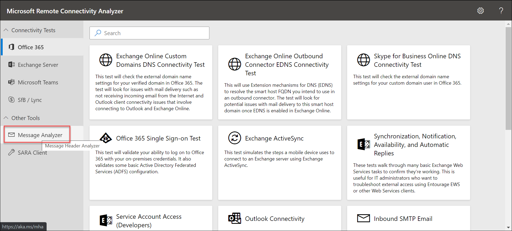

12. Take a moment to review the **Message Header Analyzer** tool. It consists of two sections - In the top section, you will paste in the diagnostic data that you copied from the failure to deliver email message; in the bottom section, the tool will display its analysis of this data. 

13. In the **Message Analyzer Header** window, paste the message (right-click and select **Paste**, or press **Ctrl+V**) in the field that appears below the **-Insert the message header you would like to analyze** row, and then select the **Analyze headers** button. 

14. SMTP message headers contain a wealth of information that allow you to determine the origins of a message and how it made its way through one or more SMTP servers to its destination. Here’s a quick summary of the information found in this header analysis:

	- **Summary section**: Displays the most important properties and total delivery time at a quick glance. Depending on the diagnostic data (for example, if a message was even sent), this section may or may not appear.

	- **Received headers section**: Displays the more important header properties and delivery time. Enables you to analyze the received headers and displays the longest delays quickly for each discovery of sources of message transfer delays.

	- **Other headers section**: Enables you to quickly detect where the longest message transfer delays occurred. You can sort all headers by occurrence number, name or value.   

	The primary problem in this example (see the **Other headers** section, Hop 1) is that the DNS domain of the email address **(@alt.none**) does not exist. Normally this is caused by a typo in the recipient’s domain name that needs to be corrected to resolve the issue. 

15. Select the **Clear** option that appears to the right of the **Analyze headers** button; this will reset the Message Header Analyzer window. 

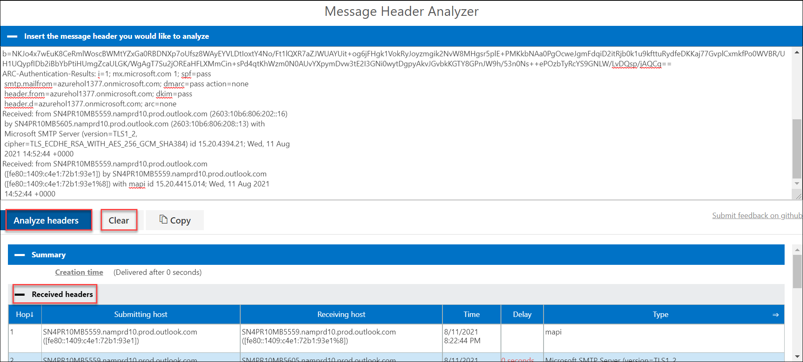

16. Return to the **Mail - Holly Dickson - Outlook** tab in your browser. In Holly's mailbox, select **New message** to create a new email.

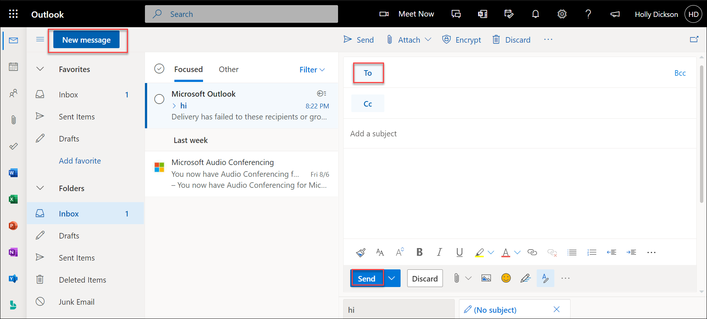

17. In this email, you will send the mail to a non-existent mailbox in a valid domain (outlook.com). In the **To** field, enter an email address of **{a random series of numbers followed by your name}@outlook.com** (for example, 123456LynneRobbins@outlook.com). After entering the email address, tab off the **To** field to commit the entered value. 

18. Enter a subject and some body text and then send the email. 

19. Wait for the delivery failure (NDR) message to appear in Holly’s Inbox, then double-click the message to open it in a new window. 

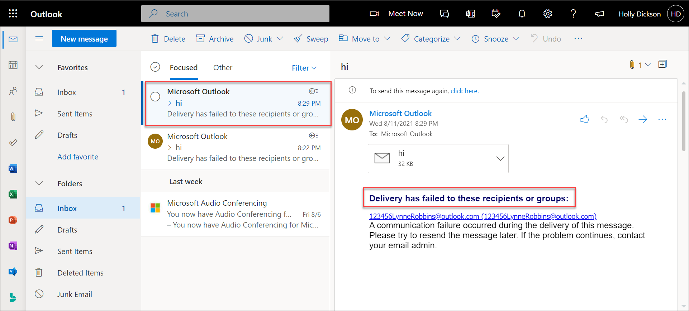
	
   **Note:** When this lab was originally written, it asked the student to enter **difflop8675399@outlook.com** in the **To** field. The lab author never assumed anyone would ever create a mailbox called **difflop8675399** in the outlook.com domain. This worked fine for several months, until someone actually created this mailbox in outlook.com. This broke the lab, since it stopped returning an NDR reply. So the previous instruction was changed to ask you to send this email to an email address consisting of a random series of numbers followed by your name. Hopefully, the combination you choose is not a valid mailbox. **If you do not receive an NDR reply within a minute (or less) after sending the email, then you can assume someone has created that mailbox in the outlook.com domain.** If this occurs, then send another email to a different mailbox address that you feel is completely bogus. 

20. In the window for the NDR reply, scroll down through the message until you reach the body of text that says **Diagnostic information for administrators**. Select the text in the body of the message starting after **Diagnostic information for administrators** through the end of the message. With this text selected, press **Ctrl+C** to copy it to the clipboard, and then close the message window. 

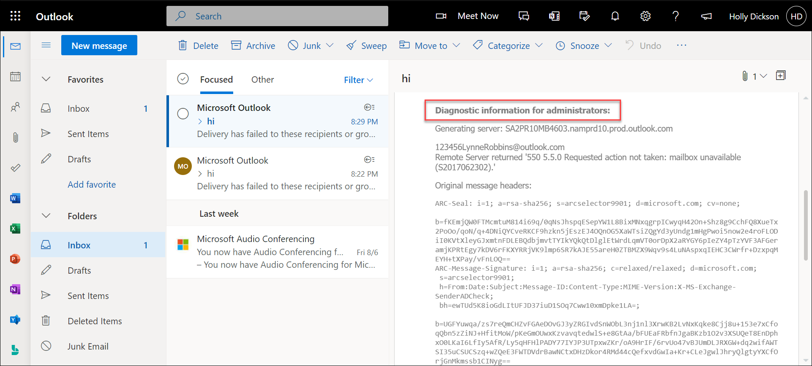

21. Switch to the **Message Header Analyzer** tab in your browser.

22. In the **Message Analyzer Header** window, paste the message in the field that appears below the **-Insert the message header you would like to analyze** row, and then select **Analyze headers**.   

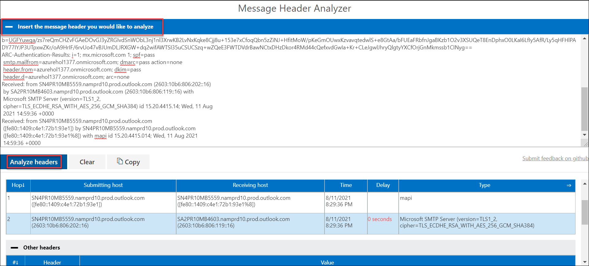

   **Note:** Review the diagnostic information and the time taken for the message to be rejected. In the prior email, the domain of the email address did not exist. In this email, the user's domain (outlook.com) was valid, but the user mailbox was unavailable. 

23. Close both the **Message Header Analyzer** tab and the **Microsoft Remote Connectivity Analyzer** tab in your Edge browser. 

24. If the **Microsoft 365 admin center** tab is still open in your browser, then select that now; otherwise, select the **Microsoft Office Home** tab in your Edge browser and then select the **Admin** icon. 

25. On the **Microsoft 365 admin center** page, in the left-hand navigation pane, select **Show all** (if necessary). 

26. Scroll down through the left-hand navigation pane, and under **Admin centers,** select **Security**. This will open the Office 365 Security & Compliance center in a new tab.

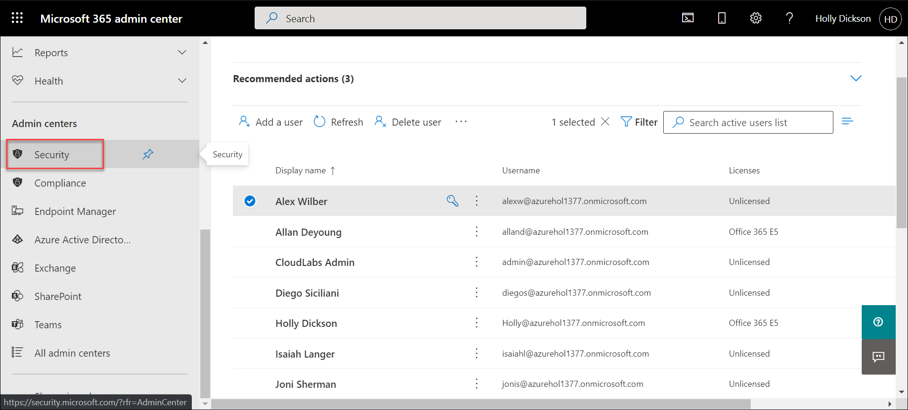

27. In the **Microsoft 365 Defender** portal, in the left-hand navigation pane, select **Email & Collaboration**, and then in the Email & Collaboration group, select **Exchange Message trace**. 

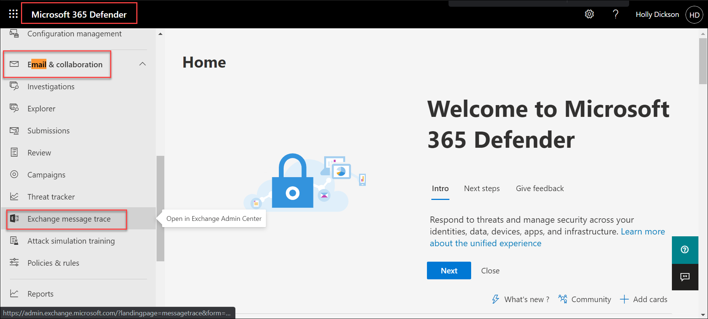

28. In the **Home > Message trace** window, select the **+Start a trace** button. 

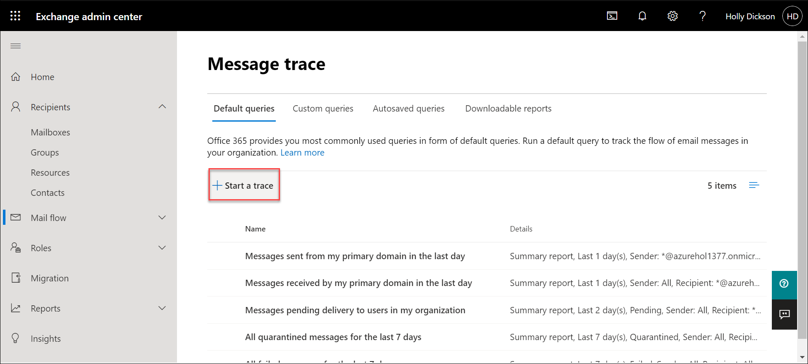

29. In the **New message trace** pane, Under the **Within this time range** section,

30. Select **1 day** that appears above the slider. Note how the slider circle moved under **1 day**.

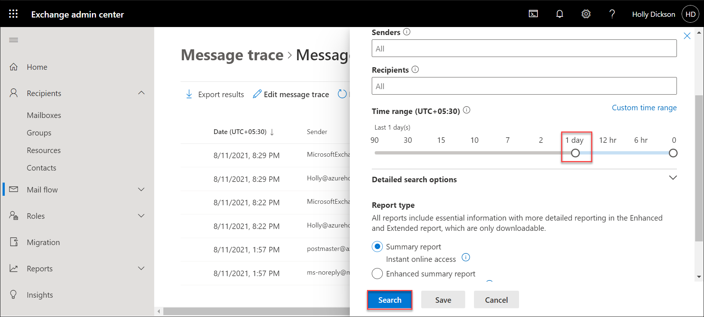

31. Scroll down and select **More search options**. In the **Delivery status** field, select the drop-down arrow and select **Failed**.

32. At the bottom of the page, select the **Search** button.

33. In the **Message trace search results** window that appears, if no failed message deliveries appear in the list, you may need to wait several minutes before selecting the **Refresh** button that appears above the item list. 

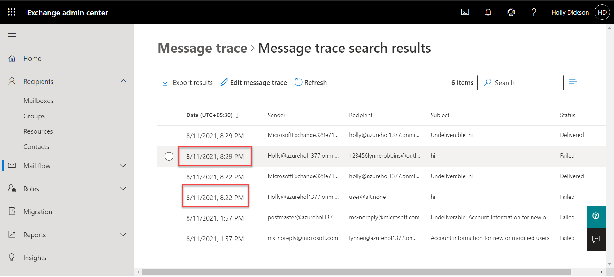

34. Double-click on the first failed message to view the **Message trace details** pane for that message. This displays the sender, recipient, status, and error information, as well as the **How to fix it** instructions. Select the **Close** button at the bottom of the pane to close it.  

	Repeat this step for the other failed message. 
	

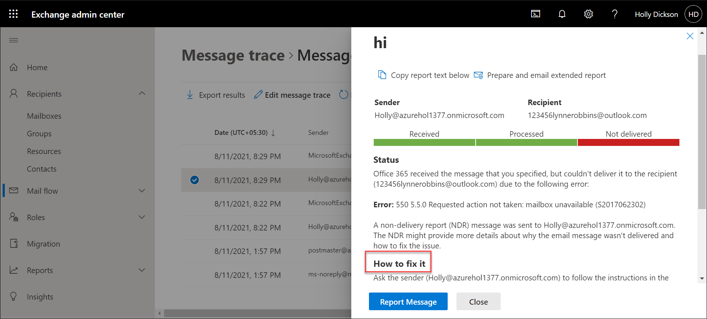

35. Close the **Message trace search results** window, and then close the **New message trace** window. This will return you to the **Home > Message trace** window in the **Office 365 Security and Compliance center**. Leave this tab open for the next task.

36. In your Edge browser, close the **Mail - Holly Dickson - Outlook** tab, but leave the **Microsoft Office Home** tab and the **Microsoft 365 admin center** tab open for the next task.
  

### Task 2 - Monitor Service Health and Analyze Reports 

Adatum's CTO is concerned with the service health issues that have recently come to light throughout the organization. He has asked Holly to review several of the key service health queries and reports so that she becomes aware of the information that's available to help Adatum monitor its service health.

1. On the LON-DC1 VM, select the **Microsoft 365 admin center** tab within your Edge browser. 

2. In the left-hand navigation pane, you previously selected the **Show all** option in the prior task. Select the **Health** group that displayed when you selected **Show all**, and then select **Service health**. 

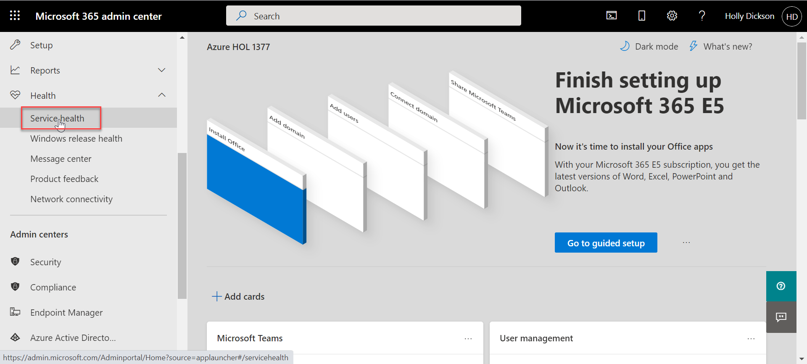

3. On the **Service health** page, the **All services** tab is displayed by default across the top of the page. Select the **History** tab.  

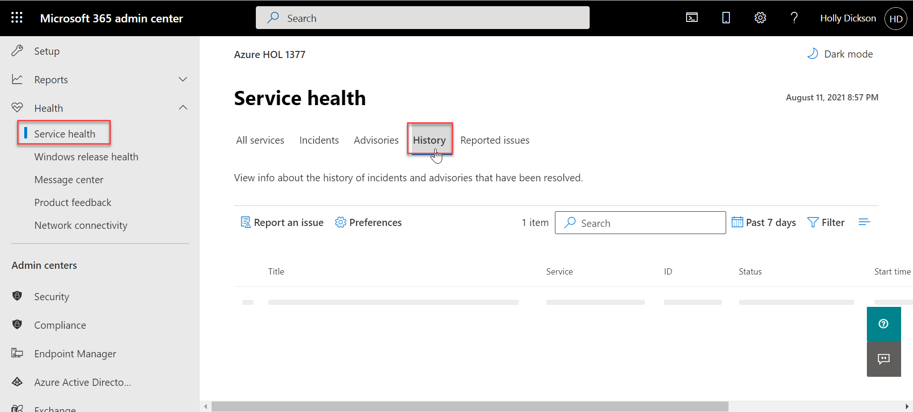

4. The default option is to display a list of items from the past 7 days (see the right side of the menu bar above the list of items; **Past 7 days** displays as the default option). Select any entry in the list to see further details about the incident. Close the incident window when you’re done reviewing it. 

5. In the **Microsoft 365 admin center**, on the left-hand navigation pane, select **Reports**, and then select **Usage.** 

6. On the **Usage** page, scroll down and view the **Active users - Microsoft 365 Services** chart. 

7. To the right of this chart, view the **Email activity** chart.   

	‎**Note:** There may be little or no data shown due to the limited mailbox usage in the lab environment. 
	
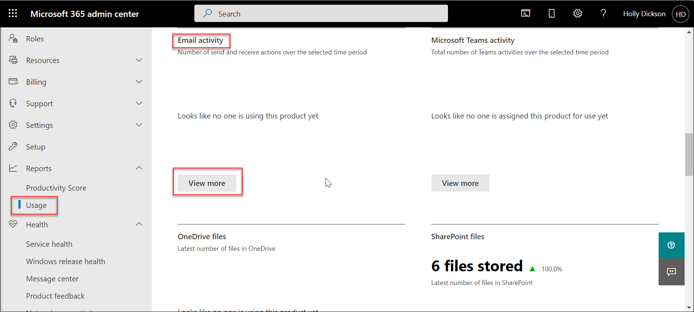

8. Under the **Email activity** chart select the **View more** button. This displays the **Exchange** report dashboard. In the report header at the top of the page, select **Mailbox usage**. 

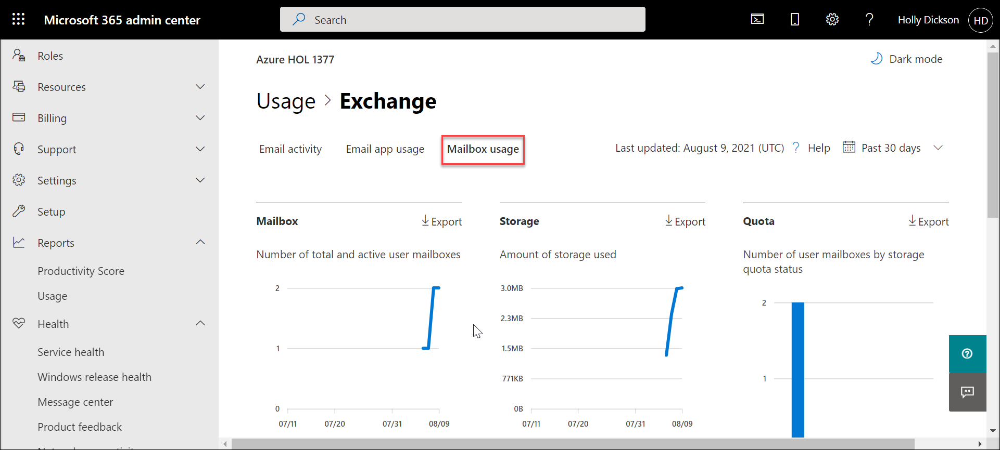

9. The default mailbox usage that is initially displayed is **30 days**. Select the other date views at the top of the report (**7 days**, **90 days**, and **180 days**) to see how the display changes. 

10. Scroll down to the bottom of the page to see mailbox details for each of the active users.

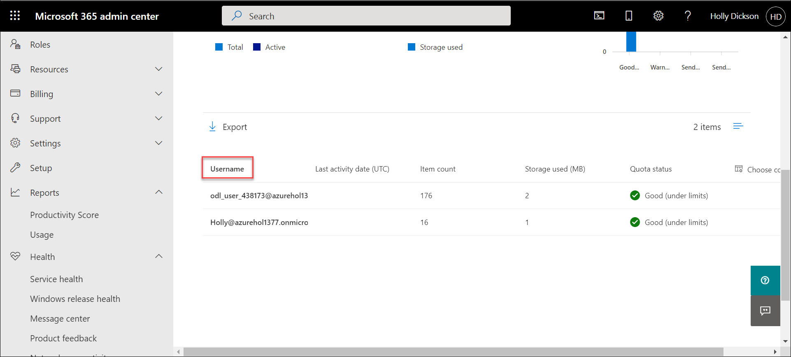

11. Scroll back to the top of the page. On the menu bar above the chart, it currently displays **Mailbox usage** followed by a drop-down arrow. Select the drop-down arrow, and in the menu that appears, select **SharePoint**. In the SharePoint group, select **Site usage**. 

12. The default site usage that is initially displayed at the top-right of the screen is **Past 30 days**. Select the drop-down arrow next to this and in the menu that appears, select the other date views to see how the display changes: **7 days**, **90 days**, and **180 days**. 

13. Scroll down to the bottom of the page to see details for each of the site collections for your tenant.

14.In your browser, open **Microsoft 365 admin center**, under the **Admin centers** group, select **Security** then if you now want to review the reports, you should select the **Exchange message trace**.

15. Now go to https://protection.office.com for **Office 365 Security &amp; Compliance** center, scroll down in the left-hand navigation pane and select **Reports,** and then under the **Reports** section, select **Dashboard.** 

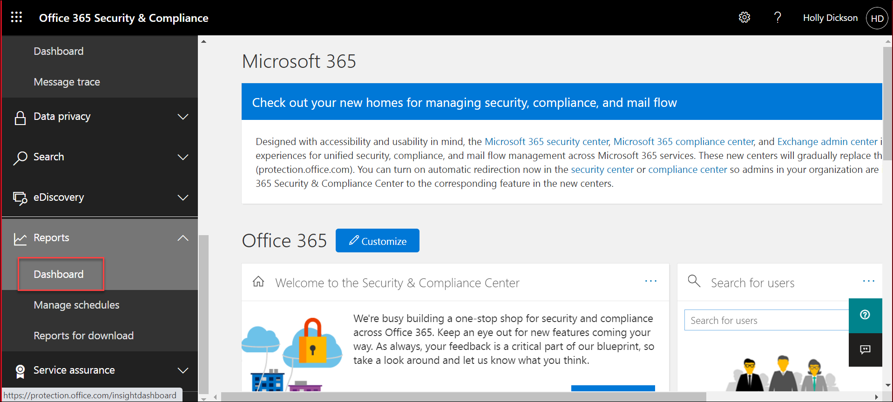

16. In the **Home > Dashboard** window, scroll down to any report that has data displayed (for example, **Top senders and recipients**) and click in the chart area to open the **Report Viewer** for that report. 

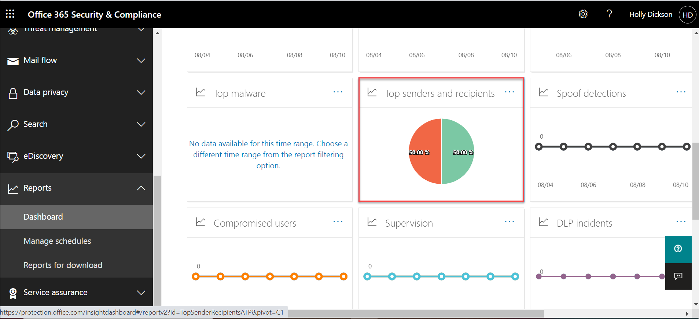

17. After reviewing the report, select **Dashboard** in navigation thread at the top of the page (Home > **Dashboard** > Report Viewer - Security &amp; Compliance) to return to the report dashboard.

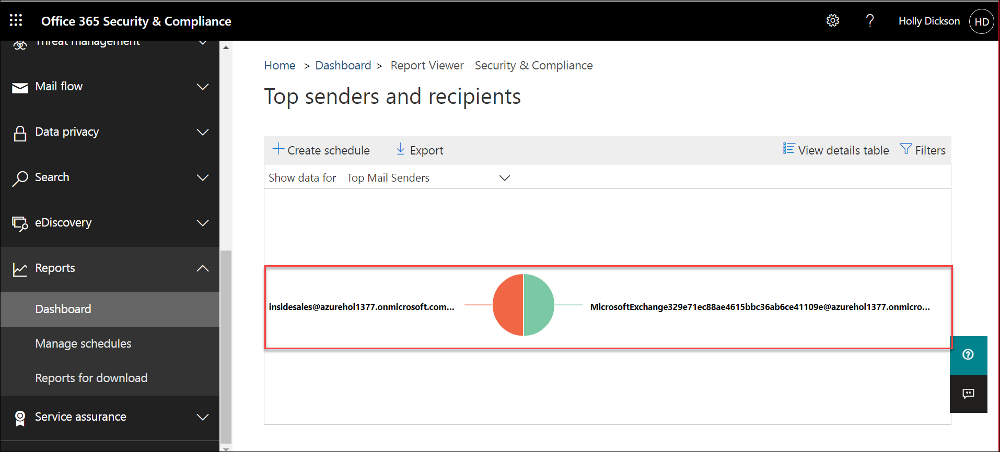

18. Repeat the prior two steps for any other report that has data displayed.

19. Close the **Security &amp; Compliance center** tab in your Edge browser but leave the other Microsoft 365 admin center tabs open for the next task.
 

### Task 3 – Submit a Help Request to Microsoft Support

If an organization runs into a situation in Microsoft 365 where it needs assistance with a problem, it must submit a service request with the Microsoft Support team. As part of Adatum's pilot project, Holly Dickson and Patti Fernandez (Adatum's Service Support Administrator) have decided to submit a test request that does not require a call back. They are performing this task to become familiar with the service request process.

1. On LON-DC1, in the **Microsoft 365 admin center** tab of your Edge browser, select **Support** in the left-hand navigation pane, and then select **View service requests** to see if there are any outstanding service request tickets. You should verify that no service request tickets appear on the **Service request history** page.

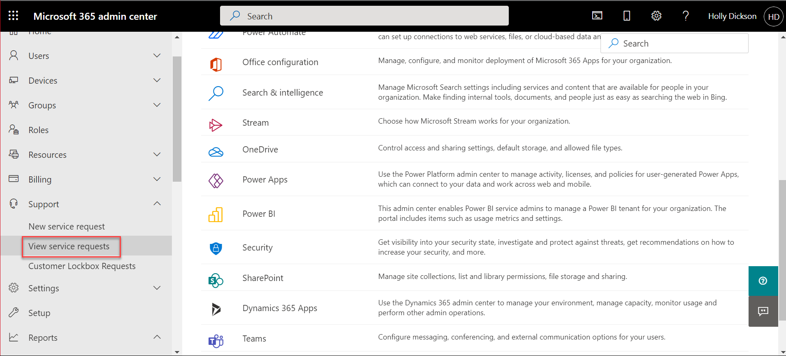

2. In the left-hand navigation bar, under the **Support** group, select **New service request**.

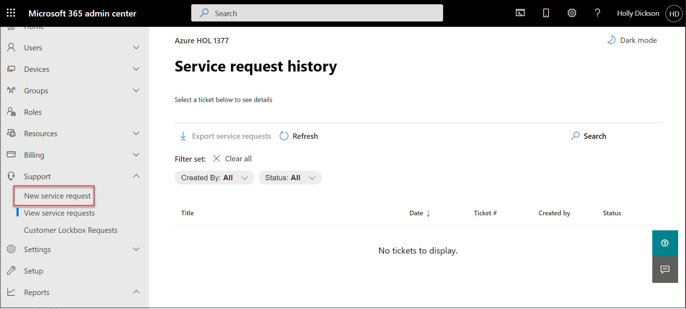

3. In the **Support Assistant** pane that appears, select the **Message** line at the bottom of the window (which currently displays **Message e.g. How do I install Office?**) and type the following message: **This is a test of the service request system; a call back is not needed.** When you are done, select the **Send message** arrow icon that appears below the message line.

4. This initiates an automated bot that asks a clarifying question and provides some optional answers that you can choose from. Select one of the answers to see how the automated bot responds. 

5. If you need further assistance and would like to speak to a Microsoft support agent, at the top of the window select the **headset** icon (the middle icon) to get help from one of the support agents. Select the **headset** icon now.

6. In the **Contact support** window that appears, do NOT enter any information; instead, just review the information that you would enter to complete this request in a real-world situation. You could also attach any necessary documents before selecting **Contact me** at the bottom of the page.    

	‎**IMPORTANT:** Do NOT complete this form in your lab environment. If you enter this request with the **Phone** option selected, you will receive a call from a Microsoft 365 support representative.  
	
7. Select the **X** in the upper right-hand corner of the page to close the **Contact support** window.
	
8. Leave LON-DC1 and your Edge browser open for the next lab exercise.  

# Proceed to Lab 2 - Exercise 3
