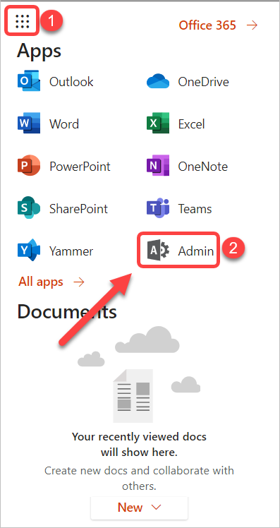
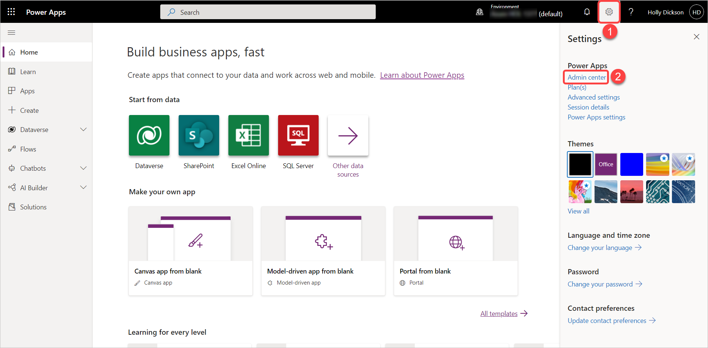
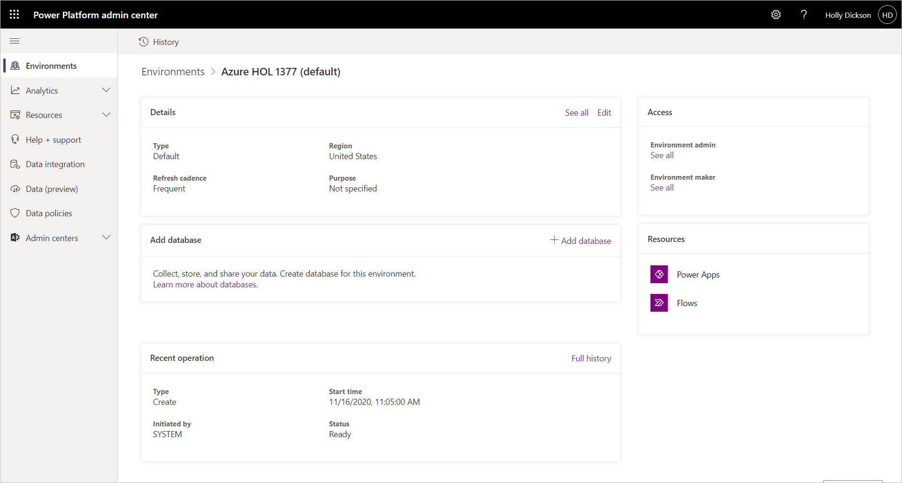
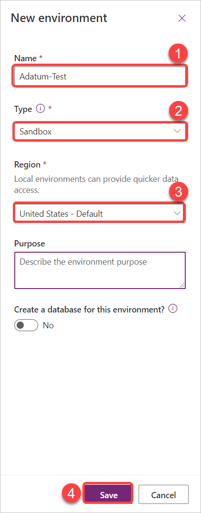

# Learning Path 4 - Lab 3 - Exercise 5 - Review the Power Platform Admin Center

As Adatum begins its transition to Microsoft 365 as its hosted cloud solution, they want to use this opportunity to examine Microsoft’s Power Platform functionality. In your role as Holly Dickson, Adatum’s Enterprise Administrator, you have been asked to expand your Microsoft 365 pilot project to include Microsoft’s Power Platform. Therefore, your first task towards that goal is to familiarize yourself with the Power Platform admin center, which provides a unified portal for administrators to manage environments and settings for Power Apps, Power Automate, and Power BI. 

### Task 1 – Review the Power Platform Admin Center

In your role as Holly Dickson, you want to review the Power Platform admin center, which is the go-to destination for administrators who create, manage, and support their Microsoft Power Platform environments. 

1. Switch to **LON-DC1-ID** VM, if not, then do so now.

2. On **LON-DC1-ID**, you should still have your Microsoft Edge browser and the **Microsoft 365 admin center** open from the prior lab in which you were logged in as Holly Dickson. If so, proceed to the next step; otherwise, open Microsoft Edge, navigate to **https://portal.office.com/**, log in as **Holly@xxxxxZZZZZZ.onmicrosoft.com** (where xxxxxZZZZZZ is the tenant prefix provided by your lab hosting provider) and **Pa55w.rd**, and then in the **Microsoft 365 Home** page, select the **Admin** icon to open the Microsoft 365 admin center.

   

3. In your Edge browser, close all tabs except for the **Microsoft Office Home** tab and the **Microsoft 365 admin center** tab. Open a new tab in your Edge browser and enter the following URL in the address bar: **https://make.powerapps.com/home** 

4. This opens the **PowerApps** studio. Select the **gear (Settings)** icon on the top right corner of the screen. In the **Settings** pane that appears, select **Admin center**. This opens a new tab that displays the **Power Platform admin center.**  

   

5. In the **Power Platform admin center**, the **Environments** tab in the left-hand navigation pane is displayed by default. In the list of **Environments**, note how there is only one environment, the **Adatum Corporation (default)** environment. Select the **Adatum Corporation (default)** environment and review the information available for this environment.

   

   

6. In the navigation pane at the top of the screen (**Environments > Adatum Corporation (default))**, select **Environments**.

7. You have decided to create a new environment. On the menu bar at the top of the screen, select **+New** to create a new environment.

   

8. In the **New environment** pane that appears, enter the following information:

	- Name: **Adatum-Test**

	- Type: **Sandbox**

	- Region: **United States - Default**

	-  Create a database for this environment: **No**

   

9. Select **Save.**  

	**Note:** Trying to save this new environment record will result in an error message at the top of the window. This message indicates you need at least 1 Gb of database capacity, which is not available in your VM lab environment. Close the **New environment** window. 

10. Explore other areas of the **Power Platform admin center**, as desired. 

11. When you are finished, close the **Power Platform admin center** tab in your browser.

12. In your browser, leave the **Power Apps** tab open for the next lab exercise.

 

# Proceed to Lab 3 - Exercise 6
