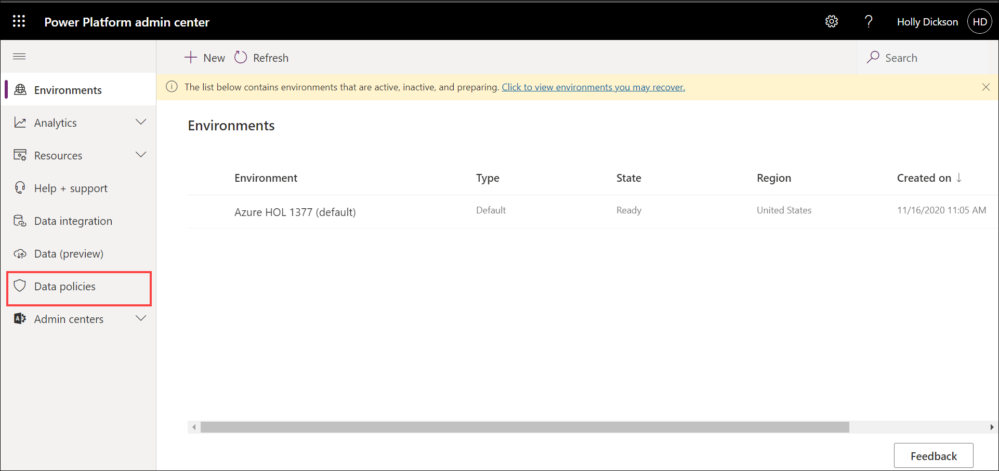
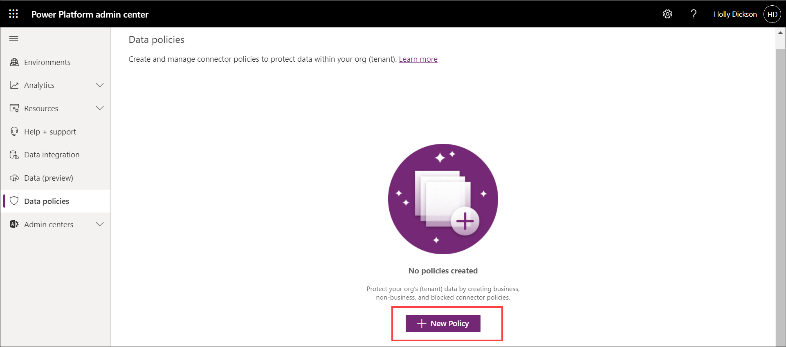
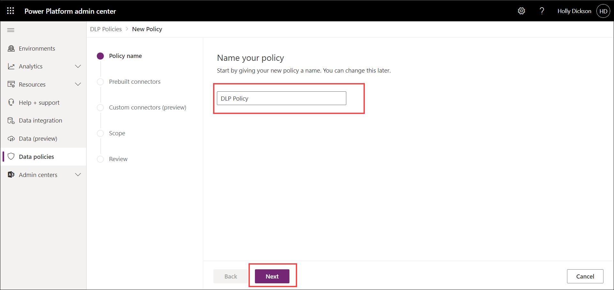
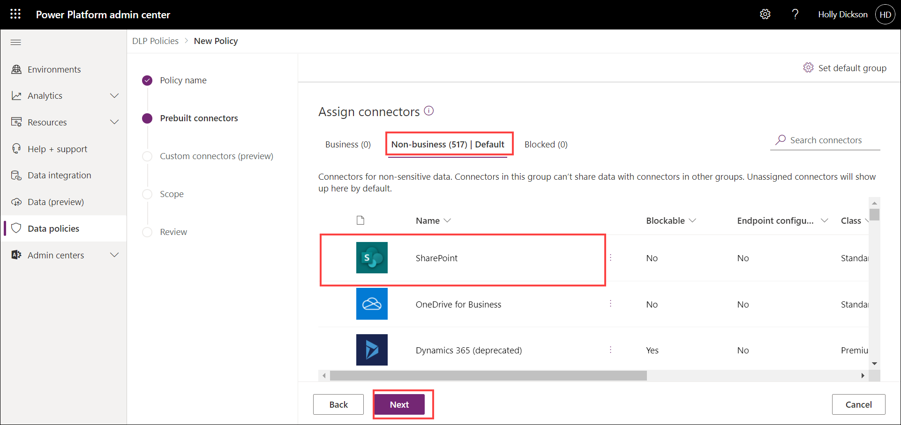
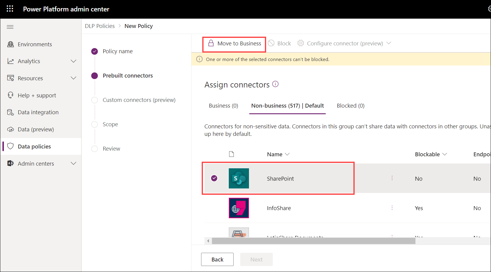
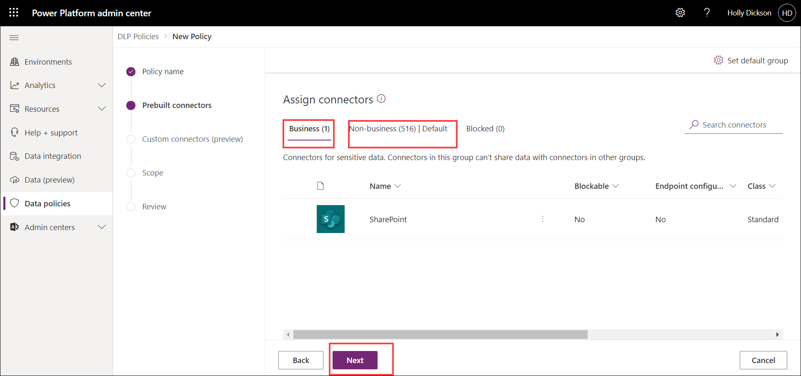
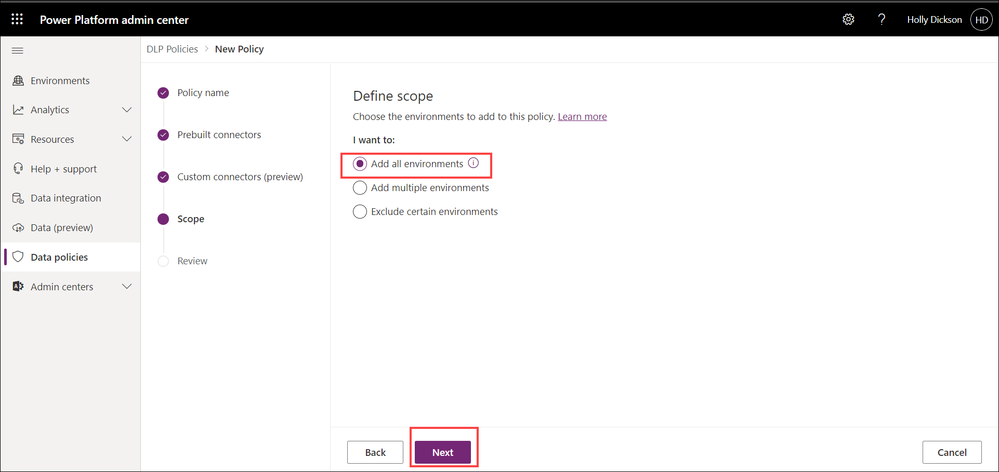
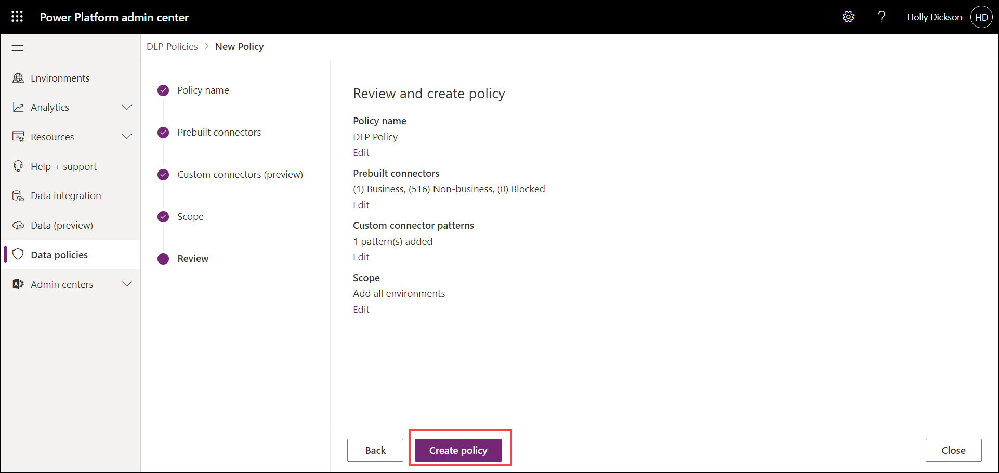
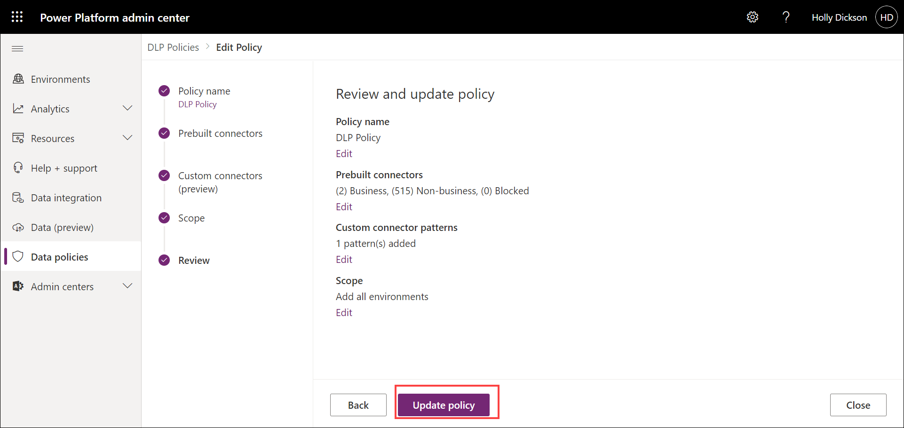
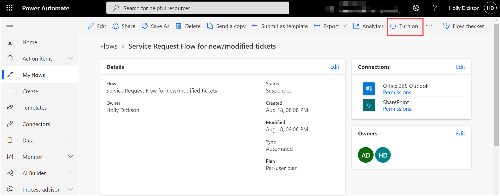

# Learning Path 4 - Lab 3 - Exercise 9 - Create a DLP Policy using Power Automate

For security reasons, administrators oftentimes want to ensure that certain data is kept protected. Power Platform allows you to create data loss prevention policies that define which connectors can share specific business data. For example, you may not want business data that is stored in SharePoint to be automatically published to its Twitter feed by a Power Automate flow. 

Power Platform uses data groups as a simple way to categorize connectors within a DLP policy. The three data groups available are the Business data group, the Non-Business data group, and the Blocked data group. 

A good way to categorize connectors is to place them in groups based on the business-centered or personal-use-centered services they connect to in the context of your organization. Connectors that host business-use data should be classified as Business, and connectors that host personal-use data should be classified as Non-Business. Any connectors that you want to restrict usage of across one or more environments should be classified as Blocked.

When a new policy is created, by default all connectors are placed in the Non-Business group. From there they can be moved to Business or Blocked based on your preference. For a flow to run, all its connectors must be in one group or the other. If your flow has connectors in both groups, then the flow will automatically be suspended and will not run. Since all connectors are assigned by default to the **Non-business** group, if you want to include any data in your flow, you must add all the connectors used in the flow into the Business data only group. 

In this exercise, you will create a DLP policy that uses two connectors - a SharePoint connector and an Office 365 Outlook connector. For the flow to work that uses this DLP policy, you must move both connectors to the Business data group. 

### Task 1:  Create a data loss prevention policy

In this task, Holly wants to create a data lost prevention policy for the flows that she plans to create as part of her pilot project. In this task, she will initially add the **SharePoint** connector to **Business** group. She will then see how this affects the flow that she just created. 

1. After having completed the prior exercise in which you created a flow in Power Automate and assigned to it an additional owner, you should still be logged into LON-DC1 as **ADATUM\Azureuser Administrator** and a password of **Pa55w.rd**; if not, then do so now.

2. You should still have your Edge browser open to the **Microsoft Power Automate** tab, which should still be displaying the **Flows** window and the **Team flows** tab. If not, then repeat the steps you performed in the prior task to get to this tab (from **Power Automate studio**, select **My flows**, and then select the **Team flows** tab).

3. In the top right corner of the screen, select the **gear (Settings)** icon. In the **Settings** pane that appears, under the **Power Automate** section, select **Admin Center**.

   

4. A new tab will open in your browser that displays the **Power Platform admin center**. In the left-hand navigation pane select **Data policies**.

   

5. On the **Data policies** page, select the **+New Policy** button. This initiates a **New Policy** wizard, which displays the pages to be completed in the middle pane on the screen. 

   

6. In the **Policy Name** page, enter **DLP Policy** in the **Name your policy** field and then select **Next**.

   

7. In the **Assign Connectors** page, the menu bar displays tabs for three groups of connectors - the **Business** connectors (there are currently no Business connectors), the **Non-business** connectors (which currently includes over 400 connectors; this is also the default tab displayed), and the **Blocked** connectors (which also contains no connectors). 

   In the list of **Non-business** connectors, you want to select the connector for SharePoint.

   The quickest way to select the SharePoint connector is to use the **Search connectors** field that appears to the right of the menu bar. Enter **share** in this field. This will filter the list of **Non-business** connectors and only show those with **share** in the connector name. This will save you from having to scroll down through hundreds of **Non-business** connectors to those whose name starts with **share**. 
   
   Before you select the SharePoint connector, note how nothing appears above the **Assign connectors** heading at the top of the page. Now, in the list of filtered **Non-business** connectors, select the **SharePoint** connector. Once you selected the SharePoint connector, notice how the **Move to Business** option now appears at the top of the page.
   
   

8. Since Adatum wants the connector for this policy to share data with connectors in other groups, you must move the SharePoint connector from the **Non-business** group to the **Business** group. 

      To do so, select the **Move to Business** option at the top of the page. Once the connector has been moved, note how the **Business** tab now displays **(1)** next to it (indicating there is now one Business connector), and how the number of **Non-business** connectors is now reduced by 1. Select the **Business** tab to see the SharePoint connector. Select **Next**.
      
    
    
    

9. On the **Scope** page, you must define the environment to which the new policy will apply. Select the **Add all environments** option and then select **Next**.

    

10. On the **Review** page, review all the settings that you previously assigned to the new policy. If any setting needs to be changed, select the **Edit** option for that setting. If all settings are correct, select the **Create policy** button.

    

11. On the **Data policies** page, you should now see in the list of policies the new **DLP Policy** that you just created.

    

      **Important:** You have created a data policy that has one of the two connectors used in your flow (SharePoint) in the **Business** group. However, Holly has forgotten that she actually has two connectors in her flow; the second connector is **Office 365 Outlook**, which manages the email that is automatically created and sent by the flow. This connector remains in the **Non-business** group.   
   
      In practice, you would not be able to implement this policy as you need both connectors used by the flow in the same group. If both connectors are not in the same group, the policy will be automatically suspended. Continue on to see how connectors in both groups impact the flow. 

12. In your Edge browser, select the **View your flow owners | Power Automate** tab to return to the **Flows** window that displays your flow in the **Shared with me** tab. 

13. Select the **Service Request Flow for new/modified tickets**, which displays the detail information about the selected flow.  

     

      **Note:** The Status of the flow is **On**. Eventually, once the policy propagates through the system, the status will change from **On** to **Suspended**.
      
      **Important:** It can take several minutes for the policy to propagate; in testing, it has been found to take approximately 5 minutes. After that time, select the **Refresh** icon that appears to the left of the address bar. In the **Details** section, notice the **Status** of the flow, which should change from **On** to **Suspended**.   

      Do NOT proceed to the next step until the **Status** of the flow has changed to **Suspended**. You may need to refresh the window a few times until you see this status change. 

14. Once the flow has been suspended, select **Edit** in the menu bar at the top of the page. 

15. In the window that is returned, you will see the actions for your flow. Select **Save**.

      A **Flow Checker** pane appears on the right-side of the screen. Each of the two connectors used in this flow have been flagged as violating Adatum's DLP policy, since both connectors are not in the same group. Close the **Flow checker** pane.
   
      **Important:** Since this flow was already created at the time the policy was established, Power Automate automatically suspended the flow, which, in effect, turned the flow **Off**. If you subsequently create a new entry or modify an existing entry in the SharePoint list after the flow has been suspended, the flow will not run. 

16. At the top of the page, to the left of the flow name, select the left arrow to return to the Detail page for the flow. 

17. In the heading at the top of the page, **Flow &gt; Service Request Flow for new/modified tickets**, select **Flow** to return to the list of **Shared with me** flows. 

18. Leave your Edge browser and all its tabs open for the next task.

### Task 2:  Edit your data loss prevention policy

Although you created the DLP policy using the Power Platform admin center, the policy applies to all applications and flows in the Adatum Corporation environment. As such, the policy would apply for any Power App that uses these connections.

Now that Holly has seen what happens when she creates a DLP policy that only includes the SharePoint connector, she realizes that she needs to update the policy to include both Outlook and SharePoint in the group of **Business** connectors. While this will allow her flow to work, it will also prevent any future flow or app from running if it uses SharePoint, Outlook, and any other connector, since the additional connector is not in the **Business** group. For example, if Holly creates a second flow that includes SharePoint, Outlook, and Twitter, this first flow would still work, but the second flow would not since Twitter is not included in the **Business** group for this policy.

In your role as Holly, you will update this DLP policy to include Outlook as an additional connector in the **Business** group. 

1. You should still be logged into LON-DC1 as **ADATUM\Azureuser Administrator** and a password of **Pa55w.rd**; if not, then do so now.

2. You should still have your Edge browser open to the **Edit your flow | Power Automate** tab, which should still be displaying the **Flows** window and the **Shared with me** tab.   
‎  
‎In your browser, select the **Power Platform admin center** tab, which should be displaying the **Data policies** window. If you closed this tab at the end of the prior task, then in the **Manage your flows | Microsoft Power Automate** tab, select the gear **(Settings)** icon, select **Admin center** in the **Settings** pane, and then in the **Power Platform admin center,** select **Data policies.**

3. In the **Data policies** window, note how at the top of the screen it displays the **+New Policy** option. Now select the **DLP policy** that you created in the prior task. Note how this caused the **Edit Policy** and **Delete Policy** options to appear next to the **+New Policy** option. Select **Edit Policy**.

4. You will basically repeat the same steps that you performed in the prior task when you assigned the SharePoint connector to the policy; however, this time you will assign the **Office 365 Outlook** connector. 

   On the **Policy name** page, you will not change the policy name, so simply select **Next**.
   
5. On the **Assign Connectors** page, the **Non-business** connector group is once again displayed by default. Enter **outlook** in the **Search connectors** field. This will filter the list of **Non-business** connectors and only show those with **outlook** in the connector name. Select the **Office 365 Outlook** connector. 

6. For this Office 365 Outlook connector to work with the SharePoint connector that you earlier selected, you must move the Outlook connector to the **Business** data group. To do so, select the **Move to Business** option at the top of the screen. 

      Once the connector has moved, note how the **Business** tab now displays **(2)** next to it (indicating there are now two Business connectors), and how the number of **Non-business** connectors is once again reduced by 1. Select the **Business** tab to see both the SharePoint and Office 365 Outlook connectors that you have assigned to the Business group. Select **Next**.

7. On the **Scope** page, you previously selected the **Add all environments** option, so this time simply select **Next**.

8. On the **Review** page, review all the settings that you previously assigned to the new policy. If any setting needs to be changed, select the **Edit** option for that setting. If all settings are correct, select the **Update policy** button.

    

9. In your browser, select the **Edit your flow | Power Automate** tab to return back to the **Flows** window that displays your flow in the **Shared with me** tab. Notice that under the **Modified** column, it still indicates **Activity suspended**.

10. Select **Service Request Flow for new/modified tickets** to see the detail information about the flow.   
‎  
‎**Important:** Note that the **Status** of the flow is **Suspended**. When you first created the DLP policy, Microsoft Flow automatically changed the status of the flow from **On** to **Suspended** when you saved the policy and Flow realized that one of the data connectors for the flow was not in the policy’s **Business** group. However, when you edit a policy and change the connectors in either group, Flow does not re-evaluate this change to existing flows; therefore, the status of this flow will not be automatically changed from **Suspended** to **On** even though the policy now has both **SharePoint** and **Office 365 Outlook** in the **Business** group. Instead, you will have to manually turn the flow **On**, which you will do in the next step.   
‎  
‎**Note:** If you delete a DLP policy, Flow does not re-evaluate how this policy deletion affects existing flows. Therefore, had you deleted this policy rather than modify it, your suspended flow would remain suspended, and you would have to manually turn it **On**, just as you have to do following this policy change.

11. At the top of the **Flow &gt; Service Request Flow for new/modified tickets** window, select **Turn on** in the menu bar at the top of the page. 

     
‎  
‎This displays a message below the menu bar that says: **Your flow is off: Service Request Flow for new/modified tickets.** This message simply indicates the status of the flow prior to it being turned **On.**

12. Select the **Refresh** icon that appears to the left of the address bar. In the **Details** section, notice the **Status** of the flow, which should change from **Suspended** to **On**.  

    

13. In your Edge browser, close the **Power Automate** and **Power Platform** tabs, but leave open the **SharePoint** tabs that are related to your **Service Desk Requests** list for the next exercise. 

 
# Proceed to Lab 3 - Exercise 10

