# Learning Path 5 - Lab 4 - Exercise 1 - Prepare for Identity Synchronization  

As in the previous lab exercises you will take on the role of Holly Dickson, Adatum Corporation’s Enterprise Administrator. Adatum has recently subscribed to Microsoft 365, and you have been tasked with deploying the application in Adatum’s virtualized lab environment. In this lab, you will perform the tasks necessary to manage your Microsoft 365 identity environment using both the Microsoft 365 admin center and Windows PowerShell. 

During this exercise you will set up and manage Azure AD Connect. You will create on-premises users and validate the sync process so that their identity is moved to the cloud. Some of the steps may feel familiar from previous exercises; however, in this case they are needed to validate the synchronization process.

### Task 1: Configure your UPN suffix

In Active Directory, the default User Principal Name (UPN) suffix is the DNS name of the domain where the user account was created. The Azure AD Connect wizard uses the UserPrincipalName attribute, or it lets you specify the on-premises attribute (in a custom installation) to be used as the user principal name in Azure AD. This is the value that is used for signing into Azure AD. 

If you recall, your VM environment was created by your lab hosting provider with an on-premises domain titled **adatum.com**. This domain included a number of on-premises user accounts, such as Holly Dickson, Laura Atkins, and so on. Then in the first lab in this course, you created a custom, accepted domain for Adatum titled **xxxUPNxxx.xxxCustomDomainxxx.xxx** (where xxxUPNxxx was the unique UPN name assigned to your tenant, and xxxCustomDomainxxx.xxx was the name assigned to the domain by your lab hosting provider).

In this task, you will use PowerShell to change the user principal name of the domain for the entire Adatum Corporation by replacing the originally established **adatum.com** domain with the custom **xxxUPNxxx.xxxCustomDomainxxx.xxx** domain. In doing so, you will update the UPN suffix for the primary domain and the UPN on every on-premises user account in AD DS with **@xxxUPNxxx.xxxCustomDomainxxx.xxx**. 

A company may change its domain name for a variety of reasons. For example, a company may purchase a new domain name, or a company may change its name and it wants its domain name to reflect the new company name, or a company may be sold and it wants its domain name to reflect the new parent company’s name. Regardless of the underlying reason, the goal of changing a domain name is typically to change the domain name on each user’s email address. 

For this lab, Adatum has purchased the new xxxUPNxxx.xxxCustomDomainxxx.xxx domain (provided by your lab hosting provider); therefore, it wants to change the domain name of all its users’ email addresses from @adatum.com to @xxxUPNxxx.xxxCustomDomainxxx.xxx.

1. On your Domain Controller VM (LON-DC1-ID), make sure you’re logged in as **ADATUM\Azureuser Administrator**.. 

1. If **Windows PowerShell** is still open, then select the **PowerShell** icon on your taskbar; otherwise, you must open **Windows PowerShell** by selecting the magnifying glass (**Search**) icon on the taskbar, typing **powershell** in the Search box that appears,  right-clicking on **Windows PowerShell**, and selecting **Run as administrator** in the drop-down menu. 

	 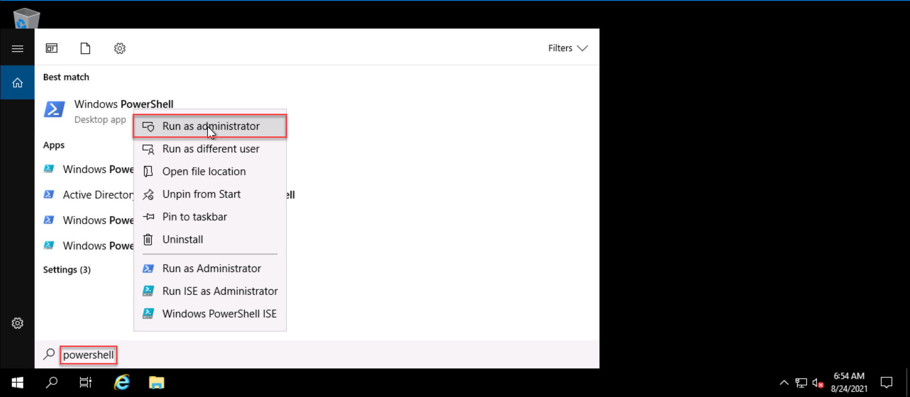

1. Using **Windows PowerShell**, you must replace the on-premises **adatum.com** domain with the **xxxUPNxxx.xxxCustomDomainxxx.xxx** domain (where you will replace xxxUPNxxx with the unique UPN name assigned to your tenant, and you will replace xxxCustomDomainxxx.xxx with your lab hosting provider's custom domain). In doing so, you will update the UPN suffix for the primary domain and the UPN on every user in AD DS with **@xxxUPNxxx.xxxCustomDomainxxx.xxx**.   

	‎In the following PowerShell command, the **Set-ADForest** cmdlet modifies the properties of an Active Directory forest, and the **-identity** parameter specifies the Active Directory forest to modify. To perform this task, run the following command to set the **UPNSuffixes** property for the **adatum.com** forest (remember to change xxxUPNxxx to your unique UPN name and xxxCustomDomainxxx.xxx to your lab hosting provider's custom domain name): 
	
		Set-ADForest -identity adatum.com -UPNSuffixes @{replace="xxxUPNxxx.xxxCustomDomainxxx.xxx"}

	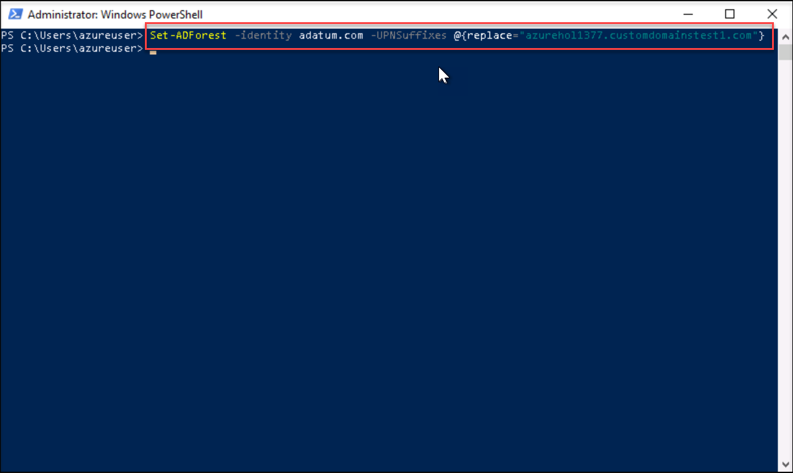

1. You must then run the following command that changes all existing adatum.com accounts to the new UPN @xxxUPNxxx.xxxCustomDomainxxx.xxx domain (remember to change xxxUPNxxx to your unique UPN name and xxxCustomDomainxxx.xxx to your lab hosting provider's custom domain name):  

		Get-ADUser -Filter * -Properties SamAccountName | ForEach-Object { Set-ADUser $_  -UserPrincipalName ($_.SamAccountName + "@xxxUPNxxx.xxxCustomDomainxxx.xxx" )}

	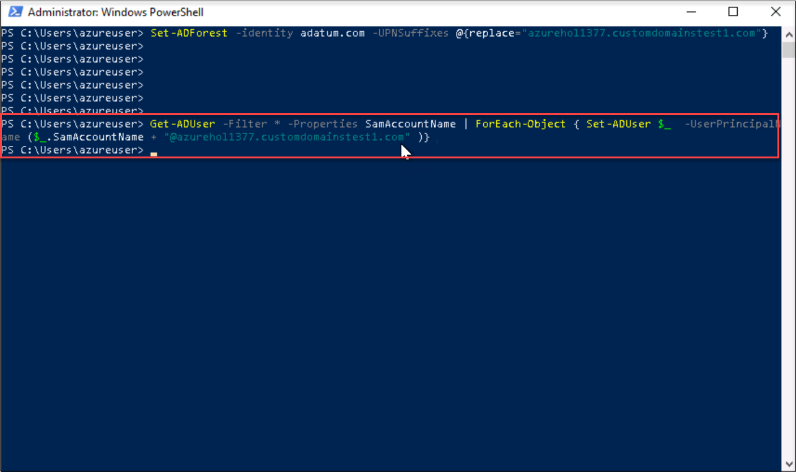

1. You will continue using PowerShell on your Domain Controller VM in the next task.

### Task 2: Prepare problem user accounts   

Integrating your on-premises Active Directory with Azure AD makes your users more productive by providing a common identity for accessing both cloud and on-premises resources. However, errors can occur when identity data is synchronized from Windows Server Active Directory (AD DS) to Azure Active Directory (Azure AD). 

For example, two or more objects may have the same value for the **ProxyAddresses** attribute or the **UserPrincipalName** attribute in on-premises Active Directory. There are a multitude of different conditions that may result in synchronization errors. Organizations can correct these errors by running Microsoft's IdFix tool, which performs discovery and remediation of identity objects and their attributes in an on-premises Active Directory environment in preparation for migration to Azure Active Directory. 

In this task, you will run a script that breaks an on-premises user account. As part of your Adatum pilot project, you are purposely breaking this identity object so that you can run the IdFix tool in the next task to see how you can fix the broken account. 

1. On your Domain Controller VM (LON-DC1-ID), in the Windows PowerShell window, run the following command to change the root source to **C:\labfiles** so that you can access any files from that location:  

		CD C:\labfiles\

	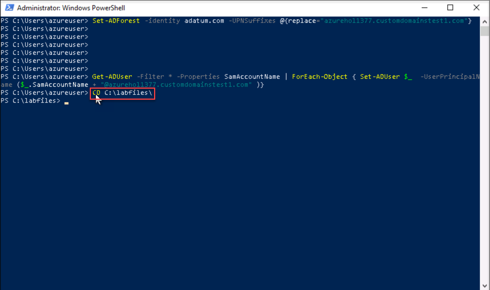

1. PowerShell's execution policy settings dictate which PowerShell scripts can be run on a Windows system. Setting this policy to **Unrestricted** enables Holly to load all configuration files and run all scripts. At the command prompt, type the following command, and then press Enter:    

		Set-ExecutionPolicy Unrestricted

	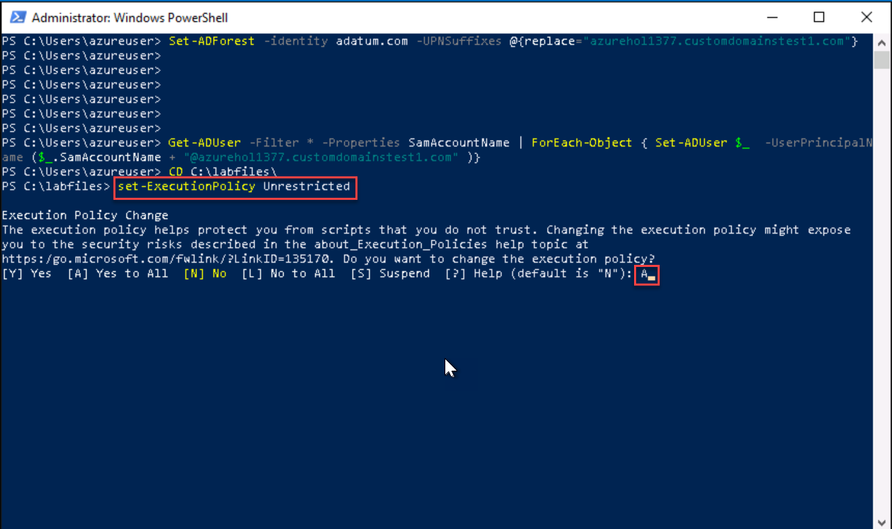
	
1. You will then be prompted to confirm the execution policy change. Type **A** and press Enter to select the **[A] Yes to All** option.

1. Enter the following command that runs a PowerShell script that creates a problem user account. This script, which is stored in the C:\labfiles folder, will purposely create an issue with the UserPrincipalName for the user's on-premises account; this will enable you to troubleshoot this account in the next task using the IdFix tool.   

		.\CreateProblemUsers.ps1
	
	**Note:** Wait until the script has completed before proceeding to the next task. This Windows PowerShell script will make the following change in AD DS:

	- **Klemen Sic**. Update the UserPrincipalName for Klemen to include an extra "@" character. 

1. Close PowerShell.

### Task 3: Run the IdFix tool and fix identified issues 

In this task you will download and use the IdFix tool to fix the on-premises user account that was broken in the previous task. Running the IdFix tool will correct any user account errors prior to synchronizing identity data between your on-premises environment and Azure AD.

1. You should still be logged into **LON-DC1** as the **Administrator** from the prior task. 

1. In **Microsoft Edge**, open a new tab and enter the following URL in the address bar to access the Microsoft Download Center page for the IdFix Directory Synchronization Error Remediation Tool:  

	**https://microsoft.github.io/idfix/installation/**

1. On the **Microsoft - IdFix** window, under the **Installation** section at the top of the page, the instructions direct you to run **setup.exe** to install the IdFix application on your machine. Select **setup.exe** to download the file to LON-DC1. 

	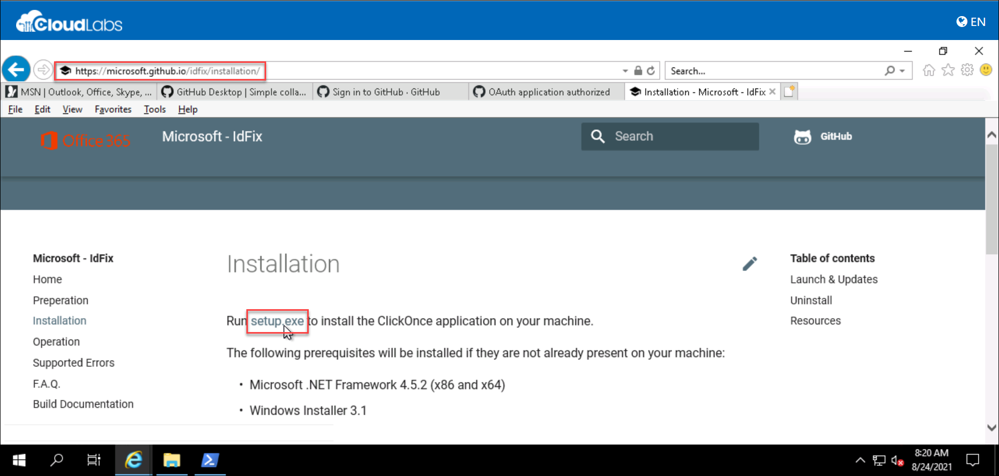

1. Once the **setup.exe** file is downloaded, it will appear in the notification bar at the bottom of the screen. Select **Run**. 

	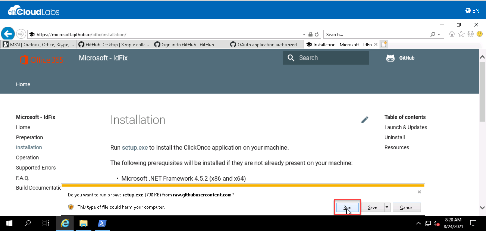

1. In the **Do you want to install this application?** dialog box, select **Install**.

	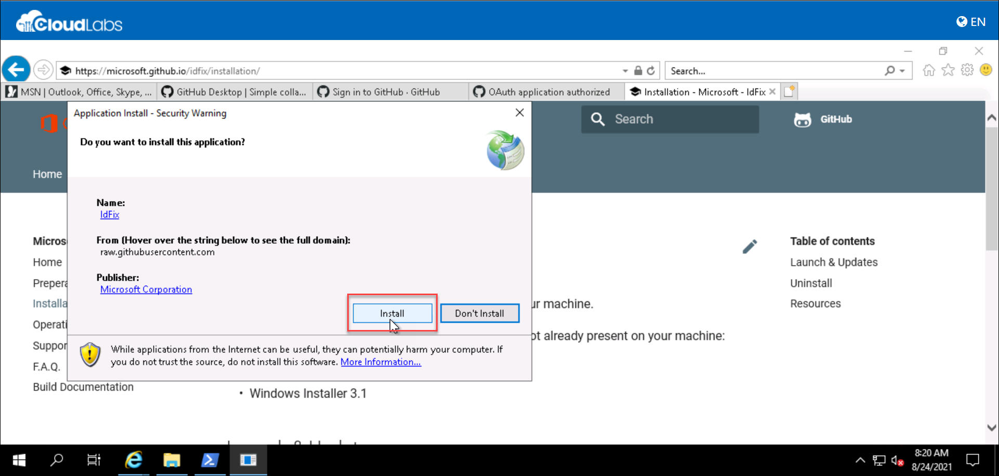
	
1. If a **Do you want to run this file?** dialog box appears, select **Run**.

1. In the **IdFix Privacy Statement** message box, select **OK**. 

	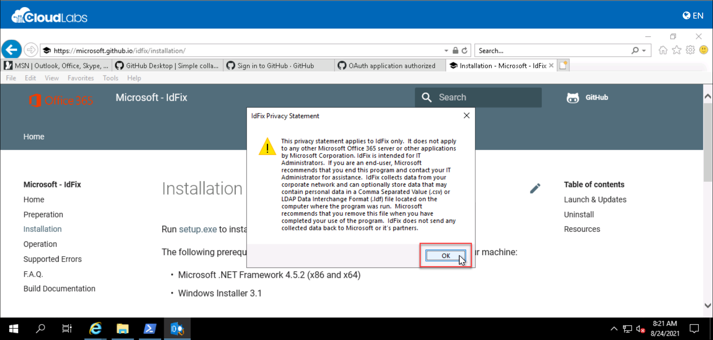

9. In the **IdFix** window that appears, on the menu bar at the very top of the screen, select **Query** to query the directory. After a short wait, you should see several errors. 

10. Select the **ERROR** column heading to sort the records by error in alphabetical error.  

	‎**Note:** If any **topleveldomain** errors appear, then ignore them as they cannot be fixed by the IdFix tool.  

11. In the **Klemen Sic** row, select the drop-down arrow in the **ACTION** field and select **EDIT**. 

12. On the menu bar at the top of the window, select **Apply**. 

13. In the **Apply Pending** dialog box that appears, select **Yes**.  

	‎**Note:** Notice the value in the **Action** column changed from **EDIT** to **COMPLETE** for this user; this indicates that IdFix updated the user object and corrected the error. 

14. On the menu bar, select **Query**. In the query results, note how the Klemen Sic row no longer appears in the results, since you just fixed this object.  

	**Note:** If a dialog box appears indicating an unhandled exception has occurred, select **Continue**.  

	As you can see, there are two users whose errors you have not fixed (**An Dung Dao** and **Ngoc Bich Tran**). We are purposely leaving these errors alone so that you can see what happens during the synchronization process using the Azure AD Connect tool in the next exercise when it processes users with these conditions.  

	**Important:** When there are format and duplicate errors for distinguished names, the **UPDATE** column either contains the same string as the **VALUE** column, or the **UPDATE** column entry is blank. In either case, this means that IdFix cannot suggest a remediation for the error. You can either fix these errors outside IdFix, or manually remediate them within IdFix. You can also export the results and use Windows PowerShell to remediate many errors.  

15. Close the IdFix window. 

16. Leave your Edge browser open. 

### Task 4: Prepare for Directory Synchronization    

Azure Active Directory Connect synchronization service is a main component of Azure AD Connect. It's responsible for processing all operations related to synchronizing identity data between your on-premises environment and Azure AD. The sync service consists of an on-premises component (Azure AD Connect sync) and a cloud service component (Azure AD Connect sync service).

Before you can run Azure AD Connect, you must first configure several settings that control the synchronization process, which you will do in this task. Once you have completed the preparation process, you will then run the Azure AD Connect tool in the next exercise. 

1. You should still be logged into **LON-DC1-ID** as the **Azureuser Administrator** from the prior task. 

1. You want to begin by adding several trusted sites for Microsoft Edge. If you're familiar doing this with Internet Explorer, the process is basically the same for Edge; however, the location of the **Security** settings is different. With IE, you added trusted sites through IE's Internet Options; for Edge, you will add trusted sites through the Windows Control Panel.  

	Select the magnifying glass icon on the taskbar and then enter **control** in the Search box. 

1. In the list of search results, select **Control Panel**.

	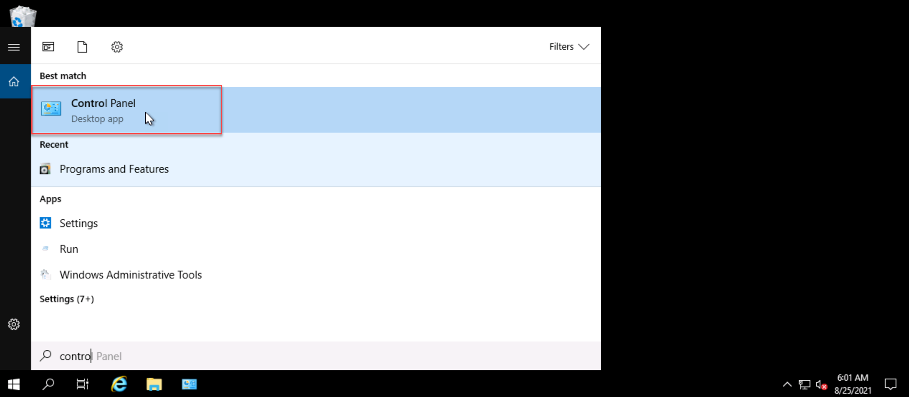

1. In the **Control Panel**, select **Network and Internet**.

	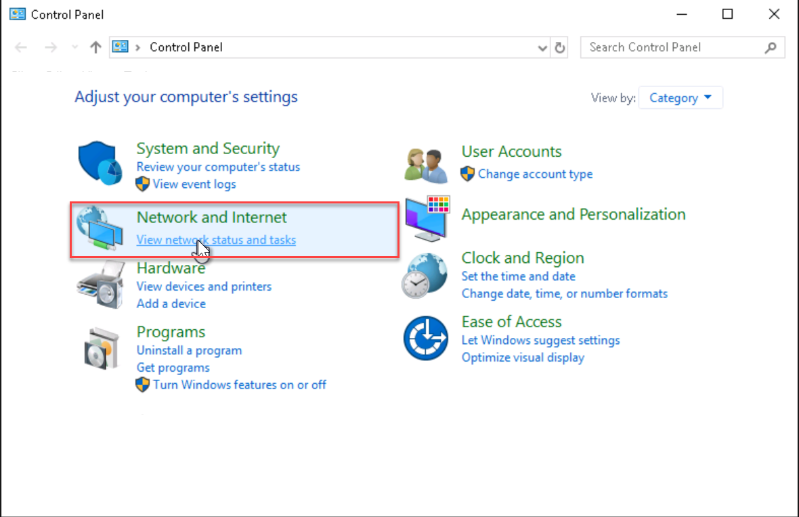

1. On the **Network and Internet** window, select **Internet Options**.

	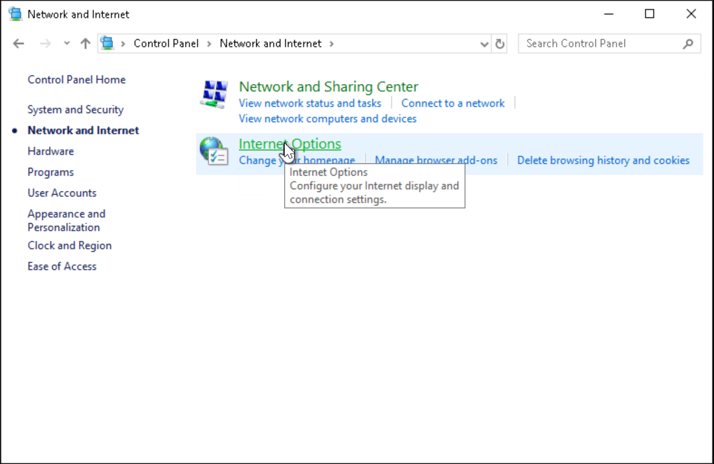

1. This opens the **Internet Properties** window. Select the **Security** tab. 

	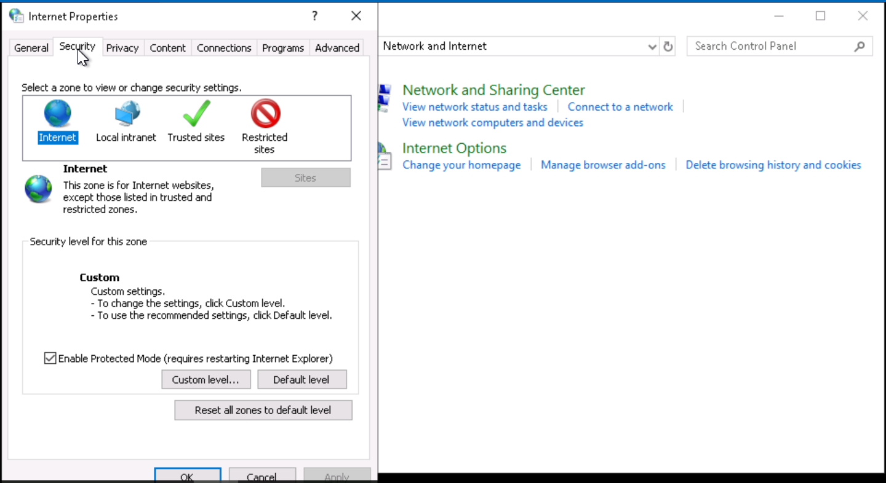

1. The **Internet** zone should be selected by default. Towards the bottom of the window, select the **Custom Level** button. 

	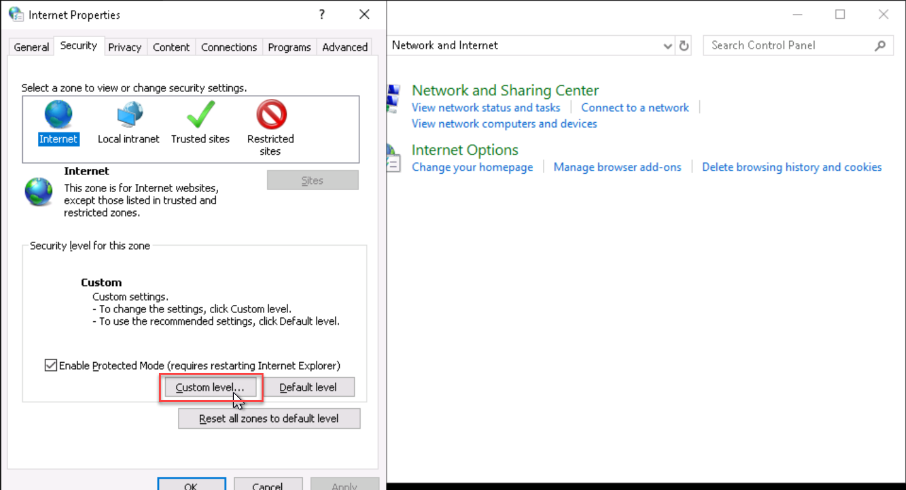

1. In the **Security Settings – Internet Zone** window, scroll down to the **Downloads** section. The first option in this section is **File download**. Verify the **File download** option is set to **Enable** and then select **OK**. 

	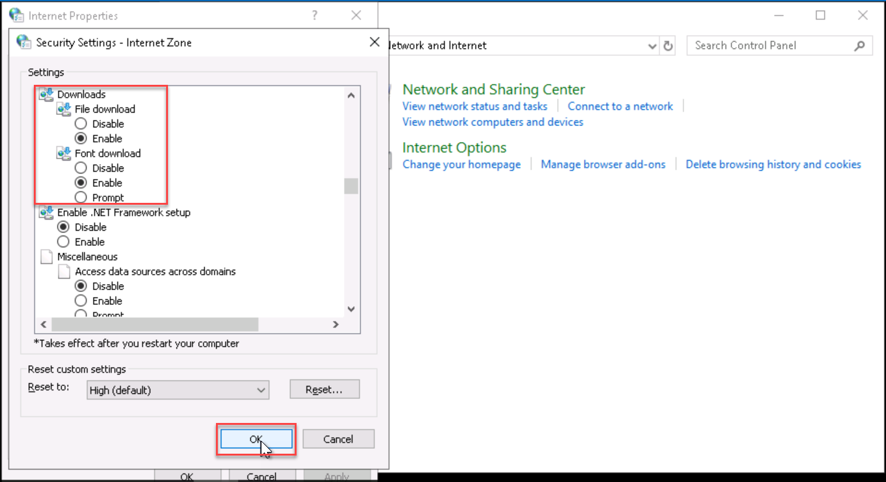

1. This takes you back to the **Internet Options** window. Select the **Trusted sites** zone.

1. In the **Trusted Sites** zone, you must add several sites. Select the **Sites** button. 

	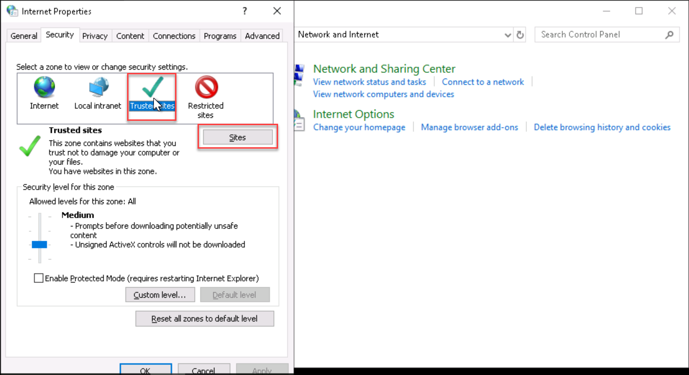

1. In the **Trusted sites** window, in the **Add this website to the zone** field, enter the following URL and then select **Add**: **https://outlook.office365.com/** 

1. Repeat step 11 to add the following site: **https://outlook.office.com/**  

1. Repeat step 11 to add the following site: **https://portal.office.com/**  

1. Select **Close** once you have added these three sites.

	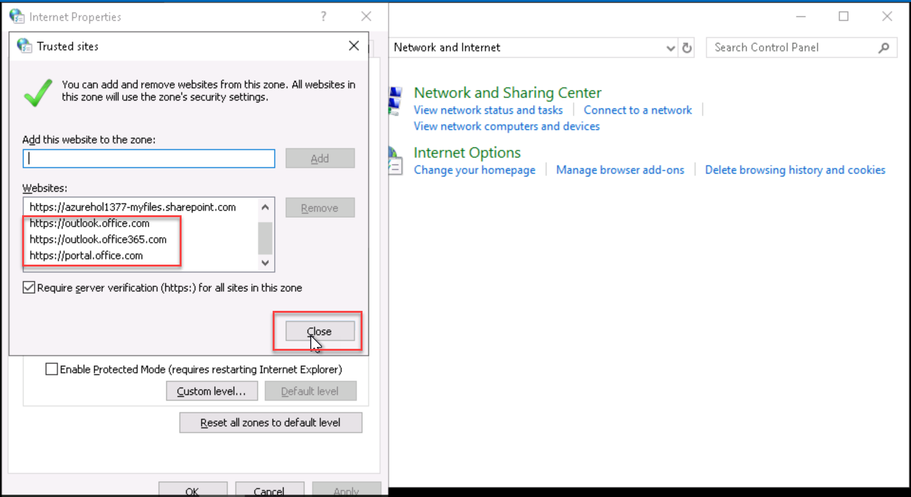

1. In the **Internet Options** window, select **OK** to close the window.

1. Close the **Network and Internet** window.

1. Proceed to the next exercise. You are now ready to install the Azure AD Connect tool and enable synchronization. 

# Proceed to Lab 4 - Exercise 2
 
