# Learning Path 5 - Lab 4 - Exercise 3 - Implement Password Management 

As Holly Dickson, Adatum’s Enterprise Administrator, you have been asked by Adatum’s CTO to deploy Pass-through Authentication (PTA) and Azure AD Smart Lockout as a means of strengthening password management throughout the organization. 

### Task 1: Deploy Azure AD Pass-Through Authentication 

Pass-through Authentication allows users to log in to cloud-based services using their on-premises passwords. All user passwords are only stored locally in the on-premises domains and never synchronized to the cloud. When a user logs in, the PTA agent takes the authentication to your on-premises environment to verify if the password is correct and then communicates the result with Azure AD.   

‎Adatum's CTO wants to provide the company's users with a better logon experience (since PTA requires one less password to remember), as well as reduce Adatum’s IT helpdesk costs because with PTA their users are less likely to forget how to sign in. While this can also be achieved by employing Password Hash Synchronization as well as Active Directory Federation Services, Adatum has chosen to test PTA in its pilot project.

1. On LON-DC1-ID, select the **Start** button on the taskbar, and then in the **Start** menu, select the **Azure AD Connect** program group and then select **Azure AD Connect**. This will initiate the **Microsoft Azure Active Directory Connect** wizard.

1. In the **Welcome to Azure AD Connect** window, you will receive a page indicating the synchronization service scheduler is suspended until this setup wizard is closed. This is because if you start the Azure AD Connect installation wizard (which you did in an earlier task), then the scheduler is temporarily suspended. Select **Configure.**

	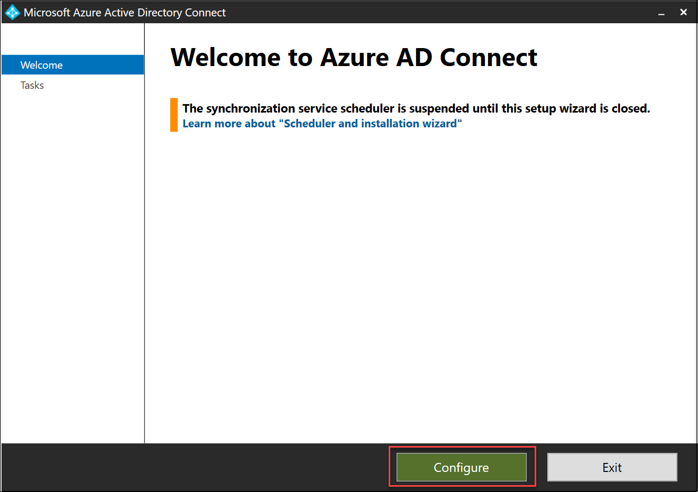

1. On the **Additional tasks** page, select the **Change user Sign-in** task and then select **Next**. 

	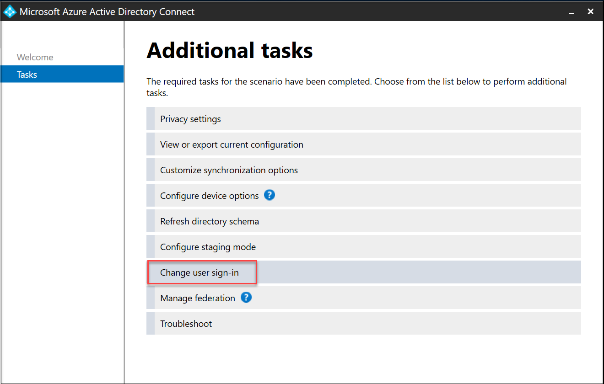

1. On the **Connect to Azure AD** page, sign into Azure AD. The **USERNAME** field is already filled with **Holly@xxxUPNxxx.xxxCustomDomainxxx.xxx.** Enter **Pa55w.rd** in the **PASSWORD** field, select **Next** button to enable it, and then select the **Next** button again to proceed to the next page. 		.

	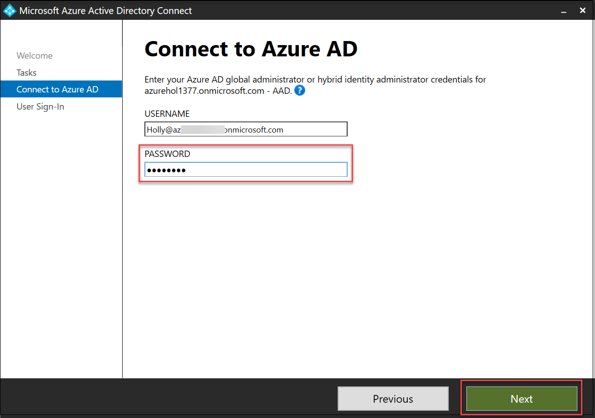

1. In the **Sign in** window, Select the **Holly@xxxUPNxxx.xxxCustomDomainxxx.xxx.** Enter **Pa55w.rd** in the **PASSWORD** field and then select **Next**. 

		

1. On the **User sign-in** page, under the **Select the Sign On method** option, select **Pass-through authentication** and then select **Next**. 

	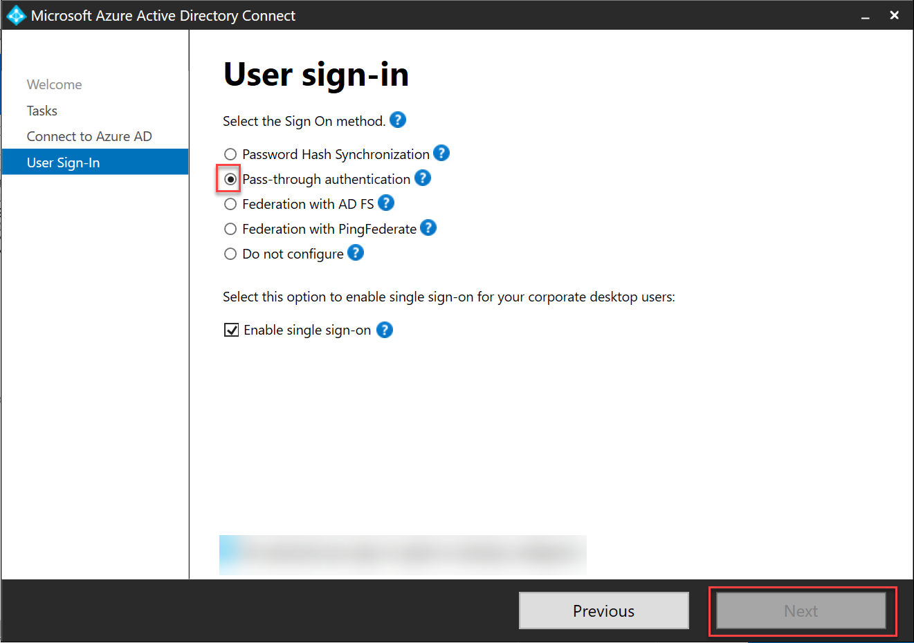

1. On the **Enable single sign-on** page, select **Enter credentials**. 

1. In the **Forest Credentials** dialog box, enter **adatum\azureuser** as the **User name** and **Pa55w.rd** as the **Password**, and then select **OK**. 

	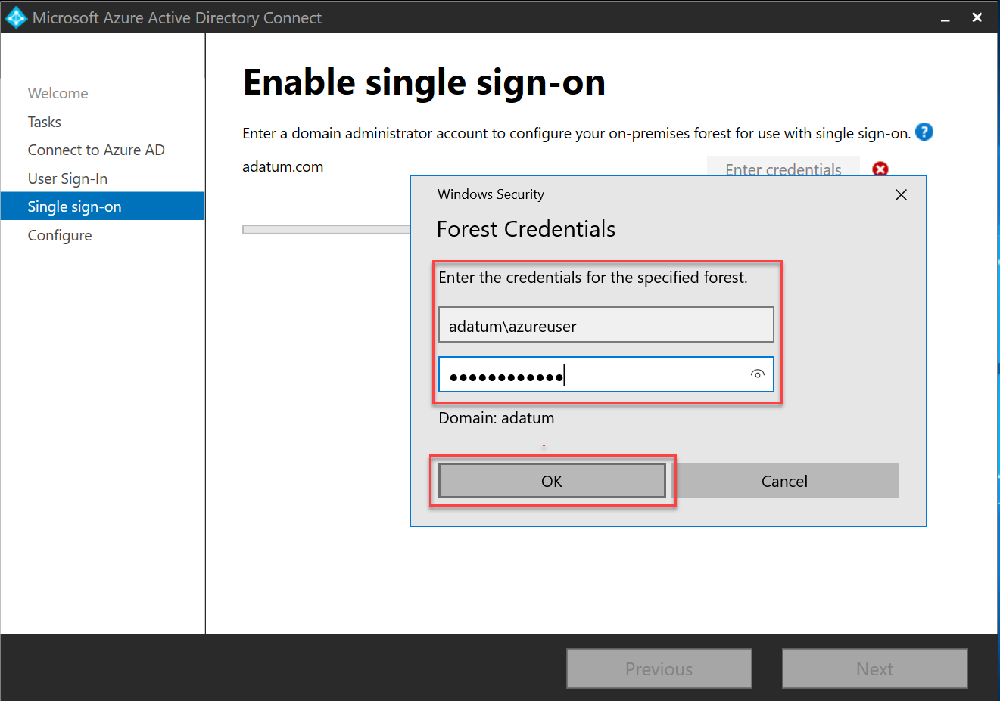

1. When the credentials are verified, a check mark will appear to the right of the **Enter credentials** button. Select **Next**. 

	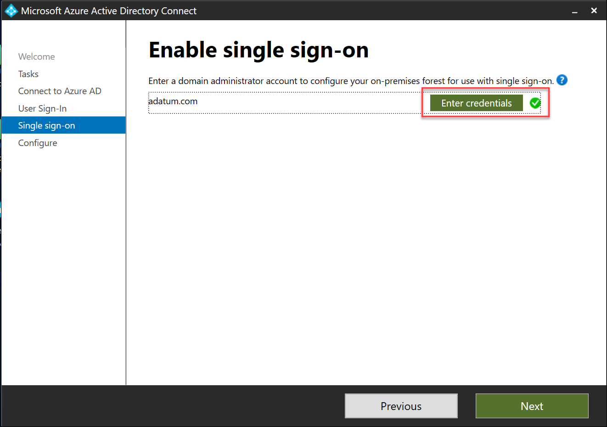

1. On the **Ready to configure** page, select **Configure**. 

	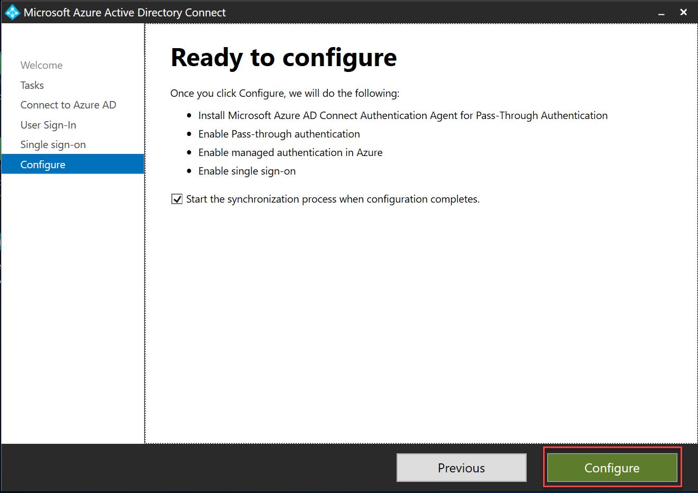

1. On the **Configuration complete** page, select **Exit**. Pass-Through Authentication has now been enabled. 

	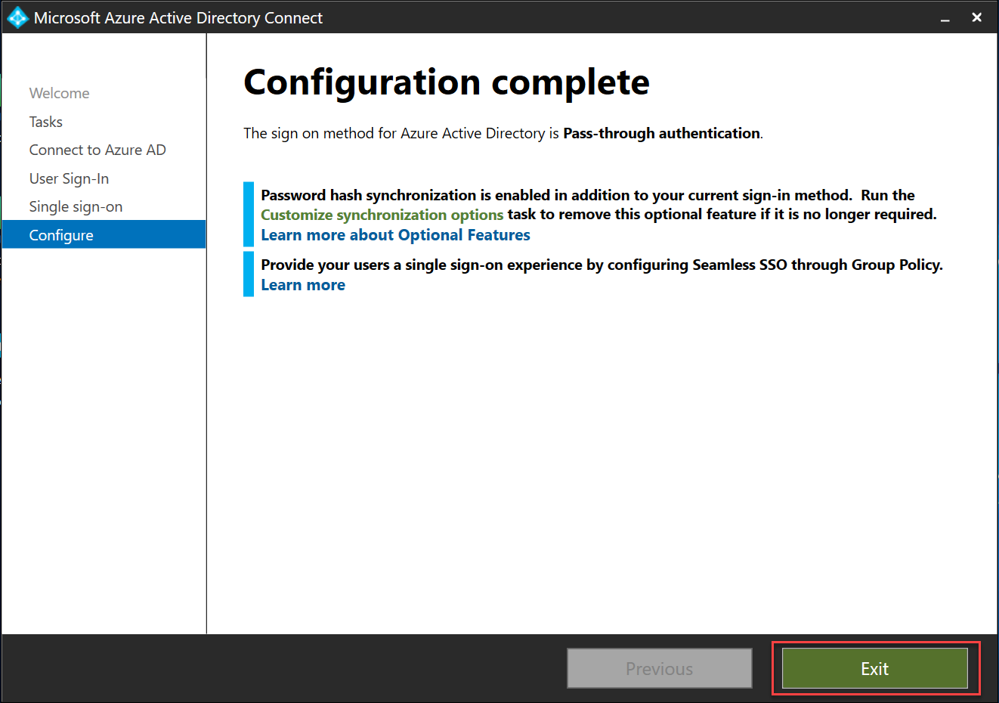

1. To verify that Pass-Through Authentication is successfully enabled, select a new tab in your Edge browser and enter the following URL in the address bar: **https://aad.portal.azure.com**

1. This opens the **Azure Active Directory admin center**. In the left-hand navigation pane, select **Azure Active Directory**. 

	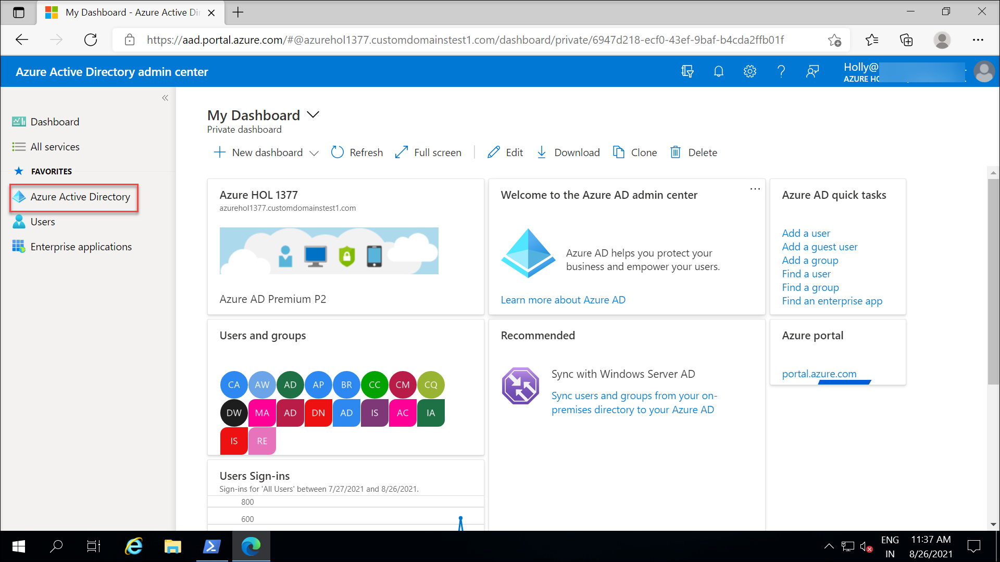

1. On the **Azure Active Directory admin center** page, in the left-hand navigation pane, select **All services**.

1. On the **All services** page, three groups are displayed - General, Identity, and Security. Under the **Identity** group, select **Azure Active Directory**. 

	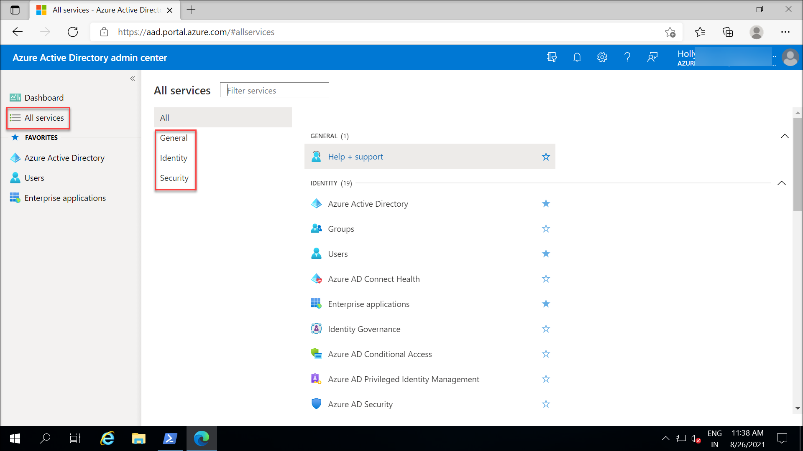
	
	

1. On the **Adatum Corporation | Overview** page, in the middle navigation pane under the **Manage** section, select **Azure AD Connect**.

	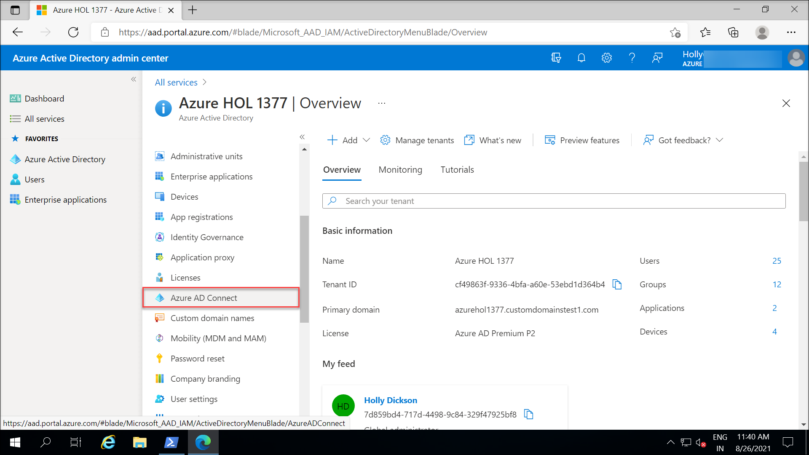

1. On the **Adatum Corporation | Azure AD Connect** page, in the detail pane on the right, under the **USER SIGN IN** section, verify that the status of **Pass-through authentication** is **Enabled**, and then select **Pass-through authentication**. 

	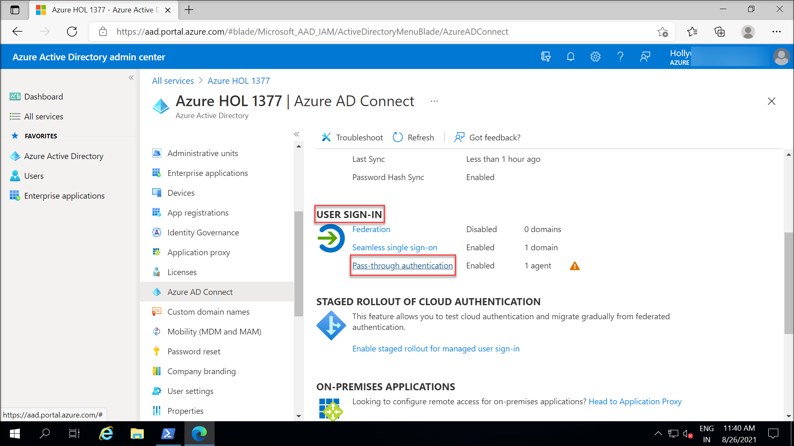

1. On the **Pass-through authentication** page, review the list of servers on which your pass-through authentication agents are installed.

	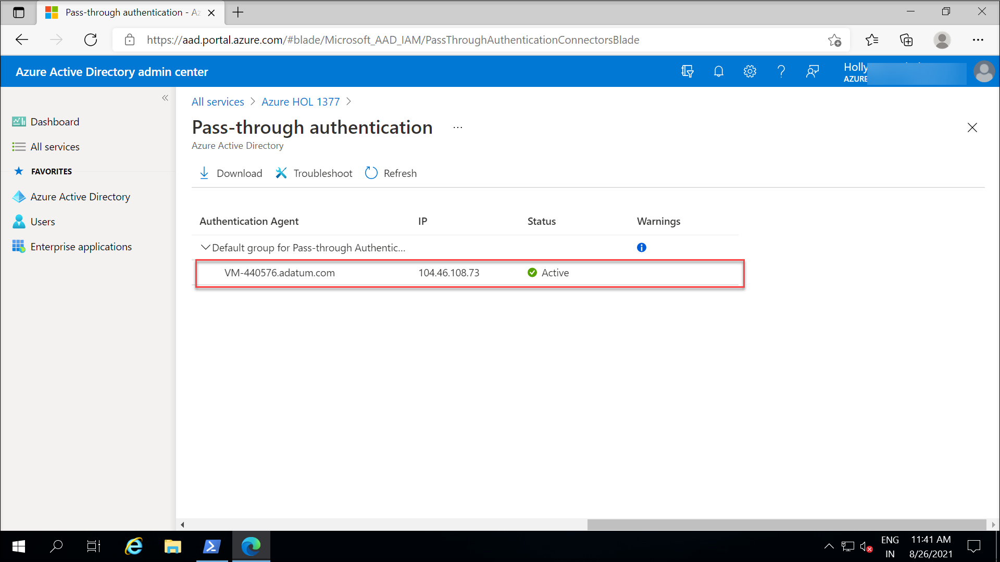

1. Select the **X** in the upper-right corner of the **Pass-through authentication** page to close it, and then do the same to close the **Adatum Corporation | Azure AD Connect** page. You should now be back to the **All services** page in the **Azure Active Directory admin center**.

1. Leave the **Azure Active Directory admin center** open as you will use it in the next task.
   

### Task 2: Deploy Azure AD Smart Lockout

Adatum’s CTO has asked you to deploy Azure AD Smart Lockout, which assists in locking out bad actors who are trying to guess your users’ passwords or use brute-force methods to get admitted into your network. Smart Lockout can recognize sign-ins coming from valid users and treat them differently than sign-ins from attackers and other unknown sources. 

The CTO is anxious to implement Smart Lockout because it will lock out the attackers while letting Adatum’s users continue to access their accounts and be productive. The CTO has asked you to configure Smart Lockout so that users can’t use the same password more than once, and they can’t use passwords that you deem too simplistic or common. 

1. On LON-DC1-ID, select the **Server Manager** icon on the taskbar if it’s already open; otherwise, open it now.

1. In **Server Manager**, select **Tools** in the upper-right menu bar, and in the drop-down menu, select **Group Policy Management.**

	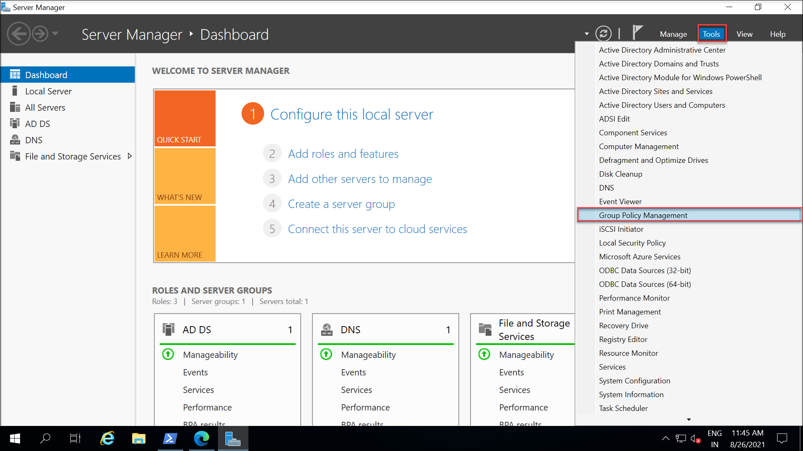

1. Maximize the **Group Policy Management** window, if necessary.

1. You want to edit the group policy that includes your organization's account lockout policy. If necessary, in the root console tree, expand **Forest:Adatum.com**, then expand **Domains**, and then expand **Adatum.com**.   

	‎Under **Adatum.com**, right-click on **Default Domain Policy** and then select **Edit** in the menu.

	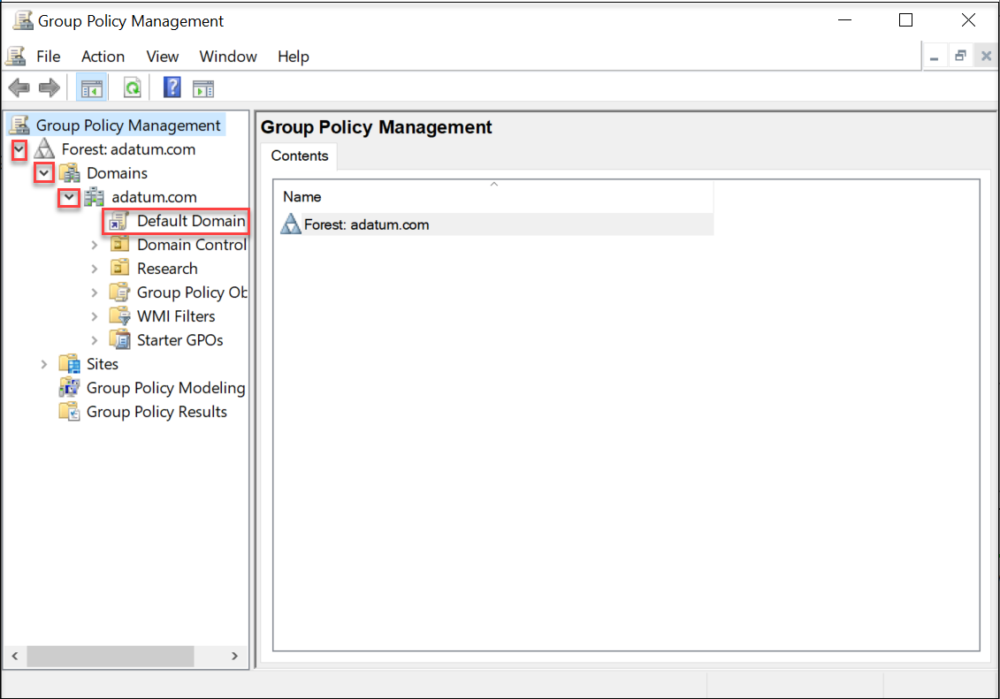

1. Maximize the **Group Policy Management Editor** window that appears.

1. In the **Default Domain Policy** tree in the left-hand pane, under **Computer Configuration**, expand **Policies**, expand **Windows Settings**, expand **Security Settings**, and then expand **Account Policies.**

1. In the **Account Policies** folder, select **Account Lockout Policy**.

	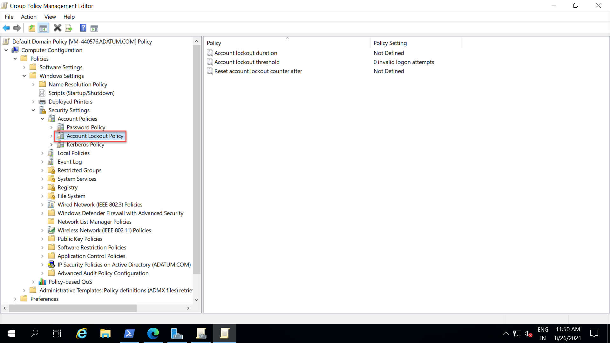

1. As you can see in the right-hand pane, none of the smart lockout parameters have been defined. You are going to use the **Azure AD admin center** to assign these values.    

	‎Select the Edge browser icon on the taskbar, which should be displaying the **All services** tab in the **Azure Active Directory admin center**. 

1. In the **Azure Active Directory admin center**, in the left-hand navigation pane, select **Azure Active Directory**.

1. In the **Adatum Corporation | Overview** page, in the middle navigation pane under the **Manage** section, scroll down and select **Security**.

	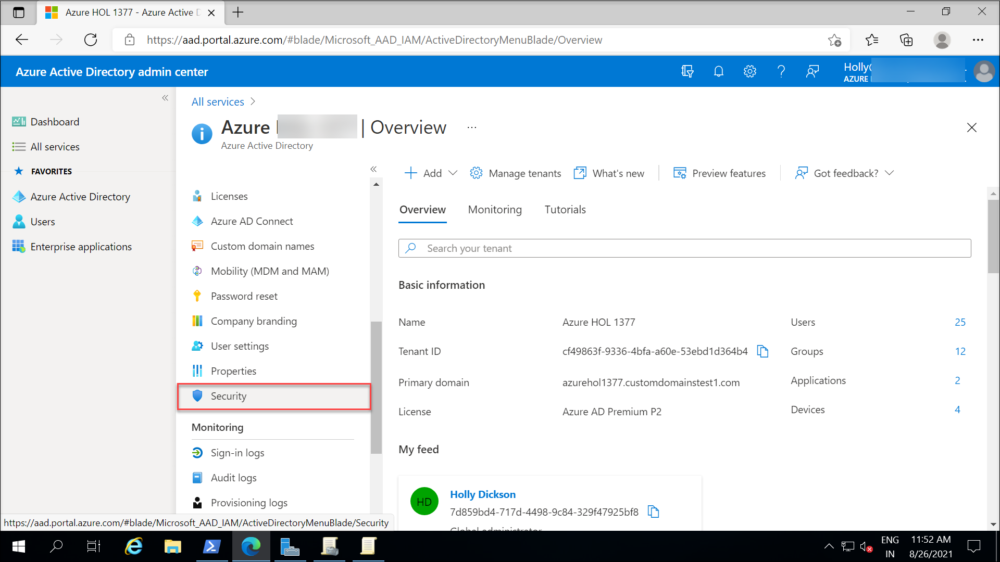

1. In the **Security | Getting started** window, in the middle pane under the **Manage** section, select **Authentication Methods**.

	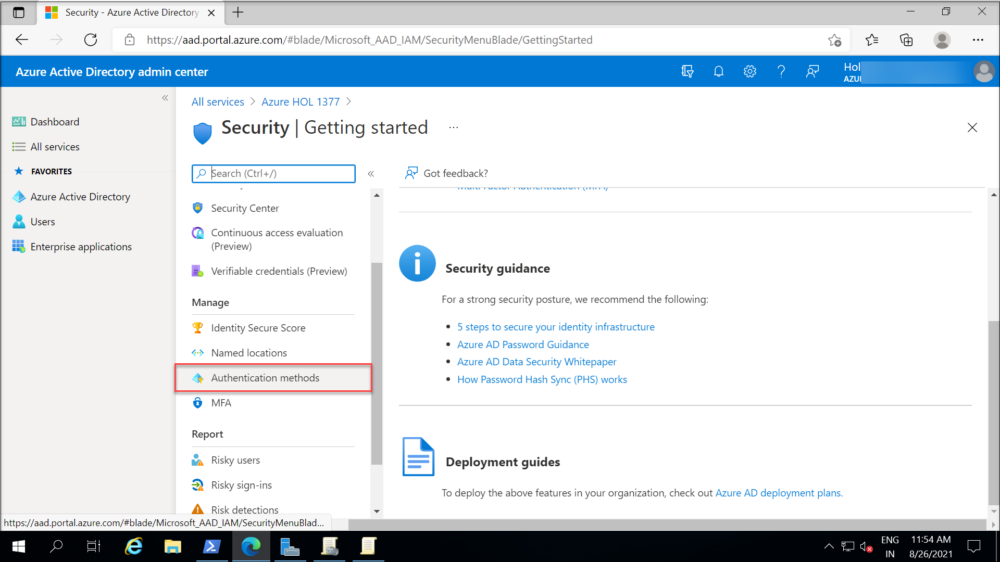

1. In the **Authentication methods | Authentication method policy** page, in the middle pane under the **Manage** section, select **Password protection.**

	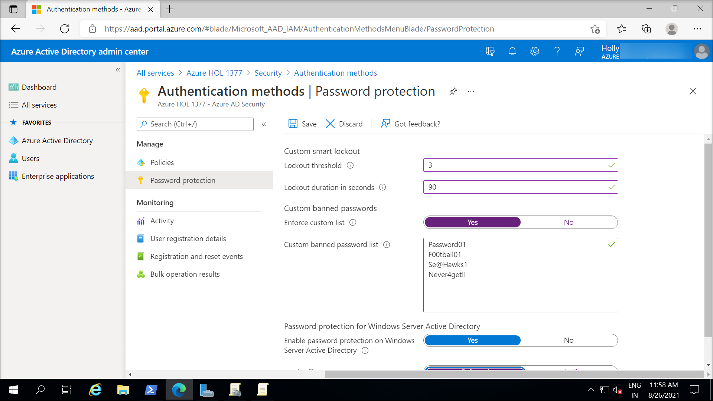

1. In the **Authentication methods | Password protection** window, in the detail pane on the right, enter the following information:

	- In the **Custom smart lockout** section:

		- **Lockout threshold:** this field indicates how many failed sign-ins are allowed on an account before its first lockout. The default is 10. For testing purposes, Adatum has requested that you set this to **3.**

		- **Lockout duration in seconds:** This is the length in seconds of each lockout. The default is 60 seconds (one minute). Adatum has requested that you change this to **90** seconds.

	- In the **Custom banned passwords** section:

		- **Enforce custom list**: select **Yes**

		- **Custom banned password list:** Enter the following values (press Enter after entering each value so that each value is on a separate line):

			- **Password01**

			- **F00tball01**

			- **Se@Hawks1**

			- **Never4get!!**

	- In the **Mode** section, select **Enforced**

	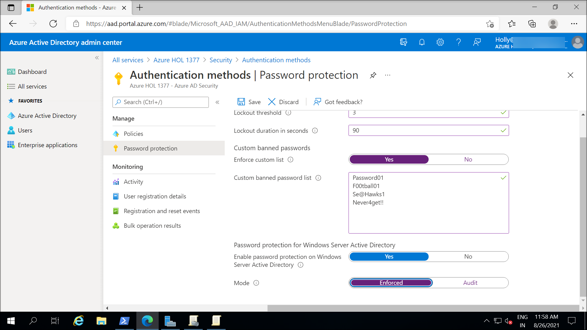
	
	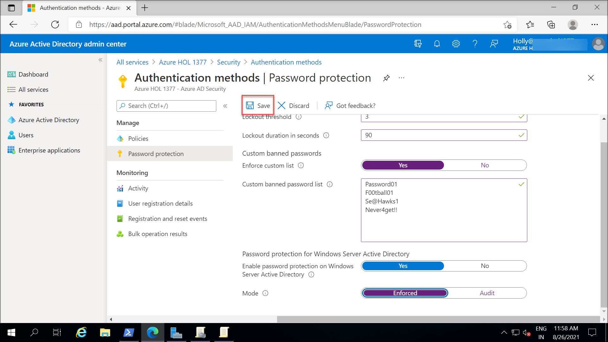

1. Select **Save** on the menu bar at the top of the page.

	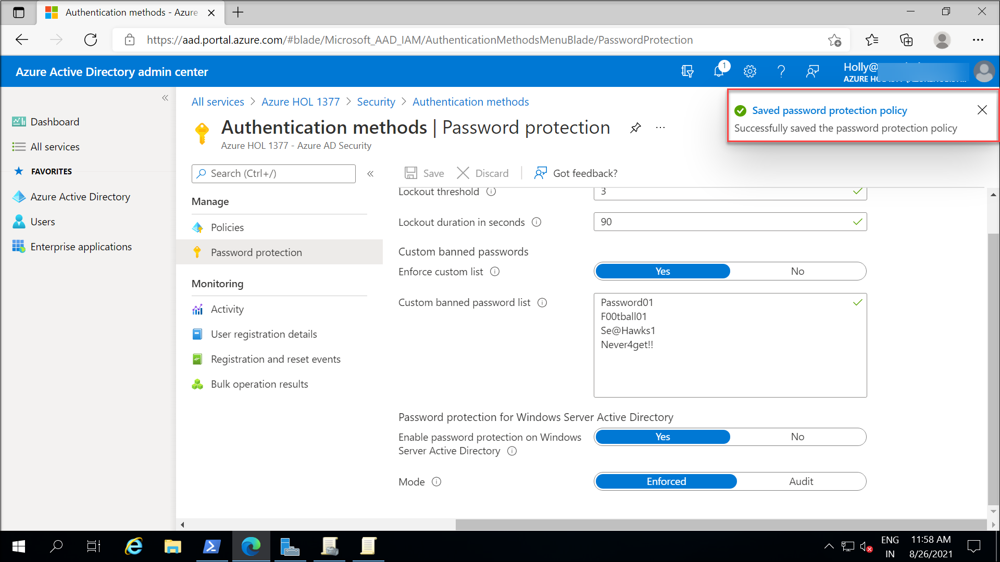

1. You should now test the banned password functionality. Select Holly Dickson's user icon in the upper right corner of the screen, and in the menu that appears select **Change password**.

	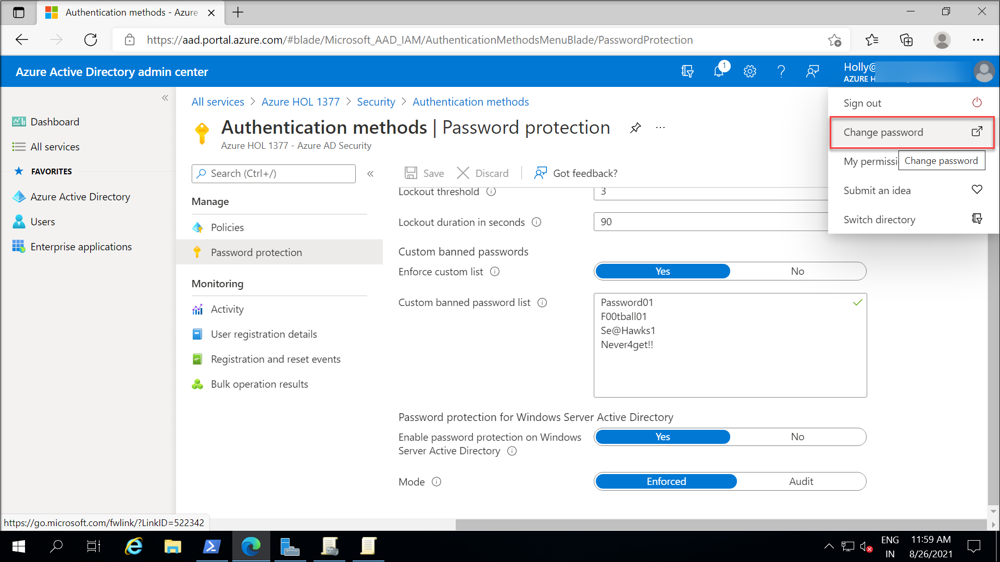

1. A new tab will open displaying the **change password** window. Enter **Pa55w.rd** in the **Old password** field, enter **Never4get!!** in the **Create new password** and **Confirm new password** fields, and then select **submit**. Note the error message that you receive.

	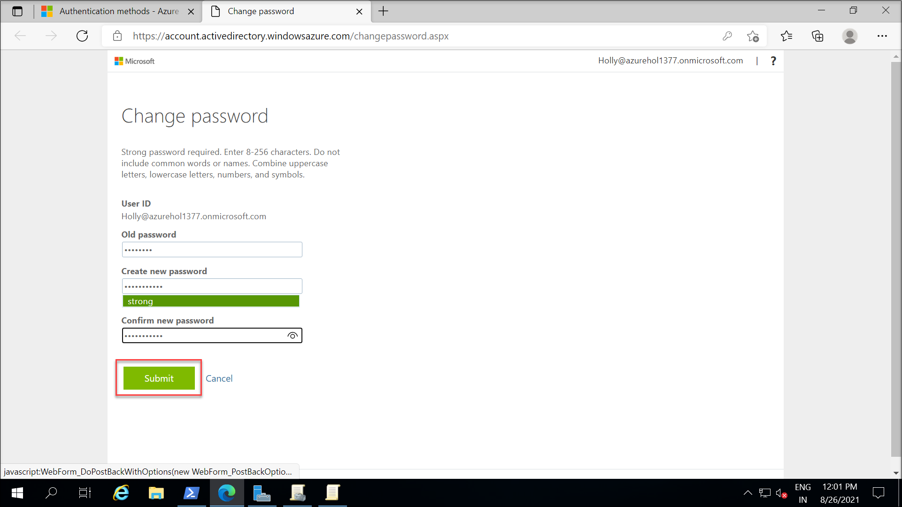
	
	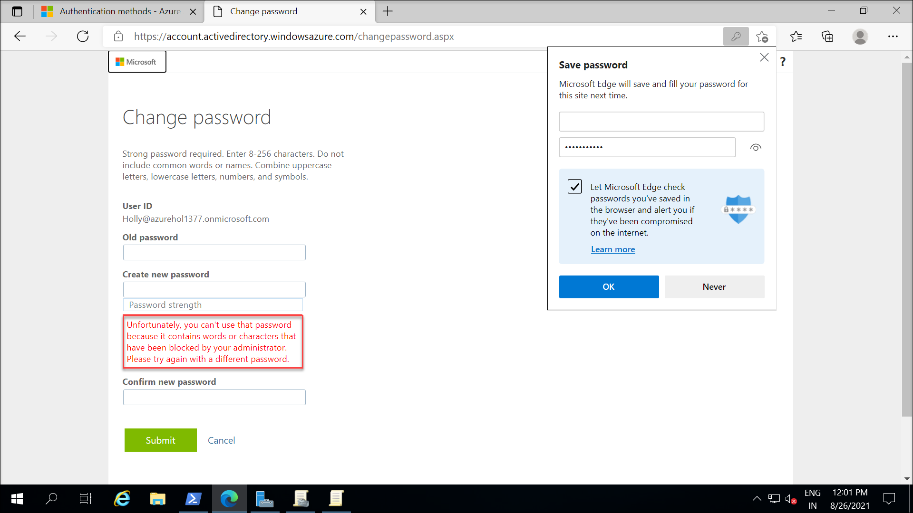

1. In your browser, close the **Change password** tab. 

1. You should now test the lockout threshold functionality. In the **Authentication methods - Azure Active Directory admin center** tab, select Holly Dickson's user icon in the upper right corner of the screen, and in the menu that appears select **Sign out**. 

	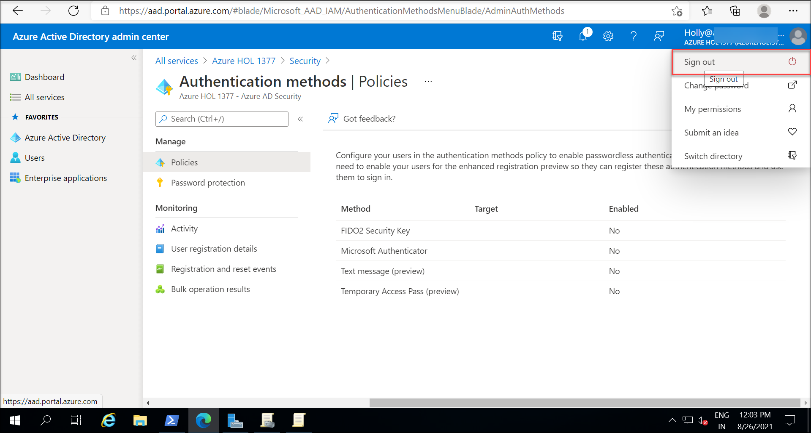

1. Once you are signed out as Holly, the **Pick an account** window will appear. Select **Use another account**. 

1. In the **Sign in** window, enter **laura@xxxxxZZZZZZ.onmicrosoft.com** (where xxxxxZZZZZZ is the tenant prefix assigned to you by your lab hosting provider), and then select **Next**. 

	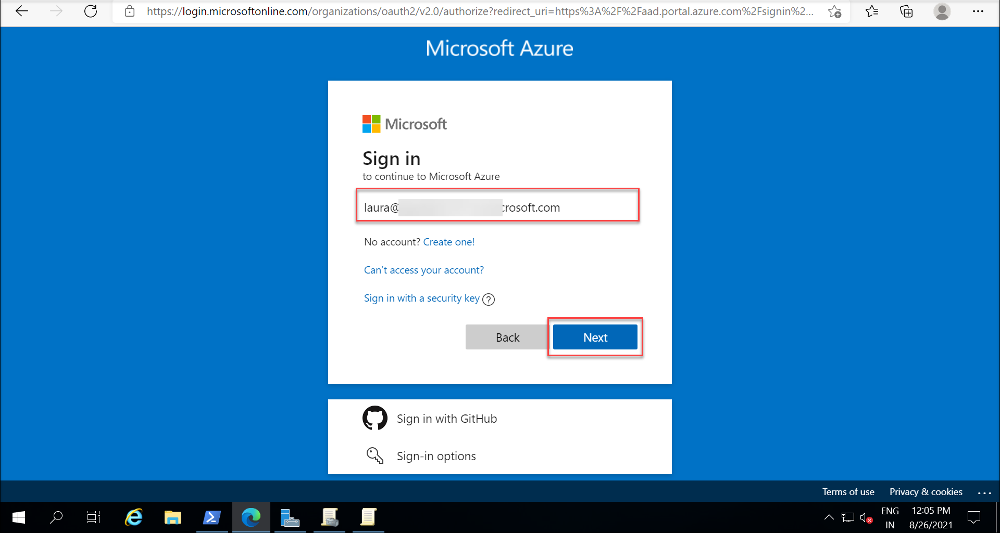

1. On the **Enter password** window, enter any mix of letters and then select **Sign in**. Note the invalid password error message. 

	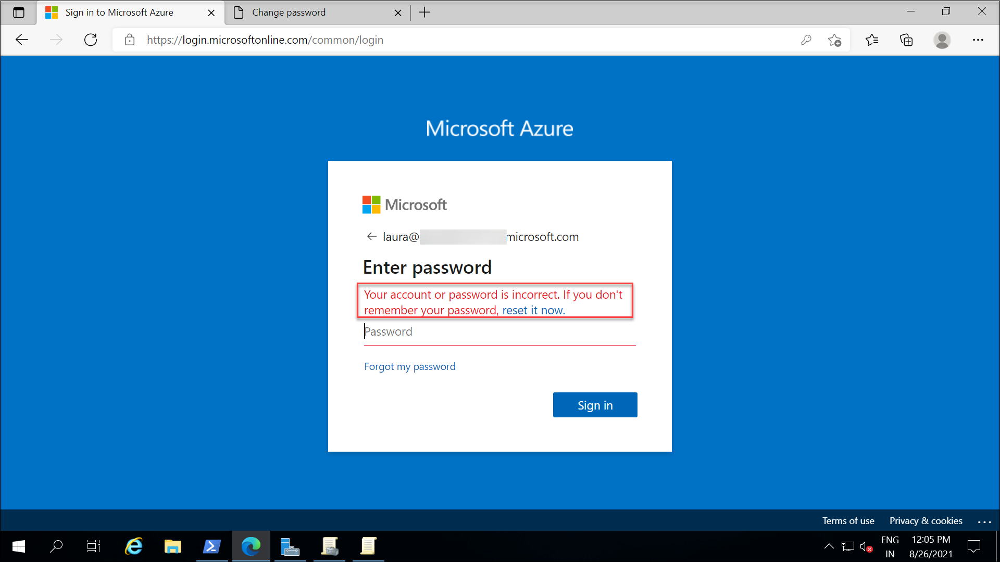

	Repeat this step 2 more times. 
	
1. Since you set the **Lockout threshold** to **3**, note the error message that you receive after the third attempt. Laura's account has been temporarily locked to prevent unauthorized access.  

	**Note:** You will be prohibited from logging in as Laura until after the **90 second lockout duration** that you set earlier. 

	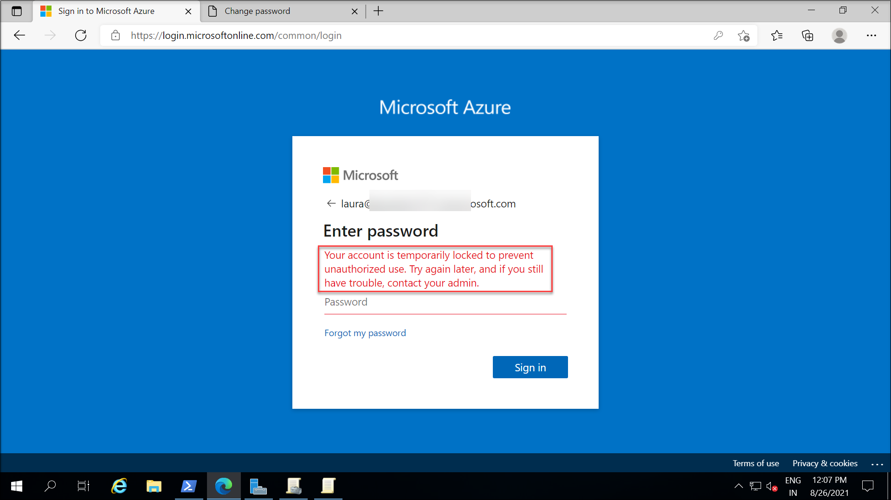
	
1. After 90 seconds, verify that you can log in once the lockout threshold has ended by logging in using the password **Pa55w.rd**. If your log in is successful, you should return to the Azure Active Directory admin center.
 

# End of Lab 4

